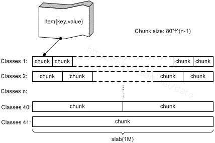
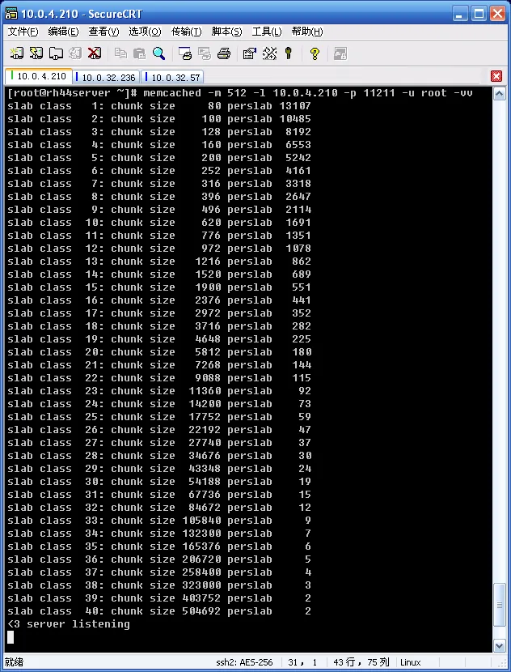

The  [memcached](https://github.com/memcached) is one of the most popular open source on-memory key-value caching systems. I will briefly talk about the design of memory management of memcached.

### Chunk and Slab  



```cpp 
/* powers-of-N allocation structures */
typedef struct {
    unsigned int size;      /* sizes of items */
    unsigned int perslab;   /* how many items per slab */
    void *slots;           /* list of item ptrs */
    unsigned int sl_curr;   /* total free items in list */
    unsigned int slabs;     /* how many slabs were allocated for this class */
    void **slab_list;       /* array of slab pointers */
    unsigned int list_size; /* size of prev array */
    unsigned int killing;  /* index+1 of dying slab, or zero if none */
    size_t requested; /* The number of requested bytes */
} slabclass_t;

```

This is the struct declaration of slabclass\_t. Each slab class contains the same size of chunk, but different classes have different chunk sizes. The size is calculated by this algorithm:

```cpp
<!--while (++i < POWER_LARGEST && size 
```

  
The content value factor is defined when memcached memory is deployed with -f, which can change the size between slab classes. For this loop, the size is multiplied by a specified factor. 



You can get this information by adding -vvv and you can use the command


 ```cpp
 stats slabs under telnet connection ip port
 ``` 

Every time when a new memory needs to be allocated. It will scan the slab class to find the most suitable class to store the chunk.

### Rebalance and reassign slab memory:

From memcached’s wiki:

**Overview**: Memcached 1.4.11. Fixes race conditions and crashes introduced in 1.4.10. Adds the ability to rebalance and reassign slab memory.

#### Slab Reassignment

Long running instances of memcached memory may run into an issue where all available memory has been assigned to a specific slab class (say items of roughly size 100 bytes). Later the application starts storing more of its data into a different slab class (items around 200 bytes). Memcached could not use the 100 byte chunks to satisfy the 200 byte requests, and thus you would be able to store very few 200 byte items.

1.4.11 introduces the ability to reassign slab pages. This is a **beta** feature and the commands may change for the next few releases, so **please** keep this in mind. When the commands are finalized they will be noted in the release notes

#### Slab Automove

While slab reassign is a manual feature, there is also the start of an automatic memory reassignment algorithm.

From the source code in [slabs.c](https://github.com/memcached/memcached/blob/master/slabs.c#L232) we can see, memcached uses two threads to monitor the slabs class, one is to do maintenance and another one is to do the re-balance the class.

Memcached defines a global variable _struct slab\_rebalance slab\_rebal,_ which is used to store the start, end information of slab. s\_clsid is the source slab id and d\_clsid is the destination slab id. The detailed blog in Chinese [memcached源码分析—–slab automove和slab rebalance](http://blog.chinaunix.net/uid-27767798-id-3404133.html) could be helpful.

```cpp

struct slab_rebalance {
    void *slab_start;
    void *slab_end;
    void *slab_pos;
    int s_clsid;
    int d_clsid;
    int busy_items;
    uint8_t done;
};

```
### Memory Pool

Memcached implements its own memory pool, which is used to avoid system memory allocation and memory fragmentation. That will make your memory efficient and easy to manage. Here is a demo implementation of memory pool. Basically it is a large pre-allocated chunk of memory.

```cpp
 mem_avail) {
        return NULL;
    }
    /* mem_current pointer _must_ be aligned!!! */
    if (size % CHUNK_ALIGN_BYTES) {
        size += CHUNK_ALIGN_BYTES - (size % CHUNK_ALIGN_BYTES);
    }
    mem_current = ((char*)mem_current) + size;
    if (size 
```
