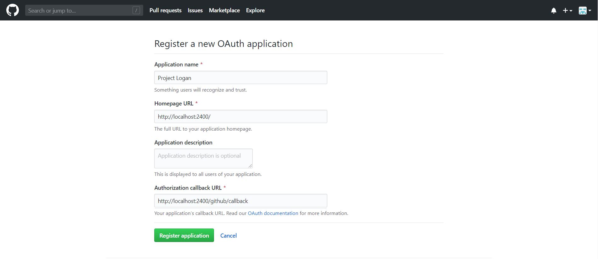
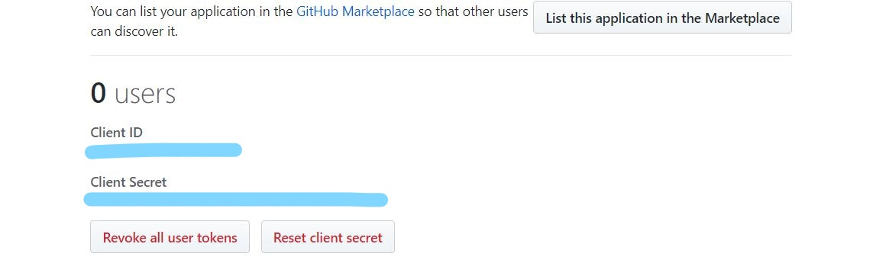
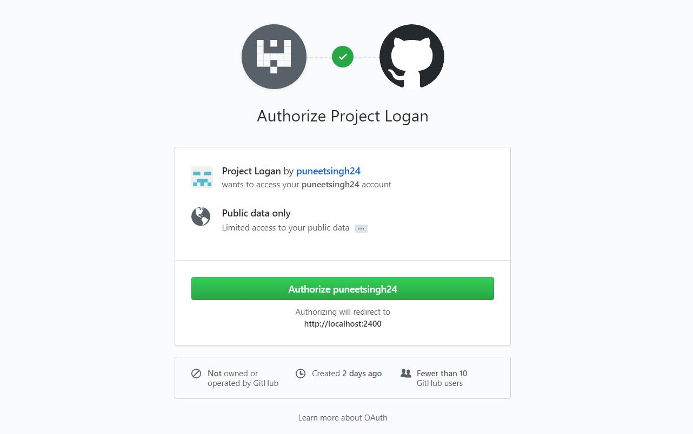
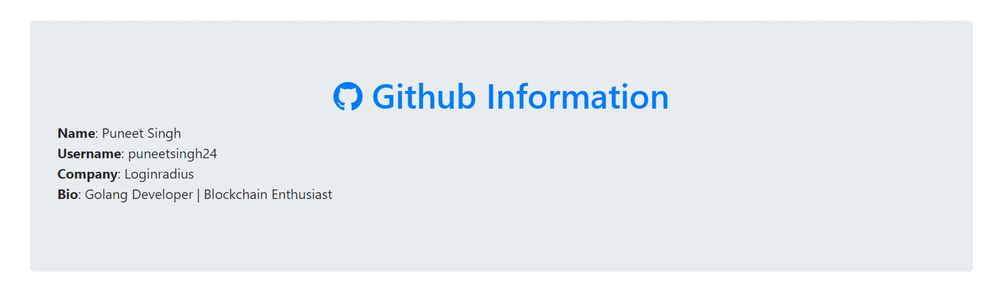

In this blog, we’ll be implementing OAuth by Github in a Node.js Application

## Before You Get Started
This tutorial assumes you have:

*   Basic knowledge of HTML/CSS
*   Basic understanding of OAuth
*   A good understanding of JavaScript and Node.js
*   Latest Node.js version installed on your system

### Step 1: Register a Github OAuth App

To implement Github Auth we need to register a new application in [Github OAuth Apps](https://github.com/settings/applications/new).

Once you start the process you will get a form like this.



You need to fill all the required details and put the Authorization callback URL as `http://localhost:2400/github/callback` (This will be the URL on which Github will send the authorization code once authorization is finished)


Once you register the application you will get the App's Client Id and Secret which we will use in our code.




### Step 2: Initialize a node.js project with all the dependencies

First in an empty folder run the below command

```
npm init
```
It essentially just creates the package.json file with all the basic information you will provide. after that, we will install all the dependencies needed in our project 


- **express:**  Node.js framework to create a server and accept requests
- **ejs:**  To render HTML pages for login and profile
- **axios:**  Use the Axios library, to make HTTP requests

```
npm install express ejs axios --save
```


### Step 3: Writing express server code to accept web requests

Create a file **index.js** in the root folder of your app and add the following code: 


```javascript
// index.js

/*  EXPRESS */
const express = require('express');
const app = express();

app.set('view engine', 'ejs');
var access_token = "";

app.get('/', function(req, res) {
  res.render('pages/index',{client_id: clientID});
});

const port = process.env.PORT || 2400;
app.listen(port , () => console.log('App listening on port ' + port));
```

Our web server has been set up, now we will add the code related to sending the OAuth request to GitHub using Axios package, at the bottom of the **index.js** file:


```javascript
// index.js

// Import the axios library, to make HTTP requests
const axios = require('axios')
// This is the client ID and client secret that you obtained
// while registering on github app
const clientID = 'xxxxxxxxxxxx'
const clientSecret = 'xxxxxxxxxxxxxxxxxxxxxxxxxxxxx'

// Declare the callback route
app.get('/github/callback', (req, res) => {

  // The req.query object has the query params that were sent to this route.
  const requestToken = req.query.code
  
  axios({
    method: 'post',
    url: `https://github.com/login/oauth/access_token?client_id=${clientID}&client_secret=${clientSecret}&code=${requestToken}`,
    // Set the content type header, so that we get the response in JSON
    headers: {
         accept: 'application/json'
    }
  }).then((response) => {
    access_token = response.data.access_token
    res.redirect('/success');
  })
})

app.get('/success', function(req, res) {

  axios({
    method: 'get',
    url: `https://api.github.com/user`,
    headers: {
      Authorization: 'token ' + access_token
    }
  }).then((response) => {
    res.render('pages/success',{ userData: response.data });
  })
});
```

**Note:** The callback URL should be the same as used in the GitHub app configuration.

### Step 4: Creating a Login and Profile page

Create an ejs file under path **views/pages/index.js**, it will render into a nice looking Github authorization page:

```html 
<!-- views/index.ejs -->
<!doctype html>
<html>
<head>
    <title>Github OAuth</title>
    <link rel="stylesheet" href="https://stackpath.bootstrapcdn.com/bootstrap/4.4.1/css/bootstrap.min.css"> <!-- load bulma css -->
    <link rel="stylesheet" href="https://stackpath.bootstrapcdn.com/font-awesome/4.7.0/css/font-awesome.min.css"> <!-- load fontawesome -->
    <style>
        body        { padding-top:70px; }
    </style>
</head>
<body>
<div class="container">
    <div class="jumbotron text-center text-primary">
        <h1><span class="fa fa-github"></span> Github OAuth</h1>
        <p>Authorize your app with:</p>
        <a href="https://github.com/login/oauth/authorize?client_id=<%= client_id %>" class="btn btn-danger"><span class="fa fa-github"></span> Github Login</a>
    </div>
</div>
</body>
</html> 
```

After it we will create an ejs file under path **views/pages/success.js**, it will be used to show the user's GitHub information we will get after authorized by Github

```html 
<!-- views/success.ejs -->
<!doctype html>
<html>
  <head>
    <title>Github OAuth</title>
    <link rel="stylesheet" href="https://stackpath.bootstrapcdn.com/bootstrap/4.4.1/css/bootstrap.min.css"> <!-- load bulma css -->
    <link rel="stylesheet" href="https://stackpath.bootstrapcdn.com/font-awesome/4.7.0/css/font-awesome.min.css"> <!-- load fontawesome -->
      <style>
          body        { padding-top:70px; }
      </style>
  </head>
  <body>
    <div class="container">
      <div class="jumbotron">
          <h1 class="text-primary  text-center"><span class="fa fa-github"></span> Github Information</h1>
          <div class="row">
            <div class="col-sm-6">
              <div class="well">
                <p>
                  <strong>Name</strong>: <%= userData.name %><br>
                  <strong>Username</strong>: <%= userData.login %><br>
                    <strong>Company</strong>: <%= userData.company %><br>
                    <strong>Bio</strong>: <%= userData.bio %>
                </p>
              </div>
            </div>
        </div>
      </div>
    </div>
  </body>
</html>
```
**Note:** Here we are also using bootstrap and font-awesome css to make our web pages look good. 


We have finished building our OAuth authorization page, let's run the application by below command


```
node index.js
```

Once our server is running, we can see our social login page on `http://localhost:2400/`


We need to click on the **Github Login button**, which will redirect us to google login page.



After login with our GitHub credentials, it will redirect back to our application and on the success page, we can see the details of users' GitHub profile and can save this detail in a database for future use also.



You can implement the OAuth in Node.js by the above process, You can found the complete code used in this tutorial on out

[ Github Repo ](https://github.com/LoginRadius/engineering-blog-samples/tree/master/NodeJs/)