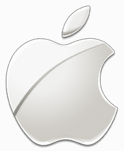
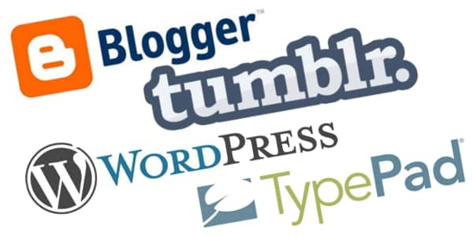
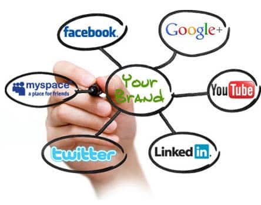

Many of the developers believe that they are immune to the need of marketing/branding themselves. As a developer your job is to create ultimate applications, right? After all you are not a celebrity or some rockstar! But isn’t it better to be in demand for fruitful consultations, speaking and writing? Well, all this is possible if you are able to create a personal brand!

In this article I am going to focus on why as a developer you should focus on personal branding, how it is going to help your job and career and finally, will guide you on how you can also create a personal brand. First thing first, let’s start with what is personal branding.

**What is personal branding?**

Do you recognize this logo? Well, Of course  you do! But have you ever wondered how come you recognized this logo without even a name? Well, you recognized it because the brand is so strong that without even a proper title, you are able to recognize it and that’s what branding do.

The concept of personal branding is quite similar to that of company branding. Personal branding is all about thinking yourself as a brand. It is about showing people who you are and what is your passion. When you think about some specific programming language, your mind goes back to some specific names associated with that language, who are either the father of that language or have done some amazing work in that field, right?

To get the more clear idea, here is what [Paul Irish](http://www.paulirish.com/), the front end developer of Google Chrome team, has to say on the concept of personal branding - 
  
_“Personal branding is the art of consistently presenting, online and offline, the essence of how you stand out from the crowd.”_

Personal branding is all about you and only you :  

- who you are
- what are you passionate about
- who you wanna be
- how would you like to be seen
- how actually people see you
- what you do and what you did
- what you know and what you don’t
- what you like to share

and more! Personal branding is basically about everything that defines you from the languages you are expertize to the blogs you write.

**Why you should focus on personal branding?**

Personal branding is no longer an option, but it has become crucial for everyone. After all we are living in the digital world where it is simpler to reach to the next level. So it’s not exactly about being the rockstar but maybe it is. May be it is about becoming popular! May be it is about getting that power. Here I am presenting you three key reasons why personal branding is important for you-

1. **You are not crucial!**  
        C’mon, no matter how rude that sounds, but you know it is true. The competition is increasing day by day and you know, there are millions of others waiting out there to take your place. So yeah, face it, YOU ARE NOT CRUCIAL! and this gives you one of the key reason to try your hand in personal branding. Let people know what you do and why you are better than others..
2. **No job is permanent!**  
          
        Another harsh reality! No matter how much your company loves you but you know no job is forever. So be prepared! You don’t know when the situation changes. As a developer personal branding matters when you are looking to change your job. You want your employers to hire you not only as a good developer but also as an innovative leader. To make that possible, you need to cultivate a personal brand that can highlight your value to your potential employers.
3. **Sky's the limit!**  
          
        The process of learning has no end. While creating personal brand, you meet many people from your niche. You interact with them, share your knowledge, learn from them, discuss ideas and all this will give you the level of expertise that wouldn’t have been possible otherwise. Doesn’t matter how you want to improve your career, personal branding is the key!

**How to manage your personal brand?**

As a developer, breaking through the glass ceiling demands much more than excellent programming skills. Cultivating a strong personal brand can really help you out. GET VISIBILITY is all I want to say!

You might have the best expertise in certain technology, you might have designed an amazing product but all this is meaningless if nobody can see you. Here are some tips on how you can get visibility :

1. **Try your hand at blogging :**  
    Blogging is an amazing way to tell people who you are. Blog about anything you hold expertize in, whether it is a programming language or it is some kind of technology, let people understand who you actually are. There are many developers out there who have some awesome technical blogs where they share their knowledge and write about their specialities.For inspiration you can have a look at the blog of [John Resig](http://ejohn.org/), the creator and founder of jQuery. Another tech blog champion is Scott Hanselman. Make sure to have a look on his popular blogs [www.hanselman.com](http://www.hanselman.com), [http://hanselminutes.com/](http://hanselminutes.com/), etc.  
      
    Stick to one topic, you are best at and select the blogging platform that suits you like Wordpress, Tumblr, Blogspot, etc. Post informative content on regular basis and soon you will have a huge audience waiting for your content and engaging with you. Posting two to three informative blog is enough to keep you in demand. Also there are some specific sites like[www.asp.net](http://www.asp.net) where you can submit articles to gain immense popularity.
2. **Embrace Social Media :**  
      
    You might have heard that Facebook and Twitter are all about wasting time, but let me tell you this is not at all true. Social media provides you a great opportunity to build networks. It is must to get visibility on various social media networks if you want to be found by people who share same niche as you.  
      
    There are various ways how you can track your brand on social media. My personal favorite is Google Alert which notifies whenever people are talking about me or my projects. While some times they are talking about the work I have done, sometimes they also complaint which helps me understand where I am wrong. There are many others, like on Twitter, you can use [Tweetdeck](https://tweetdeck.twitter.com/) . Apart from that, create a strong persona on Linkedin, Facebook, Google+, etc. Interact with people, reply to their queries and become social media champion.  
    Some popular developers who are social media champions as well include [Scott Hanselman](https://twitter.com/shanselman), [John Resig](https://www.linkedin.com/in/jeresig), etc  
    
3. **Participate in Communities:**  
      
    Communities like Quora, Stackoverflow, Warrior Forum, etc can be your best friends if you are intending to create brand online. Join these communities and try your best to solve the queries of users from your niche. It will not only help you interact your kind of people but will also improve your problem solving skills. Sites like Stack Overflow, GitHub allow users to work together on projects, that can open a wide opportunity to learn.  
    
4. **Contribute to Open source or start Open source :**  
      
    Another great way to cultivate personal brand is to contribute to open source or start open source. While contributing to an open source can be an amazing experience it will earn you recognition among your fellow community. Also you can start open source. If you are getting difficulties to start open source, have a look at this interesting [article](https://opensource.guide/how-to-contribute/).

**What I’m trying to say is**

Maybe you don’t want to become a rockstar developer or you are happy with your current job, but still there is a huge difference between doing the job and doing the job in excellent way. After all, you have worked hard to be where you are today and you deserve to get recognized for it. So why tomorrow, start now and reach the next step.
