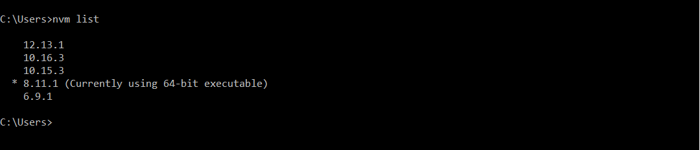

While working on the multiple projects of NodeJs,  you might be required to run different projects on the different nodejs version or for the legacy nodejs projects, you might require an old version of the nodejs, and the others required a new version of node-js, or to checkout the new feature of nodejs, you need to install the latest version of node js 

As on the same machine, we can only install one version of the nodejs, so it's very painful to uninstall and install the new node version as per your project requirements.

To overcome this problem, we can use the Node Version Manager (NVM). NVM allows installing multiple node js versions on the same machine and switching between the required node js version.


## Installation of NVM

### Windows

Download the latest version of NVM

https://github.com/coreybutler/nvm-windows/releases/latest

Download nvm-setup.zip and install on the windows

Verify Installation
```
nvm version
```

### MacOs/Linux

Using curl
```
curl -o- https://raw.githubusercontent.com/nvm-sh/nvm/v0.38.0/install.sh | bash
```
Using Wget
```
wget -qO- https://raw.githubusercontent.com/nvm-sh/nvm/v0.38.0/install.sh | bash
```
 Verify Installation
```
command -v nvm
```

## Usage

###  Get a List of all available NodeJs versions
```
nvm  ls available //windows

nvm ls-remote //MacOs/Linux
```

### Install latest NodeJs version
```
nvm install node
```
### Install latest LTS Release 
```
nvm install --lts
```
### Install particular NodeJs version
Multiple <a href="https://youtu.be/efM46qNSaeg" rel=”nofollow”>NodeJs</a> version can be installed using the below command.
```
nvm install 8.11.1 // to install the 8.11.1 version

nvm install 12.13.1 //to install the 12.13.1 version
```
### UnInstall the multiple NodeJs version
```
nvm uninstall 8.11.1
```

## Switching the NodeJs version
### Get a List of installed NodeJs version
```
nvm list  //for windows

nvm ls //for MacOs/linux
```


### Switching Between installed NodeJs Versions
```
nvm use 8.11.1  //To enable 8.11.1

nvm use 12.13.1 //To enable 12.13.1

```


### Use Custom alias for installed NodeJs versions
We can create an alias as per the Project basis or the group of projects using the same NodeJs version.
```
nvm alias awesome-project 12.13.1
```
After creating an alias, then switch to the alias
```
nvm use awesome-project
```
Remove the Alias
```
nvm unalias awesome-project
```

### Run to specific NodeJs version, without switching
```
nvm run 8.11.1 app.js
```
or can be used below command
```
nvm exec 8.11.1 node app.js
```

### Other Commands
To use installed nodeJs version in the system
```
nvm use system
```
To completely remove nvm from the system.
```
nvm unload 
```
## Conclusion
Node Version Manager (NVM) is a great tool and easy to switch between multiple node versions while working on projects that required different <a href="https://www.loginradius.com/integrations/node-js/">NodeJs</a> versions. It saves a lot of development time by just switching to the version of nodejs needed.
