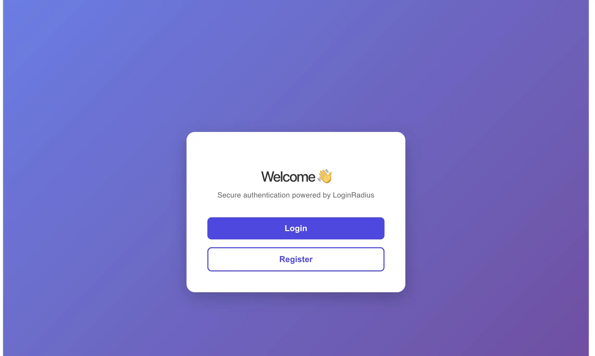
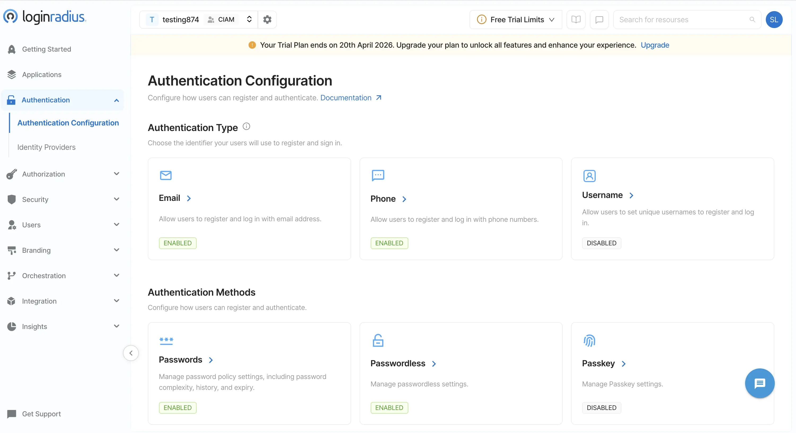
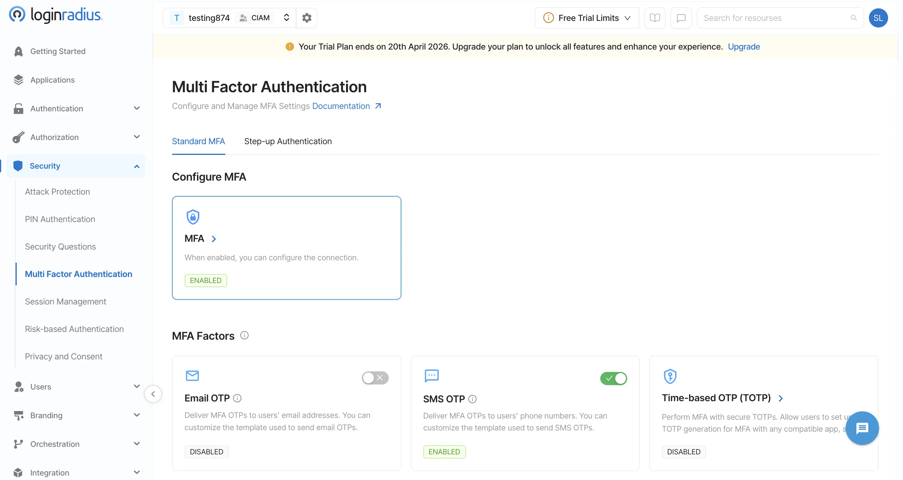
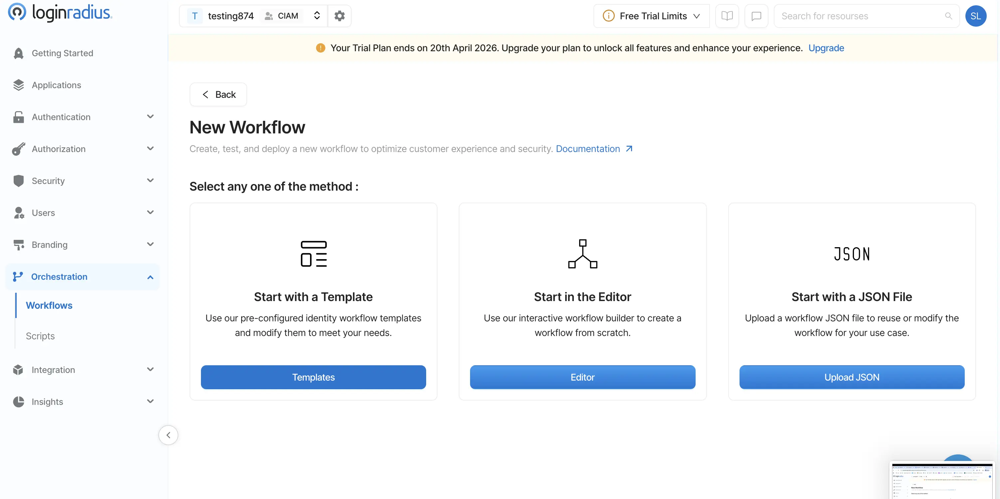
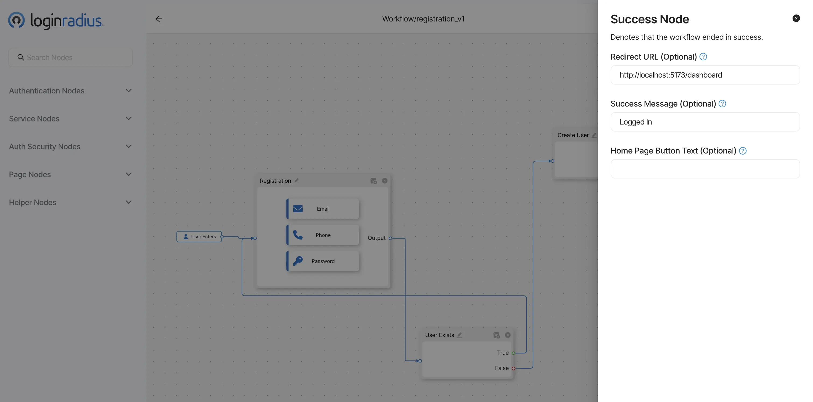
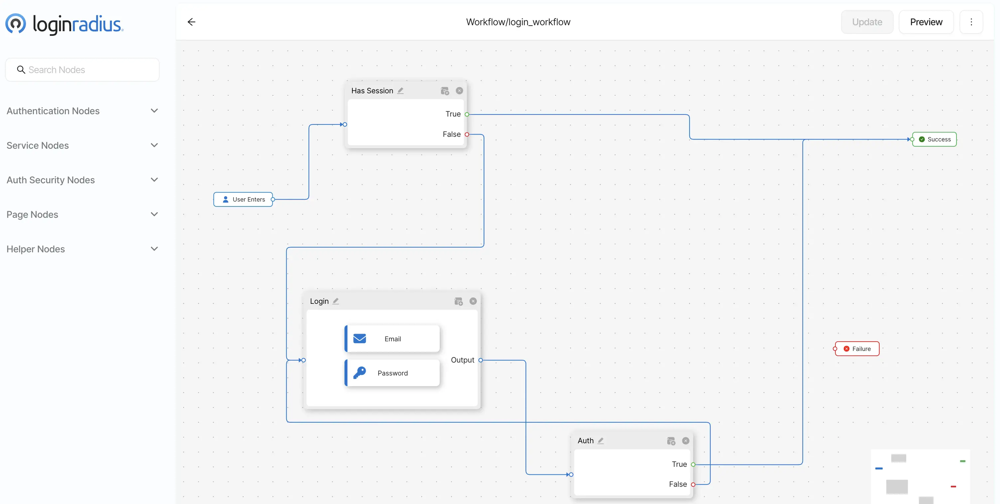
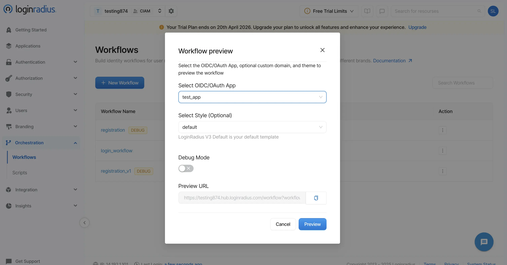
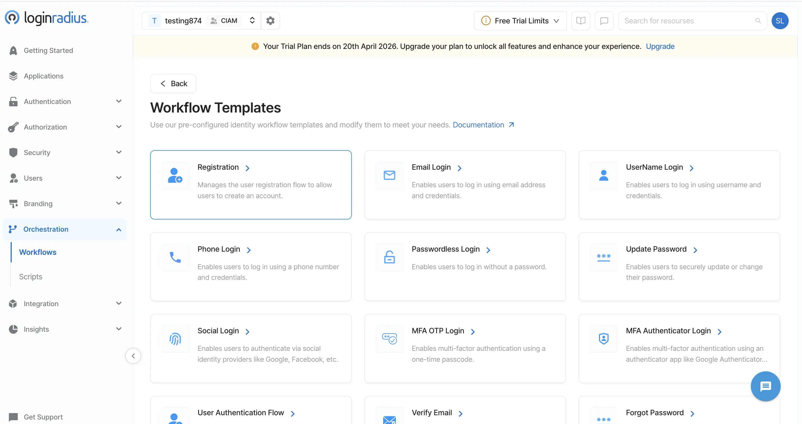
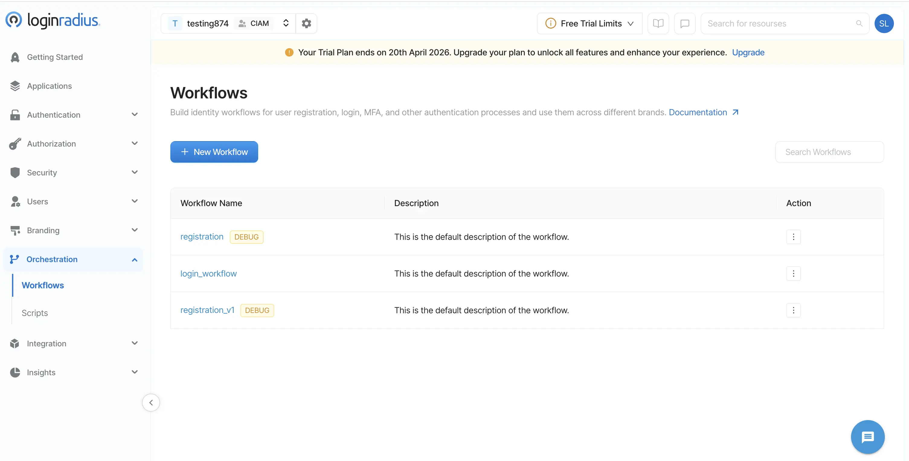

<div style="text-align:center;">
  
  <p><em>Application Main Page</em></p>
</div>

---
# 🚀 Building a Small App using JS SDK

This blog explains how to build a small authentication app using the LoginRadius JS SDK inside a Turbo monorepo. The application includes:
- ✅ User Registration  
- ✅ User Login  
- ✅ Protected Dashboard  
- ✅ Logout Functionality  
---
## 🔐 What is LoginRadius?

LoginRadius is an API-driven identity platform that simplifies the implementation of enterprise-grade authentication and user management features.

It provides:

- Single Sign-On (SSO)  
- Multi-Factor Authentication (MFA)  
- Passkeys and Passwordless Login  
- Identity Orchestration  
- Secure Token-Based Authentication  

Developers can integrate it easily using SDKs and customizable workflows with minimal coding effort.

---

## 🧩 Tech Stack
- **Frontend**: React (Vite)  
- **Backend**: Node.js (Express)  
- **Monorepo**: TurboRepo  
- **Authentication**: LoginRadius JS SDK  

---
## 📂 Project Structure
```bash
apps/
├── web/ # Frontend application
├── web2/ # Another Frontend application to implement SSO
├── api/ # Backend server
```
---

## 🏗️ Architecture

The frontend communicates with LoginRadius for authentication.
After a successful login:
An access token is generated
The frontend sends this token to the backend
The backend validates the token before returning protected data

---

## 🔐 LoginRadius Configuration
1. Create an account on LoginRadius 
2. Obtain your API Key and API Secret from Tenant settings page.
3. Add your domain in the Configured Domains section 

---

## ⚙️ Backend Implementation

### Initialize SDK

```js
var config = {
    apiDomain: process.env.API_DOMAIN,
    apiKey: process.env.API_KEY,
    apiSecret: process.env.API_SECRET,
    siteName: process.env.SITE_NAME,
    apiRequestSigning: false,
    proxy: {
        host: "",
        port: "",
        user: "",
        password: "",
    },
};
var lrv2 = require("loginradius-sdk")(config);
```

## 🔄 Authentication Flow
This application uses LoginRadius workflows and JS SDK to handle:
Registration
Login
Token validation
Logout

---

### 📝 1. User Registration Flow

When a user clicks on the **Sign Up** button:
1. The user is redirected to the LoginRadius hosted registration page  
   (this can be customized based on requirements, but the default page is used in this implementation).
2. The user completes the registration process.
3. After a successful registration:
   - LoginRadius triggers the **Success Node** in the registration workflow  
   - The user is redirected to the configured **Redirect URL**
4. In this application:
   - The redirect URL points to a **Registration Success page**
   - A success message is displayed
   - A **“Go to Home”** button allows the user to navigate back to the root (`/`)

---

### 🔐 2. User Login Flow
When a user clicks on the **Login** button:
1. The user is redirected to the LoginRadius hosted login page  
   (default or customized UI based on configuration).
2. After entering valid credentials:
   - LoginRadius validates the user
   - On success, it triggers the **Success Node** in the login workflow
3. The user is then redirected to:
http://localhost:5173/dashboard
4. Along with the redirect, LoginRadius appends an access token:
http://localhost:5173/dashboard?token=YOUR_ACCESS_TOKEN

---

### ⚙️ 3. Token Handling in Frontend

Inside the `/dashboard` route:
The React component extracts the token from the URL using:
```js
const params = new URLSearchParams(window.location.search);
const token = params.get("token”);
```
If the token is present:
It is stored in localStorage
The URL is cleaned to remove the token (for security purposes)
The stored token is then used to call the backend API:
http://localhost:5000/protected

---

### 🛡️ 4. Backend Token Validation

On the backend:
The /protected API receives the token in the request header:
Authorization: Bearer <token>
The token is validated using the LoginRadius SDK function:
authValidateAccessToken
If the token is valid:
The API returns protected data
The frontend displays the Dashboard page with a success message  

---

### 📊 5. Dashboard Behavior
After successful login:

The user sees:
A Login Success message
Protected data (if any)
A Logout button

---

### 🚪 6. Logout Flow

When the user clicks on the Logout button:
The frontend calls the backend API:
GET /logout
On the backend:
The token is invalidated using:
authInValidateAccessToken (LoginRadius SDK)
After successful logout:
The token is removed from localStorage
The user is redirected back to the Home page (/)

---
## 🧪 Running the Project Locally

To run this project locally, ensure that **Node.js** and **pnpm** are installed on your system.

---

### 📁 Step 1: Navigate to the Project

```bash
cd engineering-portal/content/engineering/small-app-using-LR-JS-SDK
```

###  📦 Step 2: Install Dependencies
```bash
pnpm install
```
This will install dependencies for all applications:

api
web
web2

### ⚙️ Step 3: Configure Environment Variables

Make sure a .env file is present inside the project root:

small-app-using-LR-JS-SDK/

Add the following environment variables:

```bash

VITE_REGISTER_URL=XXXX
VITE_LOGIN_URL=XXXX
VITE_WEB_PORT1=5173
VITE_WEB_PORT2=5174
VITE_API_URL=http://localhost:5000

BACKEND_PORT=5000
API_DOMAIN=api.loginradius.com
API_KEY=XXXX
API_SECRET=XXXX
SITE_NAME=XXXX
```
⚠️ Replace all XXXX values with your actual LoginRadius configuration details.

### 🚀 Step 4 : Start the Development Server
```bash
pnpm dev
```
✅ Notes

Ensure ports 5173, 5174, and 5000 are available

Restart the server after updating .env

Keep your API keys secure and do not commit .env files to version control


## Screenshots

<div style="text-align:center;">
  
  <p><em>Authentication Configuration Page</em></p>
</div>

<div style="text-align:center;">
  
  <p><em>MFA</em></p>
</div>

<div style="text-align:center;">
  
  <p><em>NewWorkFlow_Template</em></p>
</div>

<div style="text-align:center;">
  
  <p><em>Success Node Redirect</em></p>
</div>

<div style="text-align:center;">
  
  <p><em>Application Main Page</em></p>
</div>

<div style="text-align:center;">
  
  <p><em>Work Flow Preview</em></p>
</div>

<div style="text-align:center;">
  
  <p><em>Work Flow Template</em></p>
</div>

<div style="text-align:center;">
  
  <p><em>workflows</em></p>
</div>


