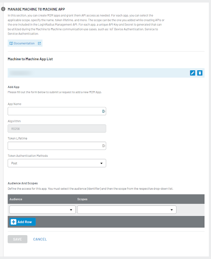
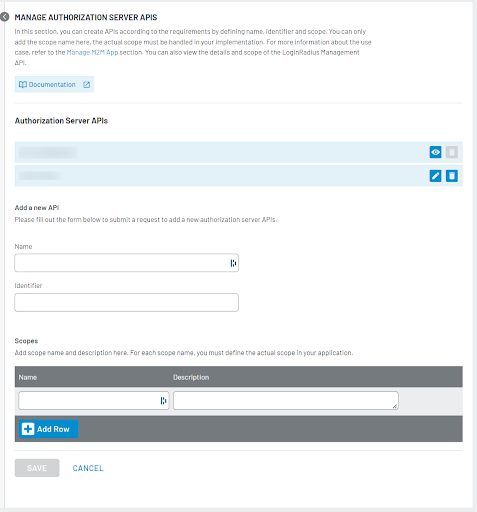
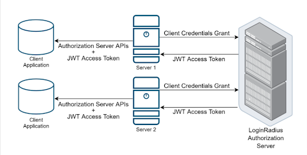

There are many use cases of a system where machine-to-machine (M2M) communication is required, or you need to manage access for internal and external APIs. The example of M2M communications are:

- Service to service
- Daemon to backend
- CLI client to internal service
- IoT tools authorization
- External APIs authorization

In such cases, the generic authentication methods such as email/password and social login — requiring human intervention — don’t fit well. These interactions also need a secure and easy-to-use authorization process for permission-based data access.

M2M Authorization fulfills both these requirements. Let’s know more about what it is and how it works.

## What is M2M Authorization?

M2M Authorization is the process of providing remote systems with secure access to information. Using this process, business systems can communicate autonomously and execute business functions based on predefined authorization.

It is exclusively used for scenarios in which a business system authenticates and authorizes a service rather than a user.

LoginRadius M2M Authorization uses the [Client Credentials Grant Flow](#client-credentials-grant-flow) (defined in OAuth 2.0 RFC 6749), in which the client passes along secure credentials to authenticate themselves and receive an authorization token.

## How LoginRadius M2M Authorization Works

Suppose an organization has a microservices environment consisting of multiple services running locally. The organization also has data storage on a different network and requires:

- One service to archive data to that storage at regular intervals
- Another service to read data from that storage at regular intervals

As a standard process and security measure, services require authorization while saving and reading the data to and from the storage. The organization can use LoginRadius for autonomous authorization by creating two dedicated M2M apps with write and read permissions.

The following two scenarios explain how you can use LoginRadius M2M Authentication and Authorization to share permission-based access of APIs to any internal or external systems:

> **Important:** M2M App referred to in the scenarios below must be created individually for each internal or external system you want to grant access to. Upon app creation, you receive the Client Id and Client Secret.

**[Scenario 1](#implement-m2m-authorization-with-loginradius-apis):** To grant desired access to your LoginRadius Management APIs.

To start using the M2M Authorization for this scenario, you need to create an M2M App and define the desired scope of API(s), as [explained here](https://www.loginradius.com/docs/api/v2/single-sign-on/Machine-to-Machine/overview/#adminconsoleconfigurationformmauthentication3).



**[Scenario 2](#implement-m2m-authorization-with-business-apis):** To grant desired access to your Business APIs.

To start using the M2M Authorization for this scenario, you need to define your API in LoginRadius with name, identifier, and scope details and then create an M2M App with the desired scope of API(s), as [explained here](https://www.loginradius.com/docs/api/v2/single-sign-on/Machine-to-Machine/overview/#adminconsoleconfigurationformmauthentication3). 



In both scenarios, you get the Client Id and Client Secret for the created app, which you need to share with the partner or service who wants to access your APIs.

### Client Credentials Grant Flow
LoginRadius M2M Authorization uses client credentials grant flow from OAuth 2.0. In this flow, the client (depicted as Server 1 and Server 2 in the diagram below) holds Client ID and Client Secret and uses them to request an access token.

This grant-type flow occurs strictly between a client app and the authorization server. The user does not participate in this grant-type flow.



- The client (server) requests with the Client ID, Client Secret, Audience, and Claims to the authorization server.

- If the request is valid, the authorization server sends a JWT access token to the client (server). 

- The client (server) uses the JWT access token to call LoginRadius Management or your APIs. APIs share data according to permissions given against the M2M app without using client Secret in this step.

## Implement M2M Authorization with LoginRadius APIs
1. The client (partner, API, service, etc.) requests the access token using the following API:
  
    API endpoint: https://api.loginradius.com/services/oauth/token

    The following is an example request:

    ```
    POST https://<LoginRadiusAppName>.hub.loginradius.com/service/oauth/token
    Content-Type: application/json
    {
      "audience": "https://api.loginradius.com/identity/v2/manage",
      "grant_type": "client_credentials",
      "client_id": "<YOUR_CLIENT_ID>",
      "client_secret": "<YOUR_CLIENT_SECRET>"
    }
    ```

2. LoginRadius Authorization Server validates the request. Upon validation, it returns the JWT access token to the client.
 
    The following is an example response with an access token:

    ```
    {
      "access_token": "eyJz93a...k4laUWw",
      "token_type": "Bearer",
      "expires_in": 86400,
    }
    
    JWT Token Details
    {
      "iss": "https://<LoginRadiusAppName>.hub.loginradius.com/",
      "sub": "<OAuth APPs APIKey>@client",
      "jti": "<unique Identifier>"
      "aud":"https://api.loginradius.com/identity/v2/manage",  //or https://service.example.com/api/v2
      "cid": "<APPConfig APIKey>",
      "sid": "<LR access Token>"  
      "exp": 1311281970,
      "iat": 1311281670,
      "scp": [
        "profile:read",
        "profile:create",
      ],
      "gty":"client_credentials"
    }
    ```

3. The client can call APIs (as per the defined scope) using the JWT token. APIs will work based on permissions without the use of Client Secret.

    ```
    curl --request GET \
      --url https://api.loginradius.com/identity/v2/manage/account/{uid} \
      --header 'authorization: Bearer eyJhb……….jVZ2w'
      --header 'X-LoginRadius-ApiKey: {apiKey}
    ```
 
4. The respective API(s) will work according to the scope or permission.

## Implement M2M Authorization with Business APIs 
1. The client (partner, API, service, etc.) requests the access token using the following API:
API endpoint: https://<LoginRadiusAppName>hub.loginradius.com/service/oauth/token

    ```
    POST https://<LoginRadiusAppName>.hub.loginradius.com/service/oauth/token
    Content-Type: application/json
    {
    "audience": "<business API endpoint>",
    "grant_type": "client_credentials",
    "client_id": "<YOUR_CLIENT_ID>",
    "client_secret": "<YOUR_CLIENT_SECRET>"
    }
    ```
    
    > **Note:** Where `<LoginRadiusAppName>` is the name of your LoginRadius App.
    In response, the client will get an access token. 

2. Use the generated JWT token in the authorization for APIs.

    ```
    curl --request GET \
    --url < API URL > \
    --header 'authorization: Bearer eyJh………VZ2w'
    ```
  
3. The client will get access to the information as per the defined scope.
 
## LoginRadius M2M Authorization — Benefits

Overall, M2M Authorization offers secure access to improve business efficiency — and ultimately enhances user experience. In detail, the benefits include but are not limited to:

- Secure data access across internal and external business systems
- Granular data access with predefined scopes with minimal configuration
- Efficient authentication and data exchange 
- Grant, limit, or block access permissions at any time

## Conclusion

M2M Authorization is a secure and reliable method of autonomous interactions. It aids business systems in achieving greater efficiency and eliminates the need for human involvement. It also enables businesses to provide flexible machine-to-machine communication while enforcing granular access, authorization, and security requirements.
