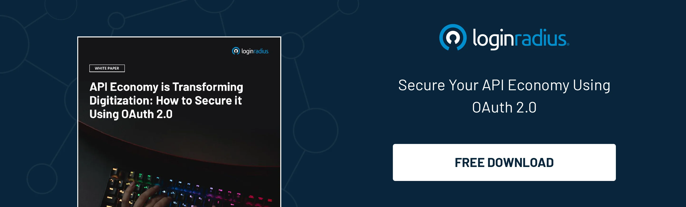

---
title: "A comprehensive guide to OAuth 2.0 "
date: "2025-03-27"
coverImage: "what-is-oauth2-0.webp"
author: "Kundan Singh"
tags: ["Oauth", "Authorization Code Flow","Authorization","Authentication"]
description: Ever clicked "Login with Google"? That’s OAuth 2.0 behind the scenes—securely granting apps access to your data without sharing passwords. In this guide, we break down what OAuth 2.0 is, how it improves upon OAuth 1.0, and why it’s become the industry standard for secure authorization in APIs, mobile apps, and web platforms.
metatitle: "OAuth 2.0 Explained: A Complete Guide to Secure Authorization"
metadescription: "Discover how OAuth 2.0 works, why it replaced OAuth 1.0, and how it secures modern applications. Learn about access tokens, grant types, and real-world use cases."
--- 

## Introduction

Have you ever used "Login with Google" or granted an app permission to access your private files from the cloud? That’s OAuth 2.0 in action. 

OAuth 2.0 is a secure authorization framework that allows applications to access your data without having to share passwords. While often mistaken as an Authentication framework, OAuth 2.0 strictly deals with authorization, using access tokens to grant permissions to resources for a specified period.

However, if you’re also unclear about how authentication differs from authorization? Check out our detailed blog:[ Authentication vs. Authorization](https://www.loginradius.com/blog/identity/authentication-vs-authorization-infographic/).

OAuth 2.0 is an important part of modern authorization. It helps platforms keep access controls secure and organized. It also makes it easy to manage user interactions. 

In this blog, we will break down how OAuth 2.0 works, why it is important and how it improves upon its predecessor,  OAuth 1.0.

## What is OAuth 2.0?

OAuth 2.0 is a [token-based authorization](https://www.loginradius.com/blog/engineering/authorization-code-flow-oauth/) framework that provides access to resources without sharing user credentials. Suppose you have some pictures in a cloud drive that you wish to print from a local photo printing shop. You can enable the print shop to access your photos in this drive without sharing your password by using OAuth 2.0 authentication. 

This keeps your account safe. It lets the shop access the information it needs. It also makes sure they cannot see anything else in your personal account. In essence, OAuth 2.0 serves the purpose of managing privacy and safety of your information as well as granting the permissions needed.

## Need for OAuth 2.0

Before OAuth, users had to share actual credentials (username and password) with applications that needed to access their data. We all understand why this approach was risky. 

### OAuth 1.0: The First Step Toward Secure Authorization

OAuth 1.0 introduced a token-based system to eliminate this need for credential sharing. Users could now grant limited access to their data via tokens. However, OAuth 1.0 had these limitations:

* Challenging to implement as every API request required cryptographic signatures.

* Difficult to adapt to new use cases, such as mobile apps.

* Cumbersome to extend sessions as there were no standardized tokens.

### OAuth 2.0: A More Flexible and Scalable Solution

OAuth 2.0 was not just an upgrade—it was a complete rewrite designed to be more developer-friendly, scalable, and secure. 

Key improvements included:

* Access tokens replaced API request signing, thereby reducing complexity.

* OAuth 2.0 introduced different grant types for different use cases, helping reach mobile app users.

* Seamless authorization flows with fewer steps for users, improving overall experience.

* Standardized refresh tokens allowed maintaining access without storing credentials.

With these improvements, OAuth 2.0 became the industry standard for authorization, used by platforms like Google, Facebook, and Microsoft.

### Key Differences Between OAuth and OAuth2.0

<table>
  <tr>
   <td><strong>Feature</strong>
   </td>
   <td><strong>OAuth 1.0</strong>
   </td>
   <td><strong>OAuth 2.0</strong>
   </td>
  </tr>
  <tr>
   <td><strong>Architecture</strong>
   </td>
   <td>More complex, requires cryptographic signatures for every request.
   </td>
   <td>Simpler, uses access tokens for authorization.
   </td>
  </tr>
  <tr>
   <td><strong>Security</strong>
   </td>
   <td>Relies on request signing and shared secrets for security.

Medium
   </td>
   <td>Focuses on token-based security with various grant types.

High (if implemented correctly)
   </td>
  </tr>
  <tr>
   <td><strong>Mobile Support</strong>
   </td>
   <td>Less suitable for mobile apps due to complexity.
   </td>
   <td>Designed with mobile apps in mind, offering simpler flows.
   </td>
  </tr>
  <tr>
   <td><strong>Token Handling</strong>
   </td>
   <td>Uses request tokens and access tokens, requiring more steps.
   </td>
   <td>Uses access tokens, refresh tokens, and authorization codes, depending on the grant type.
   </td>
  </tr>
  <tr>
   <td><strong>Scalability</strong>
   </td>
   <td>More challenging to scale due to complex signature requirements.
   </td>
   <td>Highly scalable and flexible, supporting various use cases.
   </td>
  </tr>
  <tr>
   <td><strong>User Experience</strong>
   </td>
   <td>Can be more cumbersome for users due to multiple steps.
   </td>
   <td>Offers smoother user experience with simpler authorization flows.
   </td>
  </tr>
</table>

## How OAuth 2.0 Works

**The following parties are important to understand the process:**

**1. User (Resource owner)**: Usually the end-user who has the data and grants permission.

**2. Client:** The service or application seeking access to the user’s data.

**3. Authorization Server:** The system that verifies the users and issues access tokens.

**4. Resource Server:** The service or application that holds the user’s data and grants access only when a valid token is available.

### Basic OAuth 2.0 Flow:

1. The client seeks permission from the user to authorize access.

2. The user is taken to the Authorization Server to grant or deny access.

3. If approved, the Authorization Server provides an authorization code to the client.

4. The client utilizes the authorization code to acquire an access token from the authorization server.

5. The client uses the access token to request protected data from the Resource Server.

This approach guarantees that the applications receive the exact permissions required from the resource owner without ever accessing the password.

## OAuth 2.0 Access Tokens and Authorization Code

The access token is a temporary key that allows an application to access resources. It gets issued after a successful authorization code exchange and has an expiration time for security purposes. It is often paired with a refresh token, which allows for extended access without re-authentication.

## Getting Started with OAuth 2.0 Using LoginRadius

Ready to implement OAuth 2.0? LoginRadius makes it easy to get started in just a few steps.

### 1. Set Up Your Application

Log into the[ LoginRadius Admin Console](https://accounts.loginradius.com/auth.aspx?return_url=https://console.loginradius.com/login&action=register) and go to **Applications > Apps**. Click **Add Apps**, name your app, choose **OAuth 2.0** as the protocol, and select the appropriate app type (e.g., Native, SPA, Web, or M2M). Hit **CREATE** to generate the config.

### 2. Configure OAuth Settings

Fill in key fields like:

* **Client ID & Secret** – credentials for your app 

* **Grant Types** – select one or more flows (Authorization Code, PKCE, etc.) 

* **Redirect URLs & CORS Origins** – for secure callback and cross-origin access 

* **Token Expiry & Reauthentication** – define token lifespan and re-login behavior 

Click **Save** when done.

### 3. Enable Identity Providers

Toggle on the login options (social or custom) your app will support. This gives users flexibility to sign in with their preferred IDP.

### 4. Refresh Tokens When Needed

Use the refresh token API to renew access tokens without making users log in again. Just pass the client_id, grant_type, and refresh_token in a POST request.

LoginRadius supports all major OAuth 2.0 flows, making it easy to build secure, scalable login across apps, APIs, and devices.  

Do check our [technical documentation ](https://www.loginradius.com/docs/single-sign-on/federated-sso/oauth-2.0/overview/?q=oauth)covers everything in detail—from authorization flows to token handling.

## What is an Authorization Grant, and What Are the Key Types?

**OAuth 2.0** offers different ways (grant types) for applications to obtain an access token, depending on their needs:

* **Authorization Code Grant**: This is intended for web and mobile apps as it mandates a code exchange for security.

* **Implicit Grant**: A less complex flow that is not recommended anymore for security reasons.

* **Client Credentials Grant**: This is designed for appliance-to-appliance communications.

* **Resource Owner Password Credentials Grant**: This allows users to log in with their credentials, although it is not very popular because of security challenges.

* **Refresh Token Grant**: It allows maintaining login for a user for an extended period without them having to log in again.

## Why Your Business Needs OAuth 2.0

Safeguarding sensitive information should be a top priority in today’s digital world, and OAuth 2.0 makes it easier to minimize risks associated with security breaches by limiting applications to only the information they have access to. 

Businesses that manage large quantities of data or function in highly regulated markets need compliant OAuth 2.0 implementations to maintain trust and compliance. Implementing an OAuth 2.0 system brings the following advantages:

* **Better Security:** Organizations can eliminate unauthorized access to sensitive information by reducing the use of passwords and utilizing tokens instead, making their security measures more effective.

* **Improved User Experience:** Users can easily simplify the authentication process by easily granting or denying access to different applications.

* **Scalability:** OAuth 2.0 is widely adopted by numerous services ranging from Google to Facebook as it enables use across a wide range of platforms.

* **Flexibility:** Consistent access across various devices and platforms is guaranteed as OAuth 2.0 works on numerous devices and enables multiple environments.

## Conclusion

OAuth 2.0 has become the go-to authorization option due to its versatile support of multi-services, APIs, and websites and its capacity to ease secure access. 

Leveraging platforms like LoginRadius makes the design and maintenance of an OAuth 2.0 workflow much easier. It simplifies the authorization process for your users and your business's security, regardless if your company is using web apps, mobile apps, or APIs.

Contact us today and book a live participation demo to see how you can improve your security infrastructure. Start here: [to book a live demo](https://www.loginradius.com/contact-us). 

## **FAQs**

### **1. What is Open Authorization?**

**A:** Open Authorization (OAuth) is an open-standard authorization framework that allows applications to access a user's data without exposing their credentials. Instead of sharing passwords, OAuth uses access tokens to grant limited and secure access to resources. 

### **2. What are the key components of OAuth2?**

**A:** The key components of OAuth 2.0 include User aka Resource Owner, Client (Application), Authorization Server, Resource Server, and Access Token

### **3. What is the auth token?**

**A:** An auth token (authentication token) is a digital credential used to verify a user's identity and grant access to a system without requiring repeated logins. It is typically a temporary, encrypted string issued by an authentication server after a successful login. Common types include OAuth 2.0 access tokens and JWT (JSON Web Tokens).