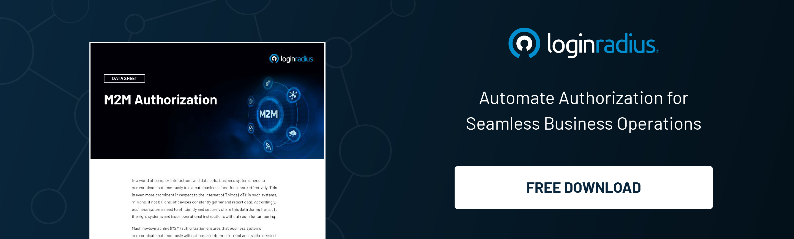

## What is Passkey?

Passkey authentication provides a highly secure, passwordless login experience tailored for modern authentication needs. Built on FIDO2 and WebAuthn standards, it addresses key vulnerabilities like data breaches and phishing attacks by leveraging cryptographic key pairs.

Unlike traditional passwords, which are often reused and stored on vulnerable servers, passkeys store private keys securely on user devices. This ensures that even in case of a server breach, user credentials remain safe.

For developers, [passkeys simplify integration](https://www.loginradius.com/docs/api/v2/customer-identity-api/passkey/overview/), reduce the need for password management, and comply with cutting-edge authentication protocols, paving the way for a passwordless future.

## How Do Passkeys Work?

Passkeys operate on a private-public key mechanism. To understand, we need to look at their registration and authentication processes.

    1.  Registration: A user’s device generates a cryptographic key pair via WebAuthn APIs during registration.
        -   The private key is securely stored on the user’s device and never shared.
        -   The public key is sent to the server to validate authentication requests.
    2.  Authentication:
        -   The server issues a cryptographic challenge to the user’s device.
        -   The device uses the private key to sign the challenge.
        -   The server verifies the signed challenge using the public key, granting access if the verification is successful.
        

This process ensures that sensitive data never leaves the user’s device, making passkeys significantly more secure than passwords. Developers can streamline implementation using tools like WebAuthn.js, ensuring compliance with [modern authentication](https://www.loginradius.com/platforms/authentication-and-registration) protocols and providing a seamless user experience.

## How Are Passkeys Used on Multiple Devices with Different Users?

Passkeys are designed to function seamlessly across devices through cloud services like Apple’s iCloud Keychain and Google’s Password Manager. These services securely synchronize passkeys, enabling users to authenticate without manually transferring credentials.

For shared devices, passkeys protect each user’s private keys using biometrics or PINs. By adhering to FIDO2 and WebAuthn standards, passkeys ensure cross-platform compatibility, making them a versatile choice for diverse ecosystems. Developers can effortlessly implement these features to cater to multi-user and multi-device scenarios.

## Passkey vs Password: Why are Passkeys a Better Choice?

The comparison between passkey vs password underscores why passkeys are revolutionizing authentication:

-   **Enhanced Security**: Passkeys are inherently resistant to threats like phishing, brute force attacks, and credential reuse. In contrast, passwords often fall victim to these vulnerabilities due to weak user practices or targeted attacks.
    
-   **Improved Usability**: Users no longer need to manage or memorize complex password strings, significantly reducing frustration and the likelihood of human error. With passkeys, authentication is both seamless and secure.
    
-   **Simplified Developer Workflows**: For developers, passkeys eliminate the burden of managing sensitive password data, streamlining the implementation of secure authentication systems. This reduces the overhead associated with password storage, encryption, and recovery mechanisms.
    

Moreover, passkeys mitigate the risks associated with server-side breaches by ensuring that sensitive user credentials are never stored centrally, setting a new standard for modern authentication.

## Are Passkeys Safer than Passwords?

When asking are passkey logins safe, the answer is unequivocally yes. Passkeys are designed with robust security features to protect users and organizations.

They provide phishing resistance by eliminating the need to input sensitive credentials manually. Private keys never leave the user’s device, ensuring that even in the event of a server breach, user credentials remain uncompromised.

Most passkeys are further protected by biometrics such as fingerprints or facial recognition, adding an additional layer of security.

Moreover, passkeys can complement existing [multi-factor authentication](https://www.loginradius.com/platforms/multi-factor-authentication) (MFA) systems, creating a comprehensive and secure framework without increasing user complexity. Passkeys offer developers a scalable and safe authentication alternative that is easier to manage than traditional methods.

## Why Choose LoginRadius for Passkey Authentication?

Image: A screenshot of LoginRadius Passkeys

LoginRadius simplifies the [adoption of passkey](https://www.loginradius.com/products/passkeys) authentication for developers and businesses. The platform offers developer-friendly tools like SDKs and APIs that make integration faster, supporting compliance with FIDO2 and WebAuthn standards.

### Key Benefits

    -   Scalability: Built to handle millions of users, ensuring performance at scale.    
    -   Security Compliance: Adheres to global standards such as GDPR and CCPA.    
    -   Developer-Friendly: Comprehensive documentation and tools for seamless integration.
    

Learn more: [How to implement passkey authentication with LoginRadius](https://www.loginradius.com/docs/authentication/tutorial/passkey-authentication/)

## Conclusion

As we move into 2025, passkeys will become an integral part of secure authentication systems, widely implemented across industries.

For developers, they simplify integration by eliminating the need to store and manage sensitive credentials, reducing both risks and operational overhead. For users, passkeys provide consistent and secure access across devices without relying on passwords, enhancing both security and usability.

This evolution signifies the shift toward a more streamlined and robust passwordless future.