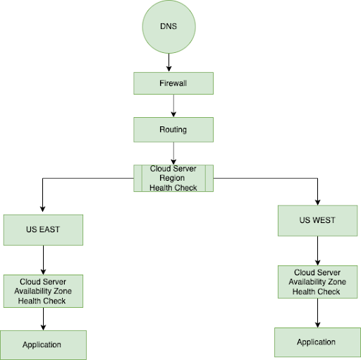
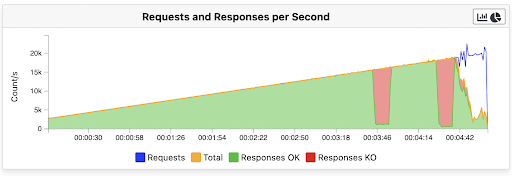
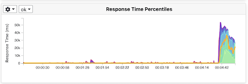
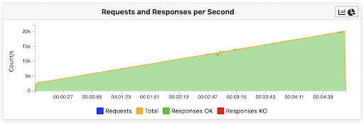
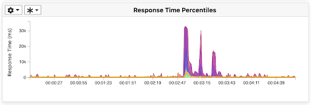

## Introduction
Currently, the LoginRadius Identity Platform processes more than 100K requests per second. As our developer and enterprise customers grow, we should be able to scale our APIs to handle staggering loads of requests per second. It won’t be surprising if our APIs have to serve a million requests per second in the future.

Generally, we add more instances, CPU, or memory for supporting high request volumes. However, it has been burdening our infrastructure budget and maintenance. 

So, we’re focused on reducing the cost of compute capacity by improving efficiency. In this engineering update, we share our experience with a highly effective, low-risk, large-scale performance and cost optimization with Go.

LoginRadius production environment consists of 30+ microservices backed by a cloud-native infrastructure. Most of these services are written in .NET and Node.js. In Q1 2021, we explored the possibilities of improving the performance of our services and optimizing costs.

## How LoginRadius Has Been Handling High RPS Throughput?
LoginRadius tech stack consists of 30+ microservices. We have different microservices for each business service like Authentication, Web SSO, Federated SSO, etc. 

- We have developed application microservices in various languages per the prevailing microservice use case.

- We have deployed our application in a multi-cloud environment across AWS, Azure, and Google Cloud by leveraging multiple availability zones and regions.

### 1) Architecture

**Core Applications:** Multiple microservices instances for Authentication, Account API, Analytics API, Risk-based Authentication, Backend Jobs, Integrations, and much more, 

**Data Storage:** MongoDB, Elasticsearch, Redis, and PostgreSQL clusters are used to store a range of datasets for various applications and functionalities.

**Queues:** Amazon Kinesis Data Streams, Amazon Simple Notification Service (SNS), Amazon Simple Queue Service (SQS), and Azure Queue Storage. 

**Other Services:** Services for rate-limiting, bcrypt clusters, feature flags, and more.

**Routing:** AWS load balancers (ALB, NLB, and ELB from AWS) and some nodes running NGINX as a proxy.

### 2) Availability

We've been utilizing a multi-cloud and multi-region architecture for years based on our and our customers’ data and privacy compliance requirements. However, as our usage (and load) grew with maintenance costs, we relied more on AWS resources.

- We are using multiple regions and multiple availability zones as per region.
- We are using terraform scripts to provision new environments. This infrastructure automation allowed us to quickly scale from thousands of requests per second to hundreds of thousands of requests per second.  

This is the basic architecture of the environment in the US:

Each request is processed as follows:

The above diagram shows two cloud regions — US East and US West.

When requests come:

- First, our infrastructure checks the primary region's health. If health is good, all requests are served by the primary US East region with three separate availability zones. 

- If health checks fail for the primary region, the US West region serves all the requests with three separate availability zones.

**So, how do we maintain high availability?**

Every availability zone has operating instances of all services (including databases). If one availability zone is down, we still have two availability zones.
 
### 3) Scaling

We are using a two-pronged scaling approach as scaling based on resource utilization (CPU & Memory) alone is not practical.

1) Traffic-based scaling
2) Based on CPU & Memory utilization

#### Why Scaling Was Challenging?

Once, our multi-tenant application received a sudden spike in API requests — from thousands of requests to millions. Usually, adding new infrastructure to the existing pool takes around 60 seconds. And application deployment and start-up time was around 90 seconds. So, we lose about 5 minutes for scaling up. 

Further, adding the time to gather metrics and make the scaling decision, the total delay can be ~6 minutes. This process can impact all multi-tenant customers' critical applications because user authentication and authorization are essential.

We keep *Scaling Buffers* to support this kind of scenario.

> **Scaling Buffers:**  During the *Scale-up Time*, the *Scaling Buffer* is the service's highest predicted traffic spike. Depending on the scaling strategy, we store several types of the buffer.

Usually, we set a one million requests concurrency buffer. And based on the traffic pattern, our scaling automation triggers the scaling.

## Why Our Platform Performance Was Good, But Not Great?
Our Platform performance is good. We can quickly handle millions of requests, and our application platform was scalable but not great. Minding the kind of growth we’re expecting, we wanted to improve and prepare our platform for the future.

### Challenges in the Existing Platform

#### 1) Startup Time
No. of requests can fluctuate within a few seconds if not minutes or hours, especially with specific events such as holiday shopping, promotional events, Black Friday, etc. So, in the event of traffic spikes, application startup time plays a significant role in scaling.

Our application startup time was around 90 seconds, so whenever scaling was happening due to high traffic, scaling took more time. That's why we needed to improve the application startup time.

#### 2) Cost

We used hundreds of *AWS c5.2xlarge* instances in a production environment to handle daily traffic. During certain events such as holiday shopping and Black Friday, we doubled our infrastructure according to expected traffic with a 20~30% buffer. We kept a high buffer because scaling took time with the existing .NET Core services. As a result, infrastructure cost was burdening as we were inefficiently deploying cloud infrastructure.

#### 3) Lack of Flexibility and Customization

We designed the platform a few years ago. Since then, the technology landscape has dramatically improved and optimized in recent years. So, current technology platforms have their limits, and it is crucial to properly align their functionality with their capabilities. 

We were facing challenges in customization. It was inflexible and limiting to deliver the required outcomes in more complex situations and use cases.

## The Road to Lightning Performance, Thanks to Go

### Why *Go*?

We did a lot of research to choose the appropriate programming language for our application. We needed a language that would be simple to understand and learn, easy to maintain, and has high concurrency. Our research ended with Go due to its amazing qualities.

Let's take a closer look. *Why choose Go? What makes Go such an excellent development language? What distinguishes it from the competition?* 

Let's get to the bottom of this by looking at what makes Go special.

### Go — Background

Go is an open-source programming language developed by Google's Rob Pike, Robert Griesemer, and Ken Thompson. It was initially released in 2009. It has several enhancements and additions based on the C syntax to properly control memory use, manage objects, and enable static or strict typing along with concurrency.

#### 1) Concurrency

Concurrent code can be executed in parallel by separate computer cores or in sequence. Most programming languages lack concurrent execution when working with multiple threads. They often slow down programming, compiling, and execution.

Go works with goroutines that are lightweight, low-cost threads. And Go channels allow goroutines to communicate with one another. 

Sequential Processes Communication: They are very similar to threads in Java but lightweight, and the cost of creating them is meager.

#### 2) Performance

Go's core value is simplicity: it builds quickly, runs quickly, and is simple to learn. To help speed things up, there are no classes or type inheritance. This makes it easier to build a market-ready product quickly. Furthermore, its simplicity allows for quick and simple maintenance.

#### 3) Standard Library

Go has an excellent standard library that includes a large number of built-in essential type functions and packages that are both practical and straightforward to use: I/O, encoding and decoding, manipulating raw bytes, network utility functions, parsing, debugging, and a lot more are all made simple by particular packages. Testing support is also included in the standard library, so no other dependencies are required.

#### 4) Easy to Learn

Go has a simpler syntax than other languages and is simple to learn. The syntax of Go is somewhat similar to the C language. Developers can begin with Go in a couple of hours, but they need to spend time understanding best coding practices, especially understanding goroutines for concurrency.

## Benchmarking API Performance Gains

We run benchmarks on our API so that the performance insights help us make decisions about the tech stack. It will paint a clearer picture of where we stand compared to our existing tech stack and what areas need improvement or immediate attention. 

We did multiple stress tests on our high usage APIs built separately with .NET Core(Old) and Go (new). 

We are using Kubernetes to deploy and manage our microservices and application infrastructure and deploy our application microservices across multiple Pods.

### Stress Test Scenario  
| Test Item | Value |
| --- | --- |
| Instance Type | c5.2xlarge on AWS |
| No. of Instances | 20 |
| Reverse Proxy | NGINX |
| Concurrent Requests | 20K per second |
| Duration | 5 minutes |
| Stress Test Tool | [Gatling](https://gatling.io/) | 

We deployed both applications in the same infrastructure and did the same stress test. 
Golang application has performed much better.

#### Existing Application Matrix — .NET Core

<figure align="center">
  
  <figcaption> Graph - 1(a): Requests and Responses per Second (.NET Core)</figcaption>
</figure>
 
<figure align="center">
  
  <figcaption> Graph -1(b): API Response Time (.NET Core)</figcaption>
</figure>

<figure align="center">
  
  <figcaption> Graph - 1(c): Overall Matrix (.NET Core)</figcaption>
</figure>

You can see some errors in Graph - 1(a) after ramping up to 15K users. Also, response time is increasing, as seen in Graph - 1(b).

The application can recover after a couple of seconds, and after that, the application cannot respond. Application scaling is taking time. And existing infra cannot handle this spike, so the application crashes after 18K RPS.

#### New Application Matrix — Go

We did the same stress test with the new Go application. It is easily able to handle this kind of concurrency without any issue. 

<figure align="center">
  
  <figcaption> Graph - 2(a): Requests and Responses per Second (Go)</figcaption>
</figure>
 
<figure align="center">
  
  <figcaption> Graph -2(b): API Response Time (Go)</figcaption>
</figure>

<figure align="center">
  
  <figcaption> Graph - 2(c): Overall Matrix (Go)</figcaption>
</figure>

The Go application can easily handle 20K ramp-up requests per second without any issue, as shown in Graph -2(a).

You can see in Graph - 2(b) what the response time was after 2 min 47 sec for a couple of seconds. The Go application was scaling during that time. It is scaling quickly, so it is not impacting API request performance, and, also, the application can recover response API time as expected. 

## Conclusion

In this article, you have learned how we have achieved better API performance by rebuilding them in Go, which were previously built in .NET Core. And you have understood our approach to this transition and how it increased the API performance of the LoginRadius Identity Platform.

Leverage LoginRadius Identity Platform to build authentication functionality for your web and mobile apps. [Sign up for a free LoginRadius account here](https://accounts.loginradius.com/auth.aspx?action=register)