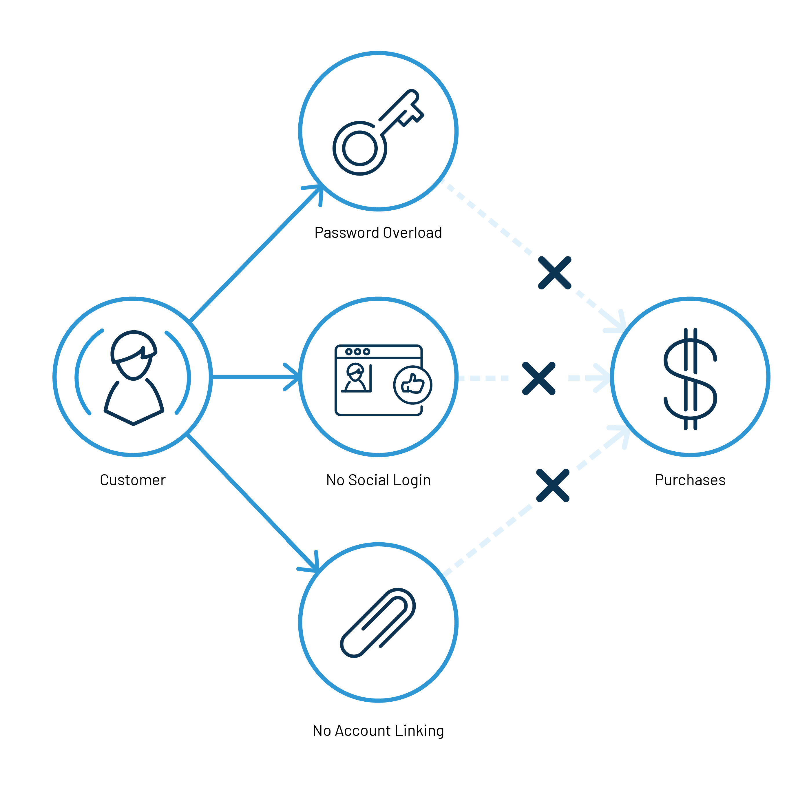

Single sign-on authentication, or SSO, is becoming more commonplace as the digital revolution continues to evolve. With numerous benefits for customers and companies alike, [SSO helps](https://www.loginradius.com/blog/2019/05/what-is-single-sign-on/) streamline user experience, aid movement between applications and services, and secure the transfer of pertinent information about customers between organizations.

- [**Web SSO**](https://www.loginradius.com/web-and-mobile-sso/) means that your customers have only one set of login details for all of your services and can switch seamlessly between applications. **Mobile SSO** allows your customers to switch seamlessly between mobile applications if you have more than one. SSO also allows user access to multiple applications without the need for separate login accounts.
- [**Federated SSO**](https://www.loginradius.com/federated-sso/) uses a range of industry-standard protocols including SAML, JWT, OAuth, OpenID Connect, and more to allow the same seamless experience between service applications from a range of providers and sources.

Why is it time to use SSO as part of your customer authentication process? Here are three compelling reasons:

## 1. Consumers Expect SSO

Today’s customers expect SSO. They might not be able to articulate this expectation in words, but as a matter of course, many customers already use single sign-on authentication in services every day. This means that the customer-facing features of SSO are now considered to be a minimum standard of customer convenience. Simply put, SSO is a service that most customers expect from every online company.

If you have more than one website or service that requires logging in, you _need_ [single sign-on](https://www.loginradius.com/single-sign-on/) if you don’t want to annoy your customers and appear behind the times. With single sign-on, you can eliminate several common roadblocks that can hurt your business.

For example, we heard from a consumer in the UK that there's a customer experience disconnect between different divisions at Virgin. People getting cable TV and home broadband services from Virgin Media are encouraged to sign up for Virgin Mobile with several competitively priced offers. However, even though the sites look similar, consumers need to have two separate logins for the two Virgin services. They even have different rules for password strength.

I’m sure you can think of examples of your own, perhaps where (like with Virgin) you can’t even choose to use the same sign-in details if you want to. Maybe others require you to log in to different services from the same company repeatedly.

Don’t be one of these companies. You probably won’t end up with frustrated customers, since they’ll end up voting with their feet (and leaving you for another provider).

## 2. SSO Makes Companies Smarter

A unified customer profile is the first step to a smarter company. With [CIAM](https://www.loginradius.com/blog/2019/06/customer-identity-and-access-management/), you’ll have a single location for everything about individual customers (including their login and service usage data).

What’s more, CIAM creates a unified customer profile on which to base all other metrics and predictions. Customer-specific data can be used in marketing, sales, customer support, content planning, product development, customer security, and more. [Unified customer profiles](https://www.loginradius.com/blog/2017/08/unified-customer-identities-increase-ecommerce-conversions-revenue/) are simply a brilliant resource for rich data, metrics, and analytics that multiple departments can use.

## 3. Single Sign-on Saves Money

By reducing the number of separate sign-in databases and systems you need to maintain and service, SSO reduces maintenance costs for every application or service that would previously have needed a separate login system.

A centralized identity solution also streamlines the creation of new apps and services by providing a “drop-in” solution for logging in, and for a multitude of useful data gathering methods. An effective **enterprise SSO solution saves money** in the long term _and_ short term by making it easier than ever to collect customer data and user credentials in one secure spot.

## 4. SSO Improves Conversion Rate

By leveraging Single Sign On (SSO), brands can reduce the barriers to entry for users and bring them onto a single platform. That’s one login, one set of credentials, one consistent experience.

Easy site navigation is the key to making a site user-friendly. The process should be quick and simple, allowing users to get in and get out without hassle. 

Now busines
ses can link their consumers to their own applications in just one click, making it easy to log in with the service they choose.

Faster, less cluttered sign-ups result in more loyal users. No wonder, SSO is gradually becoming the new, industry-standard solution to increase conversion rates across web and mobile properties. 

## 5. SSO Cuts Down Churn Rate

You need to focus fiercely on consumer retention during the initial days of your business. If you’re not in the top 10, you’re nowhere. That means that you need to convince your users to stick around and keep using your service from day one. 

According to [a Localytics study](https://andrewchen.com/new-data-shows-why-losing-80-of-your-mobile-users-is-normal-and-that-the-best-apps-do-much-better/), if you can keep 80% of your users around after Day 1, you're on track to be on top 10. But, if you can't keep 40% around after Day 1, you won't make the top 100. 

Although your frequent users are unlikely to lose their log-in credentials, a third of your user base isn't yet on a daily basis. If they forget their details, there's a good chance you'll never see them again.

Without any need for passwords, SSO enables your users to come back to your app seamlessly. It's like leaving the porch light on for them: it makes them feel involved.

## **So Why Does My Business Need SSO Authentication?**

Single sign-on directly benefits your organization by gathering a wealth of customer data and credentials securely in one spot for your services, teams, and applications to use. Failing to use SSO will make your consumers notice you in a bad light as they try to navigate your apps and services. By contrast, leaders who bring an SSO solution to their organization will stand out because of the multitude of benefits that single sign-on provides.

Find out more about enterprise SSO authentication and how to get it by downloading the LoginRadius SSO 

