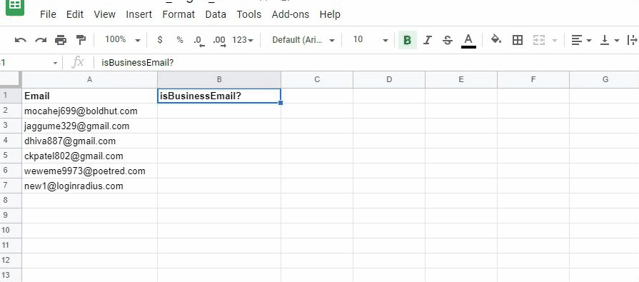

Suppose, You have a massive amount of data and are going to add them to your new product campaign. You are probably not sure that all of them belong to the right audience; some might be spam or disposable emails.

#### Now the actual problem is that how can I do validate so many email addresses?

Well, it would be great to verify them all together in a single shot with 100% accurate results without any manual interaction.

I am writing this article, as so many of us have the same concern and are looking for a business email validator that can resolve this problem with high accuracy.

Here we have the tool [EVA](https://eva.pingutil.com/) (Email Verification APIs), which provides excellent email verification services with their open APIs.

## EVA service with Google Sheet

Google allows you to create scripts using your custom functions with the service you wanted to use. You can make these functions in standard JavaScript with a basic [understanding of JS](https://www.loginradius.com/blog/async/understanding-jsonp/). Here is the guide to start with [Custom Functions in Google Sheets](https://developers.google.com/apps-script/guides/sheets/functions).

## Custom Function

`=eva(email)`

Eva needs the email address only from you and the rest will perform with their excellent service. Here is the custom function created using the EVA Services to validate email.

```js
function eva(email) {
  var url = "https://api.eva.pingutil.com/email?email="+email;
  var res = UrlFetchApp.fetch(url);

  // Get status of the API
  var status = res.getResponseCode();
  if (status != 200) {
    return false;
  }
  var contextText = res.getContentText();
 
  var result = JSON.parse(contextText);
 
 // Logic to check Business Email
  if (result["data"]["disposable"] === false && result["data"]["webmail"] === false &&  result["data"]["spam"]  === false && result["data"]["deliverable"] === true) {
    return true
  }
  return false;
}
```


## Add Script
We are all set with our script and now need to add this script under Google Script Editor under tools and save it.



## Run Script

That all! Now I need to drag this formula to the entire rows on which I want to perform validation.


Perfect :)

## Setup Trigger
You can set up a trigger to an action (i.e. on open, edit or change in sheet) by navigating tools -> script editor and click on the left alarm icon.


## Conclusion
In this article, I've explained EVA services to validate email addresses in bulk using the google script editor. If you like what you read, leave a "thank you note" in the comment section.
