Before now, you might have been wondering how to implement user authentication in APIs. This process differs from standard web applications where sessions and cookies store the state of authenticated profiles. APIs take a different route to implement this by using usernames and passwords (Basic auth), embedding auth states into tokens (Bearer Token auth), generating keys to identify users (API keys), and many more.

This tutorial will guide you on implementing Basic and Bearer Token authentication into a Flask API.

## Prerequisites

To follow and fully understand this tutorial, you will need to have:

* Python 3.7 or a newer version
* Basic knowledge of Flask
* [Postman](https://www.postman.com)
* A text editor

## Building the Demo Application

Let’s get started with building a demo application where we’ll implement Basic and Bearer Token authentication. We will build our application with Python and Flask, and it will have the following routes:

* Register Route
* Login Route
* User Status Route
* Logout Route

### Installing Required Libraries

We need to install Flask and Flask-HTTPAuth library to get our demo up and running. These libraries provide functionalities that allow Python to create web servers and implement various authentication methods into them.

In the terminal, type:

```
pip install Flask Flask_HTTPAuth Flask_SQLAlchemy Bcrypt
```

### Setting up Our Flask Server

Create a file with the name `app.py` in your text editor and save the code below in it:


```python
from auth import app, db
from auth.models import User
from auth.routes import *

db.create_all()

if __name__ == "__main__":
    app.run(debug=True)
```

The code above references an `auth` module. Let’s proceed to create it so we will store our models, routes, and utility functions.

Create a directory named `auth` in the same location as the `app.py` file. Once this is created, create a file with the name `__init__.py` in the `auth` directory and save the code below in it:


```python
from flask import Flask  
from flask_sqlalchemy import SQLAlchemy  

app = Flask(__name__)  
app.config["SERIALIZER_TOKEN"] = "SERIALIZER_TOKEN"  
app.config["SQLALCHEMY_DATABASE_URI"] = "sqlite:///auth-demo.db"  
app.config["SQLALCHEMY_TRACK_MODIFICATIONS"] = False  
db = SQLAlchemy(app)
```

After this, create a file named `models.py` in the `auth` directory and save the code below in it:

```python
from datetime import datetime
from auth import db


class User(db.Model):
    __tablename__ = "users"
    username = db.Column(db.String, primary_key=True)
    first_name = db.Column(db.String, nullable=True)
    last_name = db.Column(db.String, nullable=True)
    password = db.Column(db.String, nullable=False)
    date_created = db.Column(
        db.DateTime, nullable=False, default=datetime.utcnow)
```

Now, create a file named `utils.py` in the `auth` directory and save the code below in it:

```python
import bcrypt


def hash_password(password):
    return bcrypt.hashpw(password.encode(), bcrypt.gensalt()).decode()


def verify_bcrypt(password, hashed):
    try:
        return bcrypt.checkpw(password.encode(), hashed.encode())
    except:
        return False
```

Once you have done that, create a file named `routes.py` in the `auth` directory and save the code below in it:

```python
from auth import app, db


@app.route("/")
def home_route():
    return "Hello World"
```

Our project folder should resemble the image below:

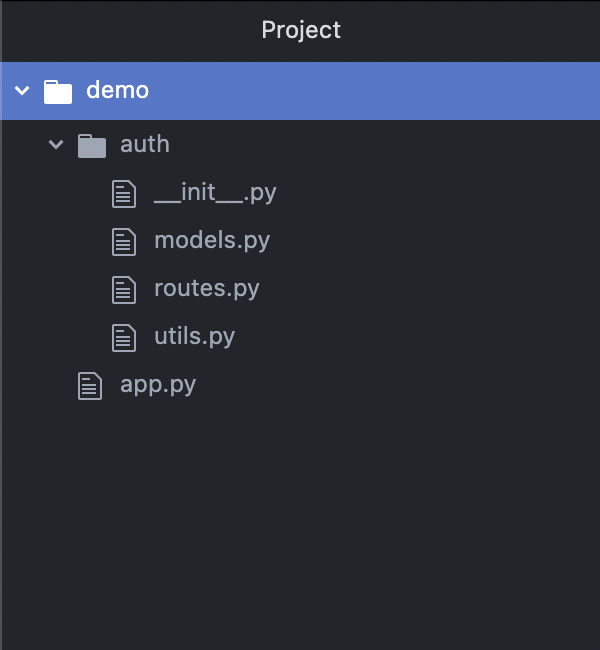

When we run our `app.py` file, we should get a response similar to the image below:

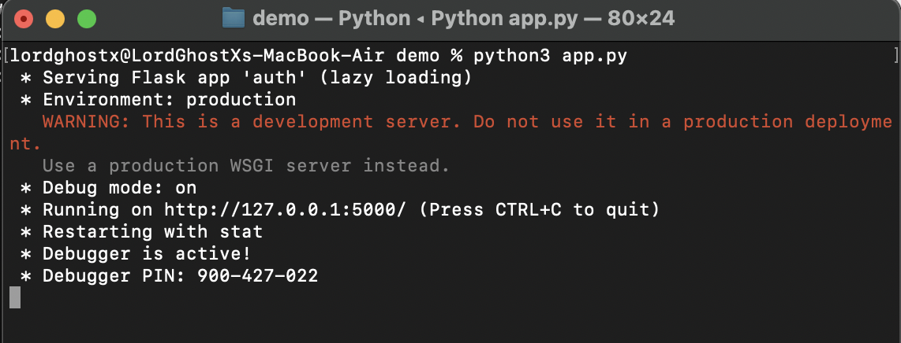

## Creating the Register Route

The registration route is responsible for creating new user accounts in our APIs database. Update the `routes.py` file with the code below to implement the route:

```python
@app.route("/register/", methods=["POST"])
def register():
    username = request.form.get("username", "")
    first_name = request.form.get("first_name")
    last_name = request.form.get("last_name")
    password = request.form.get("password", "")

    if "" in [username, password]:
        return jsonify({
            "msg": "username and password are required fields",
            "data": None
        }), 400

    if User.query.get(username) is not None:
        return jsonify({
            "msg": "this user profile already exists",
            "data": None
        }), 409

    user = User(username=username.lower(), first_name=first_name,
                last_name=last_name, password=hash_password(password))
    db.session.add(user)
    db.session.commit()

    return jsonify({
        "msg": "successfully created user profile",
        "data": None
    }), 201
```

We also need to update the imports of our `routes.py` file. Add the following to the top of the file:

```python
from flask import request, jsonify  
from auth.models import User  
from auth.utils import hash_password, verify_bcrypt
```

## Testing the Register Route

We’ll be using Postman to make requests to the API we have created. The API request in Postman should resemble the images below:

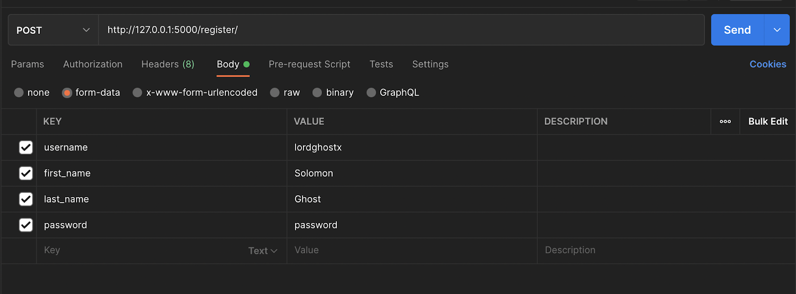

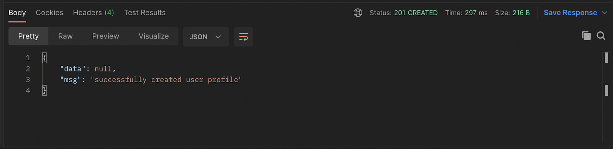

## Creating the Login Route

The login route is responsible for authenticating user accounts in our API. We will be securing this route with Basic authentication, so users can provide their username and password to authenticate themselves.

First, we need to import the `HTTPBasicAuth` class from the `Flask-HTTPAuth` library. Update the imports in the `routes.py` file with the line below:


```python
from flask_httpauth import HTTPBasicAuth
```

Next, we need to create an instance of the `HTTPBasicAuth` class to help manage Basic authentication in our API. Update the `routes.py` file with the code below:

```python
basic_auth = HTTPBasicAuth()
```

Then, we need to create a method to verify our Basic authentication. It will accept the username and password as parameters, check the database to ensure the credentials are valid, then return the user object to the calling function.

Add the following block of code to the `routes.py` file:

```python
@basic_auth.verify_password
def verify_basic_auth(username, password):
    username = username.lower()
    user = User.query.get(username)
    if user and verify_bcrypt(password, user.password):
        return user
```

Finally, we will create the login route that is protected with the `basic_auth` instance we created earlier. Update the `routes.py` file with the code below:  

```python
@app.route("/login/", methods=["POST"])
@basic_auth.login_required
def login():
    user = basic_auth.current_user()
    return jsonify({
        "msg": "successfully authenticated user",
        "data": None
    }), 200
```

## Testing the Login Route

Send a request to the login route on our API using Postman. You should receive a response similar to the image below:

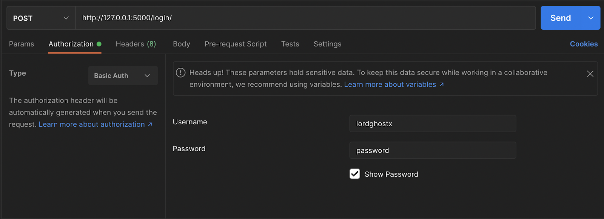

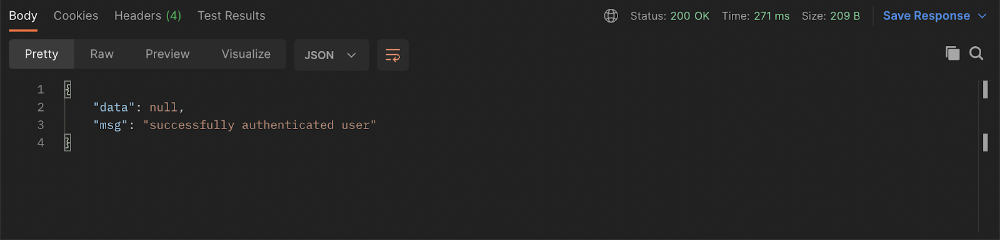

If you try an invalid credential, you should receive a 401 (unauthorized) status code in your response.

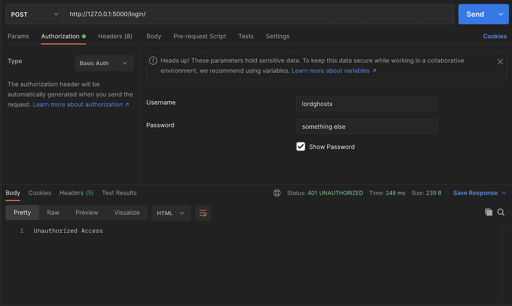

## Creating the User Status Route

The user status route is responsible for fetching the account information about an authenticated user in our API. We will secure this route with Bearer Token authentication, so users have to generate a Bearer Token from the login route and pass it in subsequent requests.

First, we need to update our login route to generate a Bearer Token upon successful authentication. We need to import the `HTTPTokenAuth` and `JSONWebSignatureSerializer` classes from the `Flask-HTTPAuth` library. Update the imports in the `routes.py` file with the line below:

```python
from flask_httpauth import HTTPTokenAuth  
from itsdangerous import JSONWebSignatureSerializer
```

Next, we need to create an instance of the `HTTPTokenAuth` class to help manage Bearer Token authentication in our API. Update the `routes.py` file with the code below:

```python
bearer_auth = HTTPTokenAuth(scheme="Bearer")  
token_serializer = JSONWebSignatureSerializer(app.config["SERIALIZER_TOKEN"])
```

Then, we will use the serializer to embed the authenticated user’s username into a Bearer Token and return it to the user. Update the `login` route in the `routes.py` file with the code below:

```python
@app.route("/login/", methods=["POST"])
@basic_auth.login_required
def login():
    user = basic_auth.current_user()
    token = token_serializer.dumps({"username": user.username}).decode("utf-8")

    return jsonify({
        "msg": "successfully authenticated user",
        "data": {
            "auth_token": token
        }
    }), 200
```

After doing that, we need to create a method to verify our Bearer Token authentication. It will accept the bearer token, check if the token is valid, then return the user object to the calling function.

Add the following block of code to the `routes.py` file:

```python
@bearer_auth.verify_token
def verify_bearer_auth(token):
    try:
        token_info = token_serializer.loads(token)
    except:
        return False
    user = User.query.get(token_info["username"])
    if user is not None:
        return user
```

> The verification function attempts to read the data embedded into the Bearer Token then query the database for a User object that matches what it finds in the token.

Finally, we will create the user status route that is protected with the `bearer_auth` instance we created earlier. Update the `routes.py` file with the code below:

```python
@app.route("/dashboard/", methods=["GET"])
@bearer_auth.login_required
def dashboard():
    user = bearer_auth.current_user()
    return jsonify({
        "msg": "successfully requested user info",
        "data": {
            "username": user.username,
            "first_name": user.first_name,
            "last_name": user.last_name
        }
    }), 200
```

## Testing the User Status Route

Send a request to the updated login route on our API using Postman. You should receive a response similar to the image below:

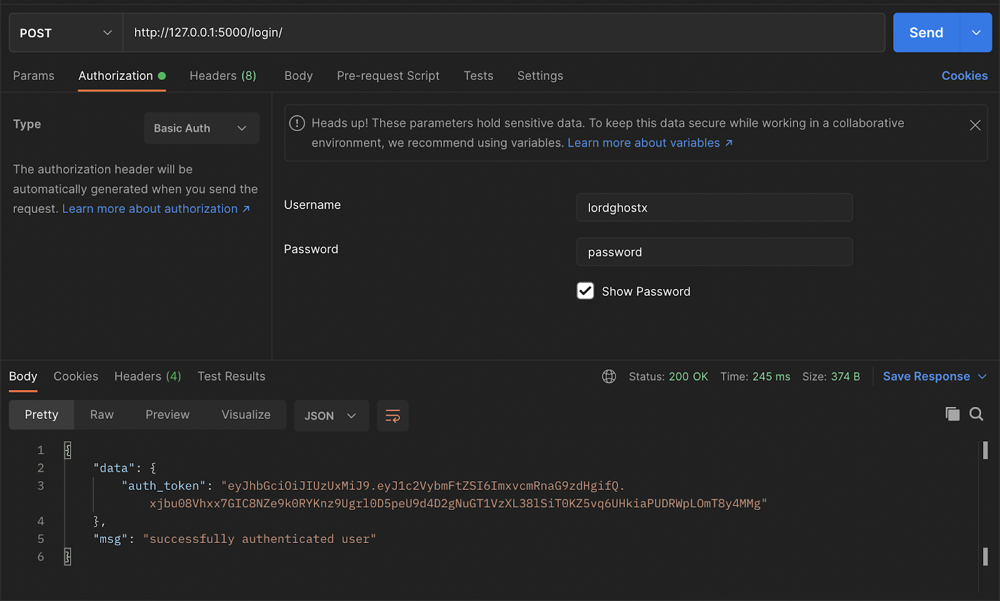

Next, we will send a request to the user status route using the Bearer Token authentication type and the `auth_token` from the login route response. The request and response should look like this:

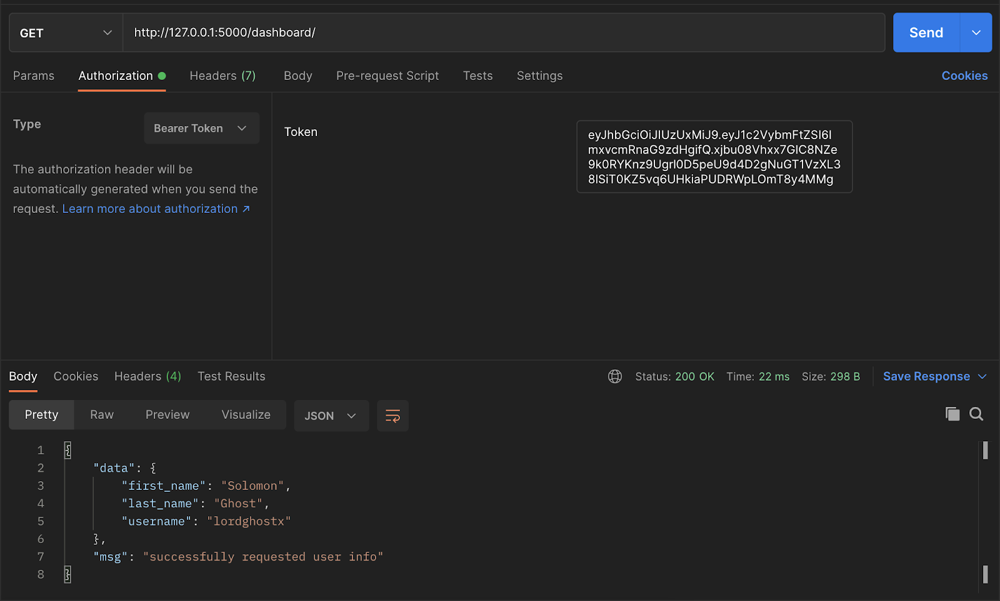

## Creating the Logout Route

The logout route is responsible for invalidating Bearer Tokens, so you can no longer use them to make requests on behalf of a user account. The logout route works by adding the Bearer Token you want to invalidate to a blacklist, so when you are verifying the token in the future, you also check if it’s not in the blacklist.

First, we have to create the database model for the token blacklist. Update the `models.py` file with the following code:

```python
class Blacklist(db.Model):
    __tablename__ = "blacklist"
    token = db.Column(db.String, primary_key=True)
```

> Don’t forget to import the Blacklist model in the `routes.py` file.

Next, we will create the logout route that will store the Bearer Token in the database. Update the `routes.py` with the code below:

```python
@app.route("/logout/", methods=["GET"])
@bearer_auth.login_required
def logout():
    token = request.headers["Authorization"].split()[1]
    db.session.add(Blacklist(token=token))
    db.session.add()

    return jsonify({
        "msg": "successfully invalidated token",
        "data": None
    }), 200
```

Finally, we need to update the `verify_bearer_auth` function to check if the token is not in our blacklist already. Update the function with the code below:

```python
@bearer_auth.verify_token
def verify_bearer_auth(token):
    try:
        token_info = token_serializer.loads(token)
    except:
        return False

    if Blacklist.query.get(token) is not None:
        return False

    user = User.query.get(token_info["username"])
    if user is not None:
        return user
```

## Testing the Logout Route

Send a request to the logout route on our API using Postman. You should receive a response similar to the image below:

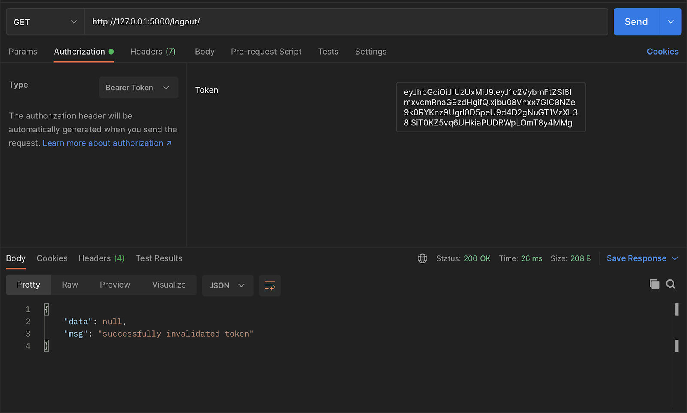

If you send a request to the user status endpoint again with the same token, you should receive a 401 (unauthorized) status code in your response.

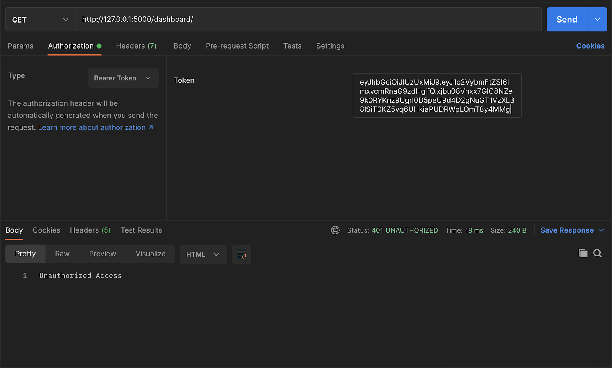

## Conclusion

This article taught us how to implement Basic and Bearer Token authentication in a Flask API. The source of the demo is available on [GitHub](https://github.com/LordGhostX/flask-auth-demo). You can learn more about the Flask-HTTPAuth library features from the [official documentation](https://flask-httpauth.readthedocs.io/en/latest/).
