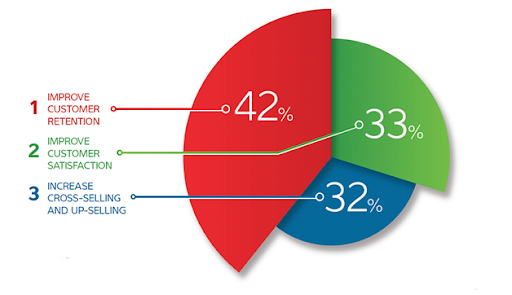
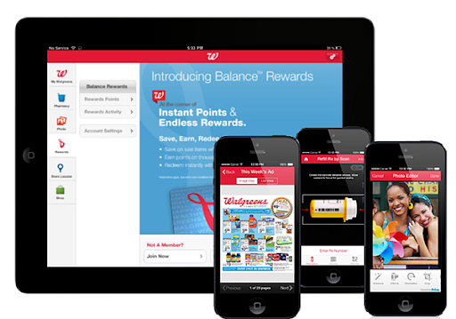

---
title: "7 Expert Tips on How to Improve the Customer Experience"
date: "2021-09-22"
coverImage: "consumer-exp-cover-page.jpg"
tags: ["loginradius"]
featured: false 
author: "Alyse Falk"
description: "If you are interested in the best practices that will come in handy for improving customer experience, read these expert tips and improve client impressions when interacting with them."
metadescription: "Your CX strategy should meet customer requirements and your business goals. Learn how to improve and deliver an omnichannel customer experience with your business."
metatitle: "Lets explore top 7 expert tips on how to improve the consumer experience"
---

Excellent customer experiences motivate people to become regular consumers. The main goal of any company is to put itself in the customer’s shoes. An improved user experience brings more leads that will convert into clients and the opportunity to increase your customer base.

Note that your perfect customer experience depends on numerous factors. These are positive feedback, brand awareness, a good reputation, the SEO-friendliness of your website, and many more.

According to a [Business2Community](https://www.business2community.com/customer-experience/how-to-optimize-the-customer-experience-strategies-and-trends-02240366) survey, customer experience (CX) should be improved for three core reasons:

-   To improve customer retention
    
-   To raise customer satisfaction rates
    
-   To boost cross and up-selling statistics
    

Additionally, your company will be able to generate more revenue via customer acquisition by renewing and upselling to your standing customers.

## Overview of the CX Evolution (2017-2020)

Before exploring the latest tips for improving customer experience, let’s check the evolution of consumer demands and the CX trends of previous years.

2017

[Zendesk](https://www.zendesk.com) found that about 88% of consumers always share their bad experiences with other people, while 87% of satisfied customers shared recommendations on ecommerce companies that provided an excellent experience.

2018

According to a [Gartner](https://www.gartner.com/en) survey, the focus on CX was predicted for 2019. Three hundred respondents proved that user experience matters and are willing to interact with a company if they were delighted with their first experience.

2019

[Accenture](https://www.accenture.com/us-en/about/company-index) found that about 86% of companies are searching for alternative ways to improve their CX because traditional experiences no longer bring high customer satisfaction.

2020

According to [Gartner's](https://www.gartner.com/en) research, about 35% of companies optimized the customer journey and focused on their omnichannel experiences. The survey report also includes the latest statistics on modern consumers: more than 25% of present-day customers get used to virtual assistants and prefer online interactions through chatbots.

  

2021 is the year of new trends in the context of customer experience. Marketers, SEO specialists, and business representatives should take into account the latest statistics provided by [Zendesk](https://www.zendesk.com/):

1.  Spotless CX is the reason to purchase/order/interact/cooperate one more time for about 75% of present-day consumers.
    
2.  64% of today’s customers switched to social messaging as a new communication + customer service channel.
    
3.  75% of companies have already implemented digital tech solutions, and 43% of ecommerce companies worldwide converted their business and CX into fully remote entities.
    

If you are interested in the best practices that will come in handy for improving CX, read these expert tips and improve client impressions when interacting with them.

## 7 Top Expert Tips for CX Improvement in 2021

If you still have not digitized your business, it is time to do it right now. Start with your website and social media network accounts. Your site should be mobile-friendly because about 70% of global traffic is generated via mobile device screens.

Besides the technical aspects that affect user experience, seven others are described in the following expert tips. Having implemented these approaches into practice, your CX will become significantly improved according to 2021 trends.

### #1 Understand Who Are Your Customers

Your task is to initiate the mouth-to-mouth recommendation cycle. For this purpose, you need to know who your customers are and improve their loyalty to your company, its goods, and services. First, you need to put yourself in the consumer’s shoes. Think like the client who would like to interact with your company. Then, it is necessary to use any CRM tool to analyze your customer data and accurately determine the client’s profile and purchasing behavior.

For improved customer loyalty with a guaranteed individual approach, you can split your consumers into several groups. It is a CX-driven idea because your target audience can have various needs and require diversified products. For example, the all-in-one SEO platform [Seranking](https://seranking.com/) provides a personal touch by segmenting its customers. Customers are divided into four groups and offered a special-purpose pack of SEO services:

-   For enterprises;
    
-   For medium and small businesses;
    
-   For agencies;
    
-   For entrepreneurs.
    

This way, first-time visitors are easily navigated to the information and features that best fit their segment. So, while being a single platform with many different SEO services, the company has improved the customer experience by providing their potential clients with a simple way to find the package designed for their needs.

### #2 Strengthen an Omnichannel Customer Experience

Omnichannel CX is a way to provide an integrated customer experience through synchronized and connected channels. Potential clients have an opportunity to interact with the company and order goods and services differently. It doesn’t need to be just a desktop ecommerce site but:

-   A user-friendly mobile version of the website;
    
-   Mobile app;
    
-   Brick and Mortar store.
    

Omnichannel CX implements many approaches simultaneously to convert CX into a seamless process. Many integration strategies bring higher conversion rates and more traffic. Additionally, it benefits customer retention. It is worth noting that omnichannel and multichannel user experiences are not the same.

The main idea of the multichannel approach is to provide many customer service channels that are not linked to each other. It means that social media networks, websites, online shops, and call centers are not synchronized. But omnichannel CX infers that all these multiple channels are connected.

To strengthen the omnichannel customer experience, tie in a CX-driven combination of all your strategies and approaches in the context of:

-   Your product/services;
    
-   Digital marketing and SEO;
    
-   Customer service;
    
-   Sales;
    
-   User experience.
    

A good example of omnichannel CX is the pharmaceutical brand [Walgreens](https://www.walgreens.com/). Brand communication takes place via a mobile-friendly app. The shopping experience is improved with the help of convenient digital features such as refilling prescriptions virtually, setting up reminders and notifications. The app saves customers time because they do not need to visit the pharmacy to get medications.

Simplified interactions and virtual communication is in high demand today and are highly appreciated by consumers and increases Walgreens’ customer retention.

### #3 Optimize the Customer Journey

The customer journey is a full cycle that takes place from the first interaction of your consumer up to the final experience. To ensure that you have provided your clients with high-level loyalty, the customer journey should be smooth without pitfalls and challenges. Nevertheless, according to an [Econsultancy](https://econsultancy.com/) report, about 50% of companies still have no idea what the customer journey is. The lifecycle consists of the following stages:

1.  Out-of-the-market – The potential client has just found some information about the company (through Internet channels like social media, advertising, websites, newsletters, or a physical store).
    
2.  Trigger – This phase is notable with interest to the company because of any trigger (sales, special offers, an invitation to any event, etc.). Potential consumers analyze these opportunities and progress to the next customer journey stage.
    
3.  Initial brand consideration – When interest arises, the user searches for some information about the brand (reviews, location of retail shops, websites, etc.). Any negative information can stop the journey here.
    
4.  Evaluation – This stage is crucial for SaaS projects that offer free trials and demos. Only in this phase, a potential customer is willing to try your services. If a free-of-charge package satisfies the user, it is more likely that the one will purchase your product.
    
5.  Decision-making – It is necessary to provide the best customer service at this stage and be sure that the customer has no hurdles. If some questions arise, the customer support team should react immediately.
    
6.  Experience – When an order is completed, the customer gets an experience. Your task is to turn it into the most positive one. When it comes to SaaS, customer support services should be rendered even after a software release.
    
7.  Loyalty – An utterly positive experience means that the client will likely repeat the purchase and recommend your product. Encourage loyal customers to submit thankful reviews that will improve your reputation, brand awareness, and search rankings.
    

## Tips for Customer Journey Optimization

To optimize your customer journey, you need to map out each step and the processes associated with them. Here is a list of ways for full-cycle optimization:

Phase

Company’s Touchpoints

Out-of-the-market

1.  Run a website audit to make it SEO-friendly and climb the search results.
    
2.  Synchronize a social media network account with the website and other online channels.
    
3.  Involve blog posters and search for publishers and market experts to promote your services.
    
4.  Optimize the strategy for a sound online presence.
    

Trigger

1.  Provide special offers like promo codes, discounts, in-person newsletters, etc.
    
2.  Specify short time limits for any triggers to gain consumer attention.
    
3.  Motivate people to share your content and promos (Instagram reposts, Facebook giveaways, bigger discounts for recommendations).
    

Evaluation

1.  Be sure that your SEO strategy is brand-focused.
    
2.  Keep track of reviews that form your reputation on the Internet.
    
3.  Engage loyal clients to leave reviews.
    
4.  Be sure that you provide enough contact information for each online channel.
    

Decision-making

1.  Provide immediate reactions to user requests.
    
2.  Optimize your call centers and online management departments.
    
3.  Add a chatbox to the website.
    
4.  Add a 24/7 customer support channel (it might be the only way to communicate - email, chatbox, calls).
    

Experience

1.  Allow potential customers to order services or products in various ways (website, social media, online shop, marketplaces).
    
2.  Provide various payment methods.
    
3.  Proceed with fast order processing and provide 24/7 customer support.
    

Loyalty

1.  Create a loyalty program for existing customers.
    
2.  Send newsletters to loyal clients.
    
3.  Notify about updates, changes, and recent news.
    
4.  Reward orders from loyal clients with bonuses.
    
5.  Engage in the word-of-mouth recommendations with discounts.
    

Finish with a gap analysis to fix all the challenging phases. If your customer cycle is well-thought-out, you will not lose potential consumers. All generated traffic will be converted into new clients and sales.

### #4 Build a Community

The rule of a great CX-driven online community is the desire for your loyal customers to promote your company and its services. Engage people to join your Internet club of like-minded people, offer them goodies like bonuses and referral points, and force them to share your brand through different online channels.

For example, [Inkbox](https://inkbox.com/) consists of a community with millions (2 million) of followers. This company makes it a priority of tattooing and shares all completed work on the Internet. The community was created around the popular Instagram hashtag #tattoosfornow. People throughout the world shared beautiful photos with tattoos and grew the community.

### #5 Take Advantage of Customer Reviews

You can use reviews for your customer experience purposes. Additionally, you can increase your brand awareness and enhance SEO efforts this way. People trust companies with numerous positive reviews. There are six ways to take advantage of client testimonials:

1.  Use reviews on the home page and other key pages of the site. For example, the https://seranking.com website has reviews at the bottom of its homepage that increases and validates trust in the brand and its services.
    

  

  

2.  Use reviews for your search ranking. Add a Sitemap with reviews to engage people to visit your site and help Google consider your website as trusted.
    

3.  Use reviews to prove your reputation on other online communication channels (social media platforms, forums, blogs).
    

4.  Use client testimonials in newsletters and for other email marketing purposes. This way, you will increase the chances that your letter will be read and taken into consideration.
    

5.  Add reviews to your video marketing materials. You can use screenshots of some eye-catching and detailed testimonials in your advertising videos.
    
6.  Analyze your customer satisfaction rates with the help of the percentages that rank positive, neutral, and negative reviews. For example, you can offer short online surveys to get more reviews after any customer journey stage (especially at the last two) and measure them. Here is a set of survey templates by [NiceReply](https://www.nicereply.com/).
    

### #6 Personalize Your Content

According to [Harvard Business Review](https://hbr.org/2018/01/ads-that-dont-overstep), online users appreciate a high personalized marketing experience. It does not relate only to personalized email letters and promotions sent via messengers and SMS. You can improve your CX with personalized content on your website. For example, you can add some special features that correspond to your niche and increase the number of leads this way.

[Spotify](https://www.spotify.com/us/) decided to launch the option “Discover Weekly” for this purpose. A personalized playlist is generated according to the listener’s preferences. Some users like this option, while some Spotify fans dislike it. Nevertheless, this is a way to promote a personalized approach and show each customer your meaningful marketing strategy.

### #7 Make the Customer Experience Safer

A significant number of Internet users are still afraid of scammers and cyber hacks regarding the user experience on a website. Assure visitors that your ecommerce platform and corporate site are risk-free for them. For example, [LoginRadius](https://www.loginradius.com/customer-security/) provides businesses with adoptive safety tools to make their CX 100% secure.

Having implemented tech solutions to protect client accounts, your company strengthens its brand awareness, improves reputation and loyalty. Usually, the most challenging aspects for customers are the security of personal data and online payments. Your task in the context of CX improvement is to maintain privacy and guarantee safe transactions.

## Final Words

Your CX strategy should meet customer requirements and your business goals. Customer experience is a proven way to develop high retention, cross-sales, and up-sales. If people decide to come back and recommend your products, this is a good sign for your company. An improved user experience benefits SEO, brand awareness, and generally the online presence of your business. 2021 requires marketers, entrepreneurs, and SEO specialists to demonstrate an omnichannel CX approach with comprehensive security, reviews, and customer journey strategies.

