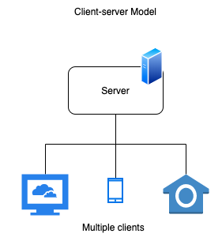

_This blog is part 1 of a series on gRPC. Part 1 will go over some important concepts, part 2 will be a walkthrough of a client-server implementation in Go, and part 3 will be about LoginRadius' experience migrating to gRPC!_

**gRPC**

gRPC, simply put, is just another way to send data across networks. It can be used to communicate between services in a microservice architecture, where a single service can interact with multiple others. Similarly, in client-server models, there can be multiple clients communicating with a common backend server.



The gRPC framework was initially developed at Google and is now open-source. It is a modern implementation of the RPC (Remote Procedure Call) protocol, which has been around since the 80s. You will often see gRPC being compared to other technologies like SOAP, REST, and GraphQL.

Some features:

- HTTP/2 based transport
- Unary calls: single request, single response
- Streaming calls: client, server, and bidirectional
- Layered design for further extension e.g. authentication, load balancing, logging

  

_How is it used to send data?_

gRPC is based on the idea of calling a remote procedure just like a local one. A procedure is like a function or a method. So, ideally developers can treat remote and local calls similarly. A great thing about gRPC is that developers do not need to know the details of the remote interaction.

Here is a diagram from the official grpc [docs](https://grpc.io/docs/guides/) showing the flow:


Each client service will include a stub, which is like an interface containing the available remote procedures. These stubs are auto-generated files.

  

_But what does proto refer to? And what are stubs? How can we generate them?_

To answer these questions, we need to look at another technology called protocol buffers.

**Protocol Buffers**

Protocol buffers (protobufs), are a way to format data for storage and transport. gRPC uses protobufs to format data sent over the wire. It is comparable to other data serialization formats such as JSON, XML, and YAML.

Some features:

- Ability to generate interfaces (stubs) for many languages
    - You can create proto definitions once (in a .proto file), and compile it into a variety of different languages including Go, Java, C#, and Python.
- Requires defining schemas - need to know expected data fields and types
    - This is unlike JSON which is flexible.
- Binary format, meaning data is converted into binary when sent over the wire.
    - Binary is smaller, and generally can be decoded faster compared to text-based formats such as JSON.

  

_How is it used with gRPC?_

Step 1: Create proto definitions - methods, requests, responses.

- For example, in account.proto file, we define 3 rpc methods: Find, Update, and Delete.
- These are the remote procedures that can be called by clients.

```protobuf
service AccountService {
  rpc Find(FindRequest) returns (FindResponse);
  rpc Update(UpdateRequest) returns (UpdateResponse);
  rpc Delete(DeleteRequest) returns (DeleteResponse);
}
```

- Each method can have its own request and response schemas.

```protobuf
message FindRequest {
  string Uid = 1;
}

message FindResponse {
  string Uid = 1;
  string Name = 2;
  int32 Age = 3;
  bool isVerified = 4;
}
```

- Note that each field in a message has a unique number. These numbers are used to identify the fields when encoded into binary (recall that protobuf sends data over the wire as binary).

Step 2: Compile proto file for auto-generated stubs in desired language.

- First, the compiler needs to be [installed](https://github.com/protocolbuffers/protobuf). Refer to blog _part 2_ for detailed instructions.
- The compiler is invoked by the protoc command. In this case, the file account.proto is compiled into Golang with a grpc plugin.

```batch
protoc account.proto --go_out=plugins=grpc:.
```

- Different languages may have different ways of compiling proto files. For instance with NodeJS, there are npm libraries which allow programmatically compiling proto files.

Step 3: Use stubs in server and clients.

**The Big Picture**


**Why gRPC?**

One compelling reason to use gRPC is that it provides high performance

- HTTP/2: e.g. requests are multiplexed, so a single long-lived TCP connection can be used by multiple requests at once. This results in less connection overhead.
- Protobufs: e.g. as a binary format, it allows for quick encoding and decoding of data. 

  

_How does it differ from REST?_

| | **gRPC** | **REST** |
| -- | -- | --|
| API | Contract-based i.e. stubs | Resource-based and relies on HTTP verbs i.e. GET/PUT/POST/DELETE
| Network protocol | HTTP/2 | HTTP/1.1 or HTTP/2 |
| Data serialization format | Protocol buffers | JSON |
| Streaming | Built-in support for client, server, and bi-directional streaming | REST on HTTP/1.1 does not allow streaming |


**Other Considerations**

Here, we briefly go over a few other things to consider with gRPC. These will be covered in more detail in another blog.

_Management of proto files_  
If you plan to have multiple proto files and client services, you need some way to manage them for distribution and version control. One solution is to keep all proto files in a central git repository, and maintain versions using git tags.

_Using proto2 vs. proto3_  
Protocol buffers have two syntax versions: proto2 and proto3.

- One key feature in proto2 is that it differentiates between required and optional fields, and supports nullable fields.
- In proto3, all fields are optional and nullable fields are no longer supported. If a field is unset, it will be set to a default value e.g. empty string for type string. Because of this, determining whether a field was intentionally set or not requires workarounds such as using wrappers.

_Load-Balancing_  
Something to note about load-balancing gRPC is that HTTP/2 requires L7 (Application Layer) load-balancers. Recall that in HTTP/2, TCP connections are long-lived and requests are multiplexed. This makes L4 (Connection Layer) load-balancers ineffective. This differs from HTTP/1.1 where TCP connections get cycled and can benefit from L4 load-balancers. 

That's it for now! To learn more, check out the official [gRPC](https://grpc.io) and [protobuf](https://developers.google.com/protocol-buffers) docs.
