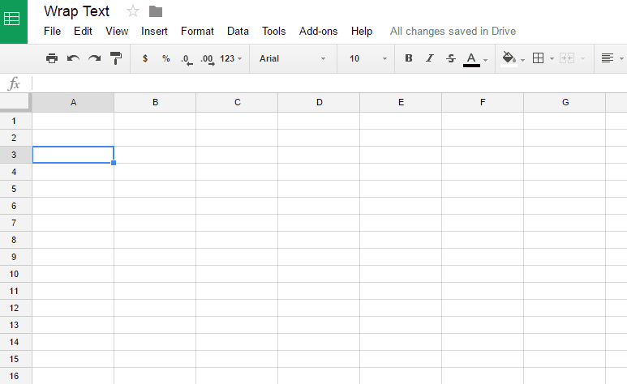

Google Spreadsheet is not a new tool. Nowadays almost everyone uses these online sheets for their daily records such as for the maintenance of their contact information, to plan a budget, or to organize a trip. Though Google Sheets is very much similar to MS Excel, there are certainly plenty of differences as well. In fact there is much more you can do with this amazing part of Google Drive. There are some very interesting features that are still not widely known to users which I would like to highlight in this article. So let’s start our learning with a quick introduction.

First some basics for our newbie readers, and then we’ll jump into a section that will help you master the subject.

**Content:**

- What is Google Sheets?
    - Google Sheets Features.
    - How to create a new Google Sheet?
- Google Spreadsheets: How To wrap text in Cells?
- Google Spreadsheets: How to send email to multiple recipients?
- Google Spreadsheets: How to create pivot table?
- Google Spreadsheets: How to apply conditional formatting?
- Google Spreadsheets: Transpose Formula!
- Google Spreadsheets: Online File Sharing!

**What is Google Sheets?**

Google Sheets is the updated version of Google Spreadsheets, Google’s free cloud-based tool for creating and managing spreadsheets. Just like Microsoft Excel, Google Spreadsheets allows you to organize, edit and analyze different types of information depending upon your need.  Let’s explore some of the features it has to offer!

**1) Google Sheets Features:**

Here are a few of the most useful and exciting features of Google Sheets that make it more amazing to use.

- **********Offline Google Sheets********** With Google Sheets you can set up offline access in your Chrome browser so that you can create and edit your spreadsheet even when you are not connected to the internet. And once when you reconnect to the internet, your spreadsheets will automatically sync and update.

- **********Filter views********** A filter view filters a shared spreadsheet for you while other users are still working on that spreadsheet. This also allows you to name and save a filter so that you don’t need to recreate them every time you need them.

- ******Custom rules for conditional formatting****** Conditional formatting is definitely not a new feature as many of us already use it in Excel to change the format of cell based on the data they contain. But in Google Sheets, you can create your own custom formulas for conditional formatting and can call on data outside the cell you’re formatting.

- ********Google sheet add-ons******** Google Sheets also has an add-on store just like Google Drive does. You can access it from any Google spreadsheet and can get your favorite add-on.

So now that we have a clear mind of what a Google sheet is, let’s start with a step-by-step guide of how it actually works.

**2) How to create a new Google Sheet?**

There are 3 ways to create a new Google Sheet. They are:

1. By clicking on the red New button in the Google Drive Dashboard and selecting Google Sheets from there.
2. Select “File -> New SpreadSheet“ from within an already open spreadsheet.
3. Click "Blank" or select a template on the [Google Sheets](https://sheets.google.com/) homepage. _ Step a: ___![How to create google spreadsheet]__ _Step b:_  _Step c:_

But for now let’s stick with the simplest method to create a blank sheet and see how it works. Feel free to play with this blank sheet.

 

 

**Google Spreadsheets: How to wrap text in cells?**

Just like we combine cells together in documents and excel sheets by merging them, we can also do this with Google spreadsheets. You can wrap text in a spreadsheet so that you can see entire text inside a single cell only. Let’s see how to do it:

Select the cell in which you want to wrap the text. If you need to select multiple cells than drag from the corner to include the range you want.

Now you have two options for text wrapping.

**Option 1:** Click the wrap text button in the toolbar.

 

**Option 2:** Select “Format -> Wrap text”

 

**Google Spreadsheets: How to** **send email to multiple recipients****?**

You may have faced some situations where you want to send multiple emails at once. For instance, you are a high school teacher and you need to send emails to many students to notify them about an upcoming seminar you are holding.. Then instead of sending one email at a time, you can take advantage of sending multiple emails from Google Sheets. Let’s have a look at how it works:

**Step 1:** First create a blank spreadsheet. Add the recipients in the first column and the message body in the second column. Fill this blank spreadsheet with the recipients to whom you want to send emails. Here I am covering only two rows from the top.

 

**Step 2:** Now open your script editor from the “Tools” menu and paste the following code snippet there and name it sendEmails.

function sendEmails() {

 var sheet = SpreadsheetApp.getActiveSheet();

 var startRow = 2; // _Start at second row because the first row contains the data labels_

 var numRows = 2; // Number of rows to process

 // Fetch the range of cells A2:B3

 var dataRange = sheet.getRange(startRow, 1, numRows, 2)

 // Fetch values for each row in the Range.

 var data = dataRange.getValues();

 for (i in data) {

 var row = data\[i\];

 var emailAddress = row\[0\]; // First column

 var message = row\[1\]; // Second column

 var subject = "Sending emails from a Spreadsheet";

 MailApp.sendEmail(emailAddress, subject, message);

 }

}

_**Note: Here in** **var startRow** **assign the number of row from where you want to select email id’s.**_

**Step 3:** Save your script and then run this function from your recipients sheet by clicking on the function “sendEmails” already saved in your script editor.

After the execution of the function, messages are immediately delivered to all your email recipients. If the number of recipients is very large, this might take a couple minutes.

**Google Spreadsheets: How to create pivot tables?**

Before learning how to create a pivot table, let’s first understand what a pivot table is.

Pivot tables are  a pre-embedded tool offered by Google spreadsheet that offers strong data analysis and summarizes the data without the use of a relational database. With the use of pivot tables it becomes very easy to extract small pieces of information and draw conclusions from a large set of information.

Now let’s understand how to create a pivot table. In this example, I am explaining how to create a pivot table that shows how many students are enrolled to a particular course in a year.

**Step 1:** First create a spreadsheet that contains the records of a student.

 

**Step 2:** Select the data cells and Go to the **Data** menu and select **Pivot Table**.

**Step 3:** Here you will have a blank pivot table report with a report editor pane on the right side of the window.

 

 

**Step 4:** In this report editor you need to select the rows and columns you want to add to your pivot table. For this example I want to add courses as row and year as column to look at the number of students enrolled to a course in a particular year. Since I want to know the counts, I will add COUNTA function to summarize the number of students in the values field.

 

In this example, I am choosing the course field. Choosing this field in the Values section results in the pivot table which is our desired report!

**Google Spreadsheets: How to apply conditional formatting?**

Conditional formatting can be used to differentiate cells based on their value. In this you apply some conditional formatting methods based on the text, numeric or date value. You can also add a custom differentiating formula, and if the sheet identifies a cell that meets that custom rule, it will format that cell differently based on the choices you made. In Google Spreadsheet you have a big list of options to choose from for applying conditional formatting. But in this article I am covering most frequently used options so that at least you get an idea of what conditional formatting is.

**Example #1 :**

Let’s say you want to highlight those cells that contains the word “abc” only. To do this follow these simple steps:

**Step 1:** In your Spreadsheet select the cells where you want to apply this rule and click on “format-> conditional formatting” menu from the top menu bar.

 

**Step 2:** After clicking on this you will get a conditional format rules panel on the right side where you will find your selected range in the “apply to range” field. Then you have to apply your formatting condition from “Format cells if” option. When you click on this option you will get a list of conditions there. But for this example you need to select “Text Contains” condition.

_Step a :_

_Step b :_

 ** Step 3:**Next in the “value or formula” field you have to type the word for which you are performing conditional formatting. For instance here you’ll type abc.

**Step 4:** From the next field you can pick your own formatting style. Here I want to highlight the cells containing “abc” with Green color. 

_Step a :_ 

_Output :_

 

**Example #2:**

Now let suppose you want to highlight those names whose values are greater than and equal to 4. For this you need to create a custom formula as described in the steps below:

**Step 1:** In the spreadsheet select the “name” column as you want to highlight names only and click on “Format->conditional formatting” from the top menu bar just like we did in the previous example.

**Step 2:** Here in the “Format Cells if” field select “custom formula is”.

**Step 3:** Then in the “value or formula” field type “=$B2:$B6 >=4” (without double quotes). And select a formatting style of your choice.

Your custom formula would be

 

_Output :_ 

 

**Example #3:**

Now let’s assume you want to highlight a complete row depending upon a certain condition. For example you want to highlight those rows with green where the age is less than and equal to 18 and highlight those rows with yellow where the age is greater than 18.

**Step 1:** Select the rows where you want to apply conditional formatting.

**Step 2:** After selecting conditional formatting option from the format menu on the top, select custom rule option from “Format cells if”.

**Step 3:** In the value or formula field type “=$B2:$B6<=18” (without double quotes) to highlight those cells that has the age value less than and equal to 18 and select green color from formatting style.

**Step 4:** Now click on **add more rule** and in the value or formula field type “=$B2:$B6>18” to highlight those rows where age value is greater than 18 and select yellow from formatting style option.

 

 

 

After clicking on Done your desired output will be like this:

 

**Google Spreadsheets: How to transpose rows and columns?**

As we all know Google Sheets are fabulous in gathering information. Due to this sometimes it becomes very difficult to view data in these spreadsheets. And we may feel like it would  look better if the rows and columns of entire sheet was interchanged. This thing can be done in Excel by using copy and paste using transpose method but in Google spreadsheets we have a formula for this. So let’s see how it works:

**Step 1:** Take your sheet that has lots of data.

 

**Condition 1:**

**Step 2:** Here I am making a whole new sheet that will contain the transposed data of your selected sheet. That’s why create a new blank sheet.

**Step 3:** In this new blank sheet select cell A1 and type the formula **“=TRANSPOSE(Sheet1!A:G)”** (ignore double quotes) and press Enter.

 

**_Note: Sheet1 is the name of your sheet that you want to transpose and A:G is the range of your data._**

If you want to ignore any column for this example I want to ignore last column i.e. G column then my  range will be A:F.

 

**Condition 2:**

When you do not want to create a new sheet instead you want to transpose your rows and columns within the same sheet. Then there will be a slight change in the formula of Transpose. Here we don’t need to mention the reference of the sheet from where we are fetching the data like we did in the previous condition. Here we simply put the formula with the specified range only.

**“=TRANSPOSE(A1:I7)”**

 

**Google Spreadsheets: How to share online?**

With this amazing feature of Google Drive you can easily share your File and folders with your network and choose whether they can view, edit or comment on them. In this section we’ll learn how to share a Google Sheet online.

When sharing a spreadsheet online there are 3 level of access. You can select what others can do with your file. There are 3 options in front of you that give others an access to your file:

- ****Can edit:** This will allow others to make some changes in your file and they also can share it further. This is the default option if you are sharing with specific people.**

- ****Can Comment :** With this option other people has the liability to view and comment on your file but they can not make any changes in your file. This option is not applicable if you are sharing a folder.**

- ****Can View :** Other people are only able to view your file. They neither can make some changes nor they can comment on your file. This is default for link sharing.**

**Share with Specific People:**

**Step 1:** Open your spreadsheet and click on share on the top right corner.

**Step 2:** You will get a **Share with others** box**.** There under **People**, type the email address of the person you want to share with.

**Step 3:** To give access to your file click on the down arrow next to people field and select the level of access you want to give.

**Step 4:** When you click on Done, the people you shared with will get an email that will notify them that you have shared a file.

 

**Share Using a link:**

**Step 1:** Open your spreadsheet and click on share on the top right corner.

**Step 2:** in the “shared with others box” click on “Get Sharable Link”.

**Step 3:** To choose the level of access click on the Down Arrow next to the “Anyone with the link" .

**Step 4:** Now you will get a file link, paste it in an email or anywhere you want to share it.

 

**Share a File Publicly:**

**Step 1:** Open your spreadsheet and click on share on the top right corner.

**Step 2:** In the “share with others” box click on “Advanced” .

**Step 3:** Here in “Who has Access” you will see private mode on. Click on “change” to select your choice.

**Step 4:** After selecting your choice, click Save and choose what level of access you want to offer.

**Step 5:** Click Done.

 

So if this article helped you to solve any of your query that is mentioned in this article share it with others and if you think I am missing on something then your feedback is very much welcomed here.
