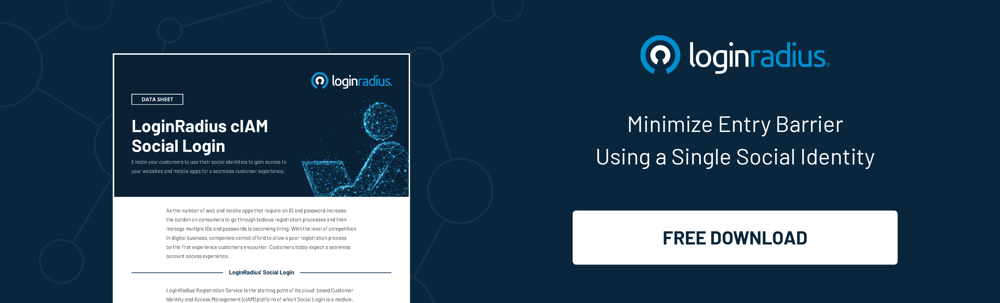
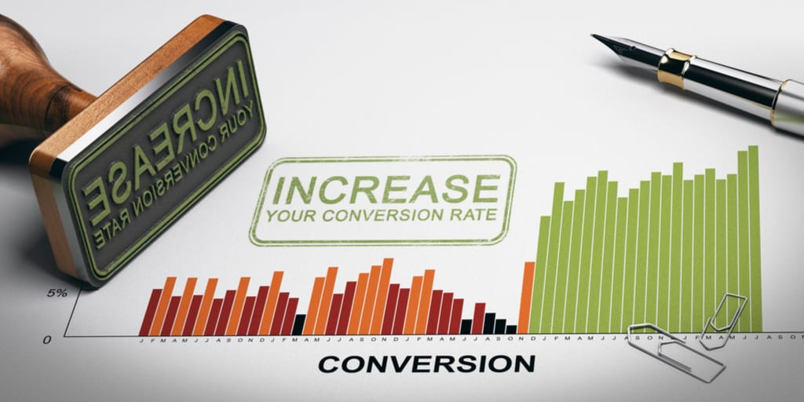

---
title: "9 Facts About Social Login & CRO That You Should Know About"
date: "2021-08-12"
coverImage: "conversion-rate-optimization.jpg"
category: ["loginradius"]
featured: false 
author: "Rashmi Mathur"
description: "Naturally, a marketing team should strive to create a user experience that will lead to more conversions. And, fortunately, social login makes this highly achievable. It allows users to easily sign on to your website with social media profiles, and also allows the consumer to customize their preferences based on their previous activity and interaction with the brand."
metadescription: "Social logins can positively influence a business’ CRO. Read on to understand the connection between login services and improving the CRO."
metatitle: "How Social Login Authentication Boost Conversion Rate Optimization"
---
Conversion rate is an all-important metric that every website keeps a close eye on. To increase this rate, businesses turn to Conversion Rate Optimization or CRO marketing.

 

CRO marketing focuses majorly on improving the experience that a user may have, which may result in them making purchases. To ensure that this takes place, businesses that also have websites use login services like [social login](https://www.loginradius.com/social-login/). These services allow them to cater to customers better.

## Essential Facts To Know Before Implementing Login Identity Solutions

A marketing team usually includes social login as a pivotal part of their strategy as it can contribute to the overall consumer experience. In addition to allowing businesses to amass a host of registered customers, they can also personalize the website based on the user’s preferences. This ability will later [boost the ROI and conversion](https://www.loginradius.com/blog/fuel/leverage-website-for-more-conversions/) of the business.

  

Also, user registration  options like social login authentication will allow a company to capitalize on the following aspects:

  

1.  Reduce Incomplete Login Forms
    

  

Users often experience a significant amount of frustration as they are required to fill long registration forms to get access to websites. This is bad news for the eCommerce sites that have such forms. Social logins will allow businesses to obtain all the necessary data they desire to eradicate this problem, which will also be accurate and complete.

  

2.  Increase Social Engagement
    

  

The use of social logins will also allow businesses to access important customer information regarding their age, gender, or personal preferences. A marketing team will use all this information to formulate a better social media marketing campaign. Therefore, companies can formulate their campaigns in a way that will best resonate with the given demographic.

3.  Influence Social Media Recommendations
    

  

Consumers are heavily influenced by the recommendations they see online. This fact is especially true if the recommendations come from another user similar to them. Therefore, marketing teams can significantly contribute to their conversion rate as users send out word-of-mouth referrals on extremely popular social media platforms.

  

4.  Extensive Data Collection
    

  

Allowing users to register using social logins will mean that businesses can get to know their customers better. They can form a cohesive idea of what users belonging to a particular demographic may like. Therefore, a company can use social logins to create feedback loops to better understand its audience and [improve customer retention](https://www.loginradius.com/blog/fuel/how-customer-retention-can-help-businesses-grow/).

   

5.  Dislike Towards Account Creation
    

  

[54%](http://www.prweb.com/releases/2012/1/prweb9086226.htm) of users state that they refrain from joining a website that asks them to fill a registration form. There are essentially two reasons why users dislike creating new accounts on third-party websites. Firstly, users try to avoid filling long registration forms on these websites or applications. The other reason is that consumers use login services like social logins to register as they prefer to have a single password for the multiple accounts that the user has.

  

6.  Recovering Login Information
    

  

According to some studies, [1 in 3](https://web.archive.org/web/20171209150724/http://www1.janrain.com/rs/janrain/images/Industry-Research-Value-of-Social-Login-2013.pdf)  users states that they are unable to remember their login information, especially for third-party websites that they do not visit frequently. Of these, a major portion also states that they will not put in a lot of effort into recovering it. Therefore, social logins will help to reduce the need for users to remember credentials. This will, in turn, improve the conversion rate.

  

Also Download: [Consumer Digital Identity Trend Report 2020](https://www.loginradius.com/resource/digital-identity-trends-2020/%5C)

  

7.  Eliminating Irrelevant Promotions
    

  

The ability of businesses to collect customer information through social logins will also help reduce the instances of users receiving irrelevant promotions. A recent poll revealed that [100%](https://cxl.com/blog/social-login/#5-100-of-the-blue-research-poll-participants-reported-receiving) of respondents saw promotions that were not relevant to their likes. With social logins, businesses can filter what consumers see and will most likely purchase.

  

8.  Chances of Free Promotion
    

  

Implementing social logins and increasing the number of registrations will further improve the chances of the company receiving a promotion from users. Once this takes place, a company will receive free promotion and make more people aware of their brand.

  

9.  Secure User Registration Option
    

  

According to a research paper, around [77%](http://www.webhostingbuzz.com/blog/wp-content/uploads/2013/03/Who-s-sharing-what.jpg) of users believe that social logins are a safe and highly effective method to register users. The reason being that in addition to implementing important customer data security  measures, it can also [encourage user engagement](https://www.loginradius.com/blog/fuel/consumer-management-to-consumer-engagement/).

  

Considering all these benefits that social login authentication offers, a marketing company can orient their social media marketing and user engagement to be more effective. Finally, a marketing team will surely improve their conversion rates and see a drastic improvement in sales.

