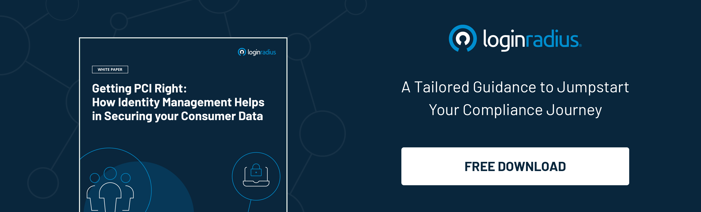

---
title: "Cybersecurity Tips for Ecommerce Websites"
date: "2021-05-19"
coverImage: "cybersecurity-tips-for-ecommerce.jpg"
category: ["loginradius"]
featured: false 
author: "David Smith"
description: "Whether you run a big business or a small niche online store, you should always be on your guard against possible security threats. Here are some of the most important tips to remember about keeping your site secure."
metadescription: "Cybercrime is a big threat to every business online. Here are some tips to help you build a secure ecommerce website that is less susceptible to external threats."
metatitle: "Cybersecurity Tips for Ecommerce Websites"
---

Whether you have a big ecommerce store or a small niche business, it will always be susceptible to certain security threats. If you are a website owner, taking care of the security of your website should be of utmost priority.

Before we discuss some tips to [secure your website](https://www.loginradius.com/blog/engineering/3-simple-ways-to-secure-your-websites-applications/), let's look into some of the most common security threats that can affect your online presence.

Most security threats come with a financial motive behind them. The victim can be subjected to either credit card fraud, phishing practices, malware practices, or spam.

System reliability is another issue that can affect the security of your website. For example, if your Internet service provider crashes or your online payment system has some bugs, it can eventually affect the security of your website.

Let's discuss some tips that can help secure your website and make it less susceptible to external threats.

### Choose the Right Platform for Your Business

Choosing the right platform is a critical factor in helping you run a successful business. When you are choosing a platform, keep in mind that it is not always easy to switch.

Therefore, making the right decision is extremely important. Here are some initial checks that will help you make the right decision.

-   Choose a platform that comes with built-in security features and supports object-oriented programming.
    
-   If you are using [WordPress](https://www.loginradius.com/integrations/wordpress/), then make sure that you are using a powerful security plug-in.
    
-   Bot threats can hamper the security of your website. Therefore, always have a bot mitigation solution at hand to help take care of an unexpected situation.
    

### Get SSL Certificates for Your Website

[SSL certificates](https://www.loginradius.com/blog/engineering/lets-encrypt-with-ssl-certificates/) are primarily used to make web browsing more secure. An SSL certificate activates the HTTPS protocol which means that all data sent over the internet is encrypted and will only be read by the required recipient.

Your SSL certificate will help to make the data transfer more secure, provide [credit card security](http://www.cardzgroup.com/ContactSmartCard.html), and secure login information for your customers. Moreover, SSL certificates are also deployed on social media websites to make web browsing more secure. 

### Comply with PCI DSS Standards

PCI DSS stands for Payment Card Industry Data Security Standard. The standard is a must-have for all websites that have integrated credit card payment systems on their websites.

PCI DSS standard helps to secure online transactions with your customers and minimizes chances for data theft. Being PCI compliant is not an easy task. It is especially difficult for small businesses to become PCI compliant.

If you want your business to become PCI compliant then it is imperative to follow a certain set of rules that could help achieve this.

Remember that [PCI compliance](https://www.comptia.org/blog/5-simple-ways-to-become-pci-dss-compliant) can be achieved through a collaborative team effort. You must ensure that all payment processes are strictly PCI DSS compliant.

Moreover, the standards need to be installed, the firewall configurations need to be maintained and anti-virus software needs to be updated. Also, remember to change the passwords and other details at the time of the purchase.

### Run Frequent Security Audits

Running frequent security audits is an important element that helps ensure that your website security is under constant update.

Security audits help to rule out any potential threats and help companies understand the ongoing security issues. If your business is constantly undergoing cash transactions then your platform must undergo regular security audits.

The security audit of your business is based on certain factors like data security, audit, navigation, performance, fulfillment, service, payment, and product.

Once the security audit is complete your platform will be granted a security certificate that helps to validate its authenticity and security.

## What else?

[Data security](https://www.loginradius.com/blog/start-with-identity/2020/12/data-security-best-practices/) is crucial for your online business. Having certain security checks in place will help ensure the security of your website and make online transactions secure for your customers.

Several other ways can also be employed to ensure your website is secure. These include using unique passwords and frequently changing passwords.

Moreover, installing the right anti-virus programs is also a great way to track any fraudulent activities. Lastly, staying up-to-date with all software updates can also help make your website more secure.

The more frequently you update software the better chances you have of maintaining the online security of your website.

