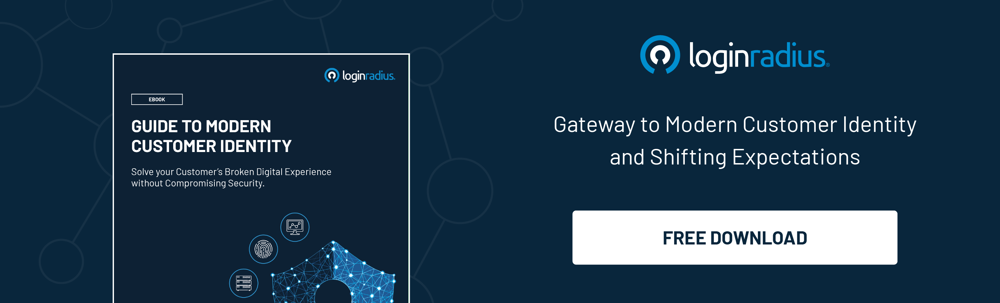

---
title: "How to Drive in the Highest Quality Leads in 2021 with Content and SEO"
date: "2021-03-23"
coverImage: "content-marketing-loginradius.jpg"
category: ["loginradius"]
featured: false 
author: "Deependra Singh"
description: "When it comes to digital marketing, SEO and lead generation techniques go hand in hand. As long as your content is SEO-friendly, you are bound to generate leads in one way or the other. The basic step to follow is to create high-quality content paired with the right SEO practices to generate leads for your business in no time."
metadescription: "Learn the top SEO and content marketing strategy that will help you drive quality leads in 2021.  This expert advice will also help you boost traffic for your website."
metatitle: "How to Drive in the Highest Quality Leads in 2021 with Content and SEO."
---

The most common response to any of your queries is to simply 'Google' it. This means that anytime your target audience is looking for content related to your business, your content must have a strong presence online to be visible.

The easiest and most effective way to improve your online presence is through content marketing and **[SEO lead generation](https://www.loginradius.com/blog/fuel/2017/04/sign-up-forms-best-practices/)**.

  

Recent statistics suggest that content marketing not only costs about [62% less than traditional marketing](https://www.demandmetric.com/content/content-marketing-infographic) strategies but is also one of the most efficient options to generate leads.

## How Do SEO and Lead Generation Work Together

When it comes to digitally google marketing, SEO and lead generation techniques go hand in hand. As long as your content is SEO-friendly, you are bound to generate leads in one way or the other. The basic step to follow is to create high-quality content paired with the right SEO practices to generate leads for your business in no time.

  

Content marketing and lead generation strategies aim to create trust within your target audience through high-quality content and the best SEO strategy, leading to more lead generations.

## The Role of SEO in Driving the Highest Quality Leads in 2021

  

As more businesses and consumers shift online for ease, the only way to stay connected with your audience is by being on the first page of Search Engine Result Pages (SERPs). For this, finding relevant and high-traffic keywords is necessary. A high-quality, well-researched content that hasn't been optimized as per SEO would be invisible unless specifically searched for and generate fewer leads than average SEO-optimized content.

  

SEO helps your content to rank higher on Search Engine Result Pages (SERPs). Thus, driving in more traffic and, in turn, leading to more conversions. The major use of SEO is to generate more leads and conversions by diverting more traffic towards your webpage. [57% B2B marketers](https://blog.hubspot.com/marketing/the-future-of-content-marketing) swear by SEO for generating more leads and prefer the same more than other marketing forms.

## Important Questions to Ask When Using SEO for Lead Generation

  

The world of SEO and lead generation is vast; before diving into finding the best lead generation tips 2021 for your business, here are some helpful questions that you must seek answers to.

  

1. What type of leads do you want?

Leads and conversions are different for different businesses. SEO lead generation for small businesses will be very different from a large-scale online retail store. The process of generating leads starts with understanding the kind of leads you are aiming for.

  

It can be a specific group of people who belong to a particular age group, geographical area, or gender. It can be a large group of people of all ages with a similar interest in a topic. Doing this is important as [18% of location-based searches](https://junto.digital/blog/seo-stats/) result in a sale within a day. Therefore, once you are sure about your ideal target audience, you can start looking for keywords to promote your products and services.

  

2. How will you speak to your leads?

The presentation of your product or service has a huge impact on your target audience. For example, if your target audience consists of parents with toddlers, your products must be child-friendly. Similarly, it is vital to focus on your product's cost-effectiveness when selling something specifically for college-going young adults.

  

While your website doesn't have to be entirely about your target audience, you should, however, dedicate a small section of your page to attract them. Do it by directing your audience to specific sections of your landing pages based on the long-tail keywords they have used.

  

3. How can you engage your dream leads?

Finding and driving a potential consumer to your page is just the first step. Getting them to take action like buying a product or sharing content is harder but not impossible. This is where social media and call-to-action phrases come into play. Depending upon your potential consumers' social media preferences, you can use several **[google marketing platforms](https://www.loginradius.com/integrations/google-marketing-platform/)** to your advantage. Even in a tweet, valuable content will help provide you more reach through retweets and shares.

  

Using SEO strategy in blog posts is a great way to generate organic traffic on search engines. Depending upon their niche and target consumers, business owners can use one or more ways to engage their leads.

  

4. How will you convert dream leads into loyal consumers?

After driving leads to your landing pages and engaging them, the next step will be to ensure conversions. This can be effectively done by using the call-to-action phrases to encourage conversions. Another way to ensure this is by writing informative content that provides something valuable to your audience. Continuous inflow of valuable information related to your niche builds trust and convinces them about your expertise.

## The Role of Content Marketing in Driving the Highest Quality Leads in 2021

Now that we have established the significance of SEO in generating leads and ways to attract a potential consumer through them, it is time to understand content marketing and its role in lead generation. As explained before, SEO and lead generation go hand in hand.

  

More SEO-friendly content means better content marketing strategies for your business. Content marketing can generate [54% more leads](https://www.hubspot.com/state-of-marketing) than traditional marketing methods.

  

-   Increase site traffic
    

The traffic on your website is directly related to your ranking on search engines. The higher you are on the SERPs, the more your visibility will be. An expert SEO agency will be perfect for ensuring high search engine rankings for all your content.

  

-   Create a landing page
    

Your landing page is like the entrance to your online store. Unless it is easy to navigate and interactive for your audience, it won't lead to conversions. It is better to take help from a professional web designer to help plan your landing pages.

  

-   Organic traffic
    

**[Organic traffic](https://www.loginradius.com/blog/fuel/2021/02/attract-consumers-to-your-website/)** for your website is the best way to ensure long-term loyal conversions. Well-framed content marketing strategies with the best SEO practices are sure to generate more leads and conversions for your business.

  

-   Lead conversion
    

Content marketing through social media platforms or blog posts provides the user with valuable content related to your niche and generates more leads through call-to-action phrases. These CTAs can be used to encourage sales, share information, or simply direct the reader to more information about the topic.

## Implementing a Winning SEO and Content Strategy

  

The basics of content marketing strategies are the same for all. To ensure that your content stands out amongst the thousands of web pages, implementing a winning content strategy is necessary. [69% of B2B marketers](https://www.smartinsights.com/content-management/content-marketing-strategy/essential-content-marketing-statistics/) have a sound content marketing strategy, and you need one, too.

  

Here are some strategies you can employ for your business:

  

1. Define the objectives of your content marketing

  

When curating content for your webpage or social media handles, having a fixed goal is essential. With clearly defined objectives and goals for conversion and leads, you can plan your content effectively. For Eg., if your main goal is to make more sales, your blog content should also include the call-to-action phrases used for the same.

  

2. Keyword research

  

Keywords are the most commonly used search terms that your target audience would use to look up content similar to yours. When selecting keywords for your content, it is better to focus on long-term keywords along with the commonly used ones. Long-term keywords help you create content and focus better on your target audience.

  

3. Topic research

  

To level up your content marketing strategies, you can work on providing value through well-researched content. This helps build trust among your potential consumers and also reflects positively on the expertise of your work.

  

4. Plan your content

  

Planning your content ahead of time is the key to implementing winning SEO and content strategies. It enables you to thoughtfully create well-researched content to ensure the quality and creativity of content relevant to your brand message.

  

5. Develop your content

  

While it is essential to come up with new content, it is equally essential to revamp your existing content as per the latest SEO trends and practices to ensure **[effective marketing](https://www.loginradius.com/blog/fuel/2021/01/engineering-as-marketing/)** of your webpage and brand instead of only focusing on the newer content.

  

6. Promote your content and build backlinks

  

Simply relying on organic traffic  through searches and SEO strategies is not enough to maintain your page's visibility and reach. A strong backlink network interlinking your content and the content of other similar pages from your niches helps increase the discoverability of your content, increasing its rank on search results.

  

7. Evaluate, re-optimize, and leverage content

  

The only constant when working with content marketing strategies is change. As long as you keep track of the latest market trends and refresh your content strategies accordingly, you will stay on top of your game. Simply put, the main job is to understand the new trends and change your strategies to fit in with the market. This ultimately gives your content leverage over the others, improving your reach, leads, and conversions.

## Conclusion

SEO lead generation is all about constant change. Understanding the market trends and keeping up with them is necessary. With the proper keywords and SEO strategy, business owners can successfully generate leads and conversions to sell their products and services. SEO leads have a [14.6% close rate](https://cdn2.hubspot.net/hub/212967/file-28030930-pdf/the_2012_state_of_inbound_marketing.pdf), more than any type. Therefore, effective SEO usage is necessary for businesses to stand apart from other competitors in the market.

