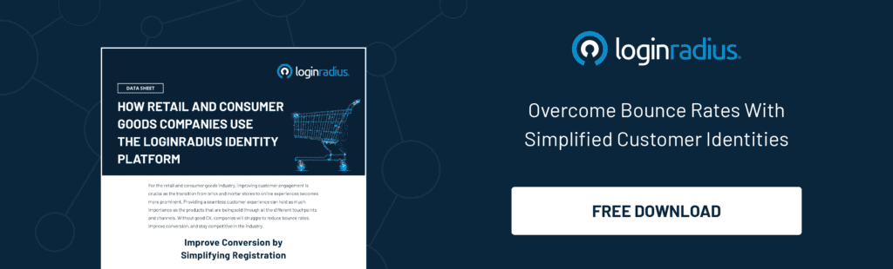

---
title: "Thinking Beyond the Pandemic: How to Make Marketing Plans After Coronavirus"
date: "2021-03-25"
coverImage: "business-after-covid-loginradius.jpg"
category: ["loginradius"]
featured: false 
author: "Sudhanshu Agarwal"
description: "B2B marketing post-COVID focuses more on the digitization of businesses where consumers are now reached via web articles, digital ads, emails, videos, and virtual presentations. There is much emphasis on fostering better connections, and delivering relevant content to build long-term relationships."
metadescription: "9 Best post-pandemic B2B marketing strategies. Incorporating these suggestions can reap maximum consumer loyalty, satisfaction, and sustained profitability."
metatitle: "How to Make Marketing Plans After Coronavirus, now need to think and take action beyond the pandemic."
---

Companies usually plan their years to meet their business goals and execute profit-driven strategies ably. Therefore, it was no big surprise that at the end of the year 2019, businesses were looking forward to the transition to yet another year full of opportunity. But none of us could have factored a global pandemic into our calculations.

  

Traditional business models and tried and tested methods of engaging with consumers and communities were no longer feasible. Now, there are even concerns that the world will never go back to the way it was before the pandemic.

  

Business-to-business organizations need to acclimate to this new normal and adopt new [B2B marketing strategies post COVID](https://www.loginradius.com/b2b-identity/) to remain relevant and achieve success.

## The State of Marketing Before COVID-19

Business models previously relied on direct delivery of services and products to consumers through physical events such as exhibitions, product seminars, ads, face-to-face interactions, and interviews.

  

If there was an online component, it was more an added advantage offered by companies than a necessary addition. Spending patterns across the world trended downward in the wake of the pandemic, while strategy, tactics, and messaging needed an urgent overhaul to suit a drastically altered landscape.

  

B2B marketing post-COVID focuses more on the digitization of businesses where consumers are now reached via web articles, digital ads, emails, videos, and virtual [presentations](https://www.visme.co/templates/presentations/). There is much emphasis on fostering better connections with consumers and communities, delivering relevant, helpful, and human content with added empathy to build long-term relationships.

  

Creative content strategy has now emerged as one of the most reliable B2B marketing strategies. It can help attract and engage audiences in innovative ways to educate them about the changing industry and entertain them at the same time.

  

Let's now explore some of the strategies employed by companies to survive in a post-pandemic world.

## 9 Successful B2B Marketing Strategies Post COVID

### 1. Focus more on existing consumers.

It says a lot about the consumer's loyalty that has stayed with you despite the pandemic. The focus on serving existing consumers has emerged as one of the most popular B2B [marketing trends after COVID](https://www.loginradius.com/blog/start-with-identity/2020/03/loginradius-business-continuity-covid-19-outbreak/). Create services and ad campaigns targeting their needs which are sure to have changed with the changing times.

  

Offering new, relevant services and providing them with the required resources will ensure their loyalty further. What's more, companies can also track consumer journeys and come up with people-oriented stories to showcase their work and promote the company brand.

### 2. Digitize your offerings.

With the travel restrictions, lockdown, and social distancing protocols, it doesn’t surprise that everyone has now moved online. Companies are not only enhancing their websites; they are also executing digital ad campaigns and setting up a dedicated social media channel to focus more on e-commerce channels and trends.

  

Digital marketing strategies are replacing traditional B2B marketing strategies as companies race to improve their online presence.

  

Invest in good CRM (consumer relationship management) software to efficiently manage your consumers. Host informative webinars for consumers and your employees to increase their digital capability and attract new consumers. The more processes companies can bring online, the more they can engage their audiences to stay relevant and achieve business goals.

### 3. Lead consumers with empathy.

The pandemic has affected us all equally. Many of us have lost friends and family to the virus, have had our jobs impacted by it, and feel the sense of displacement it has created. If there ever was a time to lead with empathy, this is it.

  

B2B marketing post COVID must be consumer-centric, adding an emotional touch to creative assets to connect better with consumers.

  

Companies should offer free resources whenever possible and employ user experience to improve brand loyalty and awareness. Inject conversations with empathy as the impact of this pandemic is far from over.

### 4. Think human-to-human, not B2B.

Companies must realize that businesses will most definitely transform and that consumers’ needs will have likely changed accordingly.

  

Engage key clients from both new and existing consumers in empathetic conversation to understand how they have changed, how their financial demands and dynamics have changed, and how their business strategies have evolved.

  

Come up with relevant, engaging content and employ creative storytelling with a human touch to reel consumers in.

### 5. Deploy omnichannel strategies.

Digital marketing has gone from being a USP to becoming a necessity overnight. Omnichannel strategies in a post-pandemic setting will provide greater access, increasing both outreach and productivity.

  

From search engine optimization to email marketing, digital ad campaigns, and creative content implementation, omnichannel allows companies to serve consumers where and when they need them and enable companies to customize their solutions.

  

Companies are better served by taking advantage of the digital spectrum and remain omnipresent across various digital marketing platforms.

### 6. Employ data-driven storytelling.

Though everything looks rather radical on the surface, the pandemic has only accelerated trends that were already reshaping the influencer and B2B media landscape. Businesses must hear out and understand their audiences better to develop innovative storytelling driven by facts and figures to make it more compelling.

  

Data analytics provides companies with a wide variety of consumer data that can be used to craft meaningful content that will find resonance with people. A dedicated social media channel can provide companies with the platform they need to tell their stories and, at the same time, drive up consumer engagement and sales.

### 7. Increase employee digital capability.

Offsite strategy sessions in picturesque locations are now out the window. Acclimatize your teams to [managing remote work](https://www.loginradius.com/blog/fuel/2021/02/tips-managing-remote-team/) (WFH) options to not lose out on productivity. This includes devoting resources towards upskilling and digital capability development, as required, to ensure high-performing remote work options.

  

Businesses will save on overhead and maintenance costs and help maximize their employees' safety by cutting down on all non-essential travel.

### 8. Address consumer needs.

B2B marketing post-COVID is consumer-centric with a focus on a positive user experience. Companies must make all their actions all about the needs of their consumers.

  

The concentration is now on how businesses help solve their problems, meet their needs, and adapt to changes. Companies must draw deeply from consumer experience and make them the story's heroes to strike a chord with audiences.

### 9. Turn salespersons into advocates.

One of the most popular marketing strategies post-COVID is employing staff members to amplify content offerings and act as marketing advocates. [Business identity](https://www.loginradius.com/b2b-identity/) also exists through the profiles of executives, sales teams, and thought leaders, the people who face your organization.

High-value B2B rarely deals closely with a conversation, and companies need their marketing and sales executives to advocate for them for a more significant impact.

## Conclusion

While there is no way to tell which B2B marketing trends post COVID continue to remain in favor, consumer-centric offerings will always find relevance in a post-pandemic world. Incorporate any of the above suggestions in your B2B marketing strategies to reap the combined benefits of maximum consumer loyalty, satisfaction, and sustained profitability.

