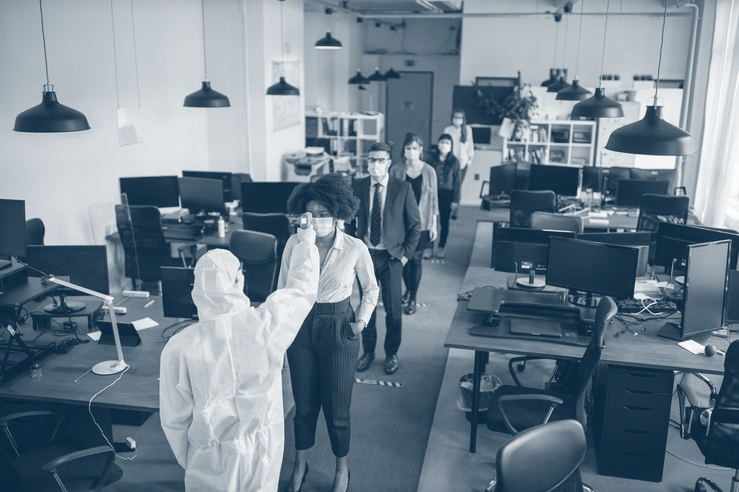

---
title: "COVID-19 Vaccine Success in USA and Remote Working – What’s The Connection"
date: "2021-05-26"
coverImage: "COVID-vaccines-for-remote-culture.jpg"
category: ["loginradius"]
featured: false 
author: "Navanita Devi"
description: "With rejuvenated hope, suddenly, talks about returning to the office have become intense. While a complete transition may still seem like a long shot, the USA COVID-19 vaccine success can have a huge impact on the remote working culture. Let’s find out how!"
metadescription: "Find out how USA’s success with COVID-19 vaccine is helping professionals to get back to office. This success is all set to have a huge impact on the WFM culture."
metatitle: "How USA COVID-19 Vaccine Success can Impact the Remote Working Culture"
---

At a time when the deadly COVID-19 pandemic is at its peak in India, significant vaccine success in the US has come as a silver lining. Buoyed by the robust impact of the COVID-19 vaccine, US president Joe Biden has even announced that those who are fully vaccinated can largely ditch masks.

  

With rejuvenated hope, suddenly, talks about returning to the office have become intense. While a complete transition may still seem like a long shot, the USA COVID-19 vaccine success can have a huge impact on the remote working culture. And that's precisely what we are going to dwell into and figure out what could be the layers of transition.

## How Effective COVID-19 Vaccine has been in the USA

According to a [real-world US study](https://www.livemint.com/news/world/pfizer-moderna-covid-19-vaccines-highly-effective-after-first-shot-in-real-world-use-study-11617066864734.html), Covid-19 vaccines developed by Pfizer Inc with BioNTech SE and Moderna Inc have decreased the risk of infection by 80%, two weeks or more after the first of two shots. Notably, they reduced the risk of infection by a whopping 90% in two weeks after the second shot.

  

"Covid-19 vaccines developed by Pfizer Inc with BioNTech SE and Moderna Inc reduced the risk of infection by 80% two weeks or more after the first of two shots. The risk of infection fell 90% by two weeks after the second shot, the study of just under 4,000 vaccinated US healthcare personnel and first responders found."

  

The study took a thorough look into the effectiveness of the mRNA vaccines among 4000 participants in six states during a long 13-week period starting from December 14, 2020 to March 13, 2021. CDC Director Rochelle Walensky said in a statement that the authorized mRNA COVID-19 vaccine delivered substantial real-world protection against infection to the nation's healthcare personnel, first responders, and frontline essential workers.

  

The findings clearly show that the USA has eventually got the better of the issue (or at least gotten very close to eliminating it) and is looking at a tomorrow that is safe and completely free from the pandemic that has claimed the lives of millions.

## Slowly but Steadily, Work from Home in the USA has Begun to Ease

Even though work from home has by and large been quite productive, there is no substitute for the real-world interaction that professionals have in the office. It not only bolsters collaboration but also enhances the much-needed bonds among colleagues that eventually turn out to be the key aspects for overall growth.

  

As the [COVID-19 threat](https://www.loginradius.com/blog/start-with-identity/2020/05/cyber-threats-business-risk-covid-19/) has subsided, work from home is expected to ease out. For one, it will no longer be full-time for everyone due to a lack of choice. Those who need the high-end tools to work will have the freedom to use them in the office. And the ones who need to collaborate on vast projects will have the luxury to interact with their colleagues and ask questions without any interference.

### Key Staff May Resume Their Work from the Office

As life begins to return to normal, key members of organizations who have to take control of end-to-end projects may soon resume their work. Aside from guiding the entire team and controlling the pivotal aspects, managers and executives will also have the option to arrange a close meeting with any members if need be. It will not only enhance the workflow but also turn out to be the much-needed shot in the arm that had been missing due to the widespread pandemic.

### Companies are Planning to Adopt a Flexible Hybrid Work Model

In order to maintain safety and also find a perfect balance, companies are planning to adopt a fully flexible hybrid work model. Those who have to carry out the work that requires complete focus will stay at home. But those who have to get involved with activities that require teamwork and collaboration will head to the office.

  

"Ford, which has more than 30,000 employees in the United States working remotely because of the pandemic, [said](https://www.nytimes.com/2021/04/05/business/office-workers-return-dates.html) in March that it would transition to a “flexible hybrid work model.” The company plans to let people stay home for focused work and come into the office for activities that require teamwork."

  

Considering that it would be apt to remain guarded against COVID-19 so that the deadly pandemic doesn't get another chance to return, the flexible hybrid work model appears to be the way to go - for now.

  

## Final Thoughts

The remarkable [COVID-19 business success](https://www.loginradius.com/blog/fuel/2021/03/how-to-make-businesses-marketing-plans-after-coronavirus/) in the USA is going to pave the way forward for other countries as well, especially the ones that are struggling to find the right answers to get rid of the pandemic. This success is all set to have a huge impact on the work from home culture and help people return to real-world interaction and teamwork, which are essential for long-term growth. The hybrid model will most likely lead the change.

