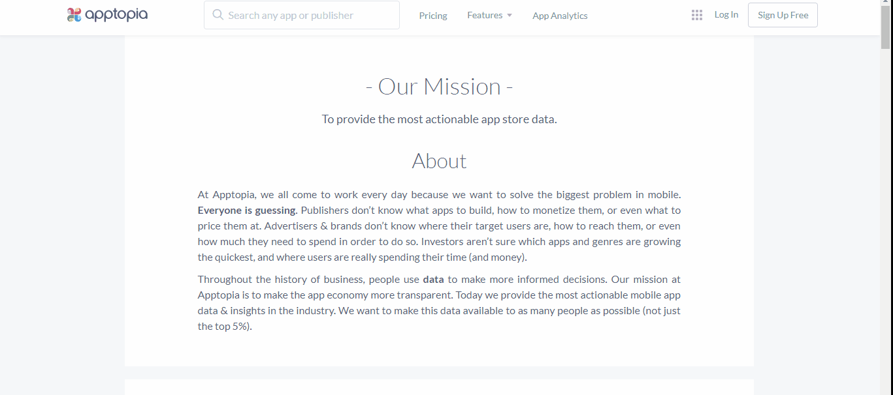
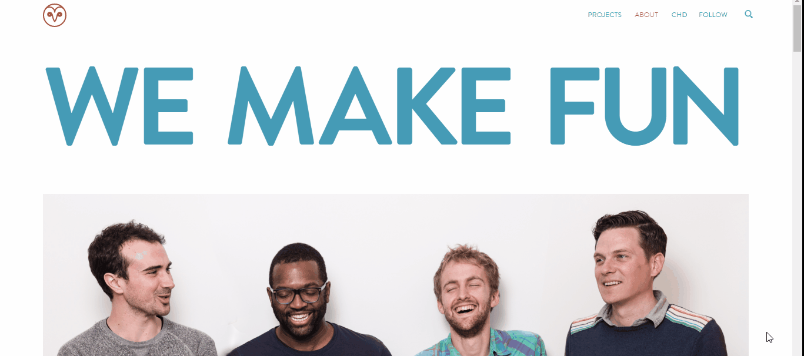
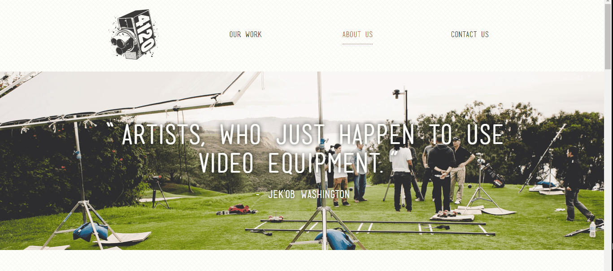
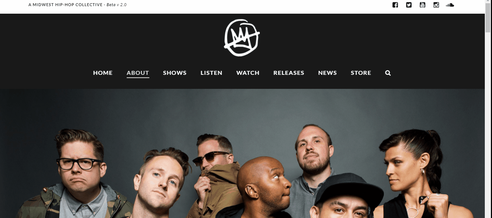

Learn with resourceful examples and effective tips to create the best About Us for your website. Also, find out what the About Us page content should look like. 
Which is the most favorite web page in any company’s website? Okay, let me rephrase it for you- Which page is the most visited page (after landing page) in a company’s website? If you say, it’s  “About Us” page, you are correct. 

If your visitors are interested in your business after visiting your landing page, they will certainly hit the “About Us” button and look for information like

- Who are you? 
- What do you do?
- Your story: how did you start and reach the current place?
- Why Should They Choose You?

Hence, About Us is a substantial web page that markets your business, and you need to take it seriously. Here in this article, I have provided some resourceful examples and some effective tips to create the best “About Us” your website ever had.

### **Best about us pages examples:**

First of all, let me show you some great examples of About Us page. I have included the best points about the web page and why I like them. I bet that you will wish to have an About us page like them:-

#### **1\. Apptopia- No Jargons**

The best thing you would notice about [Apptopia’s](https://apptopia.com/about) About us page is that it follows “**No Jargon**” policy on their website. The startup effectively communicates with its audience in a such a way that any Mr.Average will understand what Apptopia has to offer.

Hence, what you gain from Apptopia’s approach is to avoid use of jargons on your About Me page. Create punchy lines that explain sophisticated products. Your About us section is for no good if an average person cannot understand what you have to offer.

#### **2\. Yellow Leaf Hammocks- Tells A Story**

An About us page is meant to connect emotionally with people. Hence, when you own a story that tells how you have touched lives, say it loud to the world. Such content humanizes your business supplying meaning and context for your product.

[Yellow Leaf Hammocks](https://www.yellowleafhammocks.com/pages/about-us) tell it to the world about how they are making a difference in the lives of thousands of weavers. The company has wisely organized its content in the form of pictures and digestible graphics and not just text.

I believe that every company has its own story that deserves to be told to the world. Thus, it is time to bring out your storytelling skills you have learned in your English classes. Create a descriptive content that has graphics, pictures and text and can connect well emotionally with your audience.

Also read: [How To Get Influential Customer Testimonials with real life examples](http://www.tech36.com/2017/09/influential-customer-testimonials-with-examples.html)

#### **3\. Cultivated Wit- They Make it Fun**

As said in their tagline, they really take it seriously to make their entire website interesting enough by showcasing their own company’s personality. [Cultivated Wit](http://www.cultivatedwit.com/about/) with its uniqueness tries to the break the mold. The company shows that a business can tell about it not only through its “About Us” page but also its entire website.

#### **4\. FortyOneTwenty- Builds The Trust Factor Through Customers Reviews**

An About Us page is made to acquire credibility for your company and who can advertise your business better than your customers and partners. FortyOneTwenty makes sure that their prospects and visitors see how well accepted they are by their existing partners and customers. They have included testimonials of their customers and list of companies which trust them below the fold of About us page.

The testimonials increase credibility, hence you can put your personal testimonials in the form of videos, graphics and text. Thus, if your customers are pleased enough to say good things about you, build your trust factor with their testimonials.

#### **5\. Doomtree- Visual Storytelling With An Engaging Video**

An Audio Visual is a great way to convey your story. Doomtree says it all with its epic content in the form of soundtracks and videos. Visit the [About Us](http://www.doomtree.net/about/) section of Doomtree and you will love the innovative concept of these 7-member crew. The page is responsive and search-engine friendly (particularly when internet usage on [mobiles have increased than desktop users](http://bgr.com/2016/11/02/internet-usage-desktop-vs-mobile/)).

I bet you are swept off your feet by these state of the art About Us sections (you may have also started dreaming about your perfect About Us page). Hence, it’s time to give feathers to your wings. It’s time for some tips that you can meditate upon while creating the best About Us page.

### **How To Write a perfect About Us Content**

There are certain things that you need to take care about while writing the best About Us page. Here are they:-

#### **1\. Talk about your audience and not yourself**

It is really hard to not to talk about your business and talk about your audience on About Us page. Well, there is an easy method to do that. Although, your audience visits your About Us page to know your personality, they subconsciously seek for the solution to their problem. Talk about how you are dedicatedly working to solve their problems since the last few years. Try to connect your vision with needs. You can include facts and figures to make it plain for them to understand your worth. Hence, you have to be creative enough to present yourself in a way your audience will love. [Blog Tyrant's About Us](http://www.blogtyrant.com/about/) is a very good example to look out for.

#### **2\. Let your customers endorse your brand**

Introduce customers testimonials on your About Us page. Add details about your customers such as their full name and other appropriate details. It will add credibility to your page. Also include awards and recognitions especially that are customer oriented.

#### **3\. Tell your story**

Even if you do not have a great story, you can still say it. Start with your beginning, where you belong from and the transition you took. Humanize your story and introduce failures and success in it. You will build a great story. Here’s how [Moz](https://moz.com/about) tells its story. Make sure that you do not deviate in the process of building the best About Us page. You should not add anything irrelevant to the content that does not reflects your company.

#### **4\. Build a multimedia About Us**

According to [Forrester](http://www.marketwired.com/press-release/a-minute-of-video-is-worth-18-million-words-according-to-forrester-research-1900666.htm), a minute video is worth 1.8 million words. Therefore, it is important to have an eye-catching About Us content that includes infographics, videos, timelines, images and more. You can add headshots or interesting pictures of your  team, some events and your recreational moments. Make your page lively but do not stretch it too far.

#### **5\. Avoid jargons**

Always remember that your audience should understand your About Us page. Hence, do not use any words that can kill your connection with visitors.

#### **6\. Test It and ask for reviews**

Last but not the least, test your About Us page. Also, ask for reviews from your peers and even clients. Add if you are missing something(your clients can provide you valuable inputs that may not come to your mind). 

### **Tools to create About Us page**

There are not tools to create a captivating About Us page. **:D**

In the end, I just want to wish you good luck for creating the most awesome “About Us” page you have created ever. These examples and tips will surely help bring one to the desk. Say it loud about your memorable moments while creating your About Us page.
