This article is a part of our Business listing series. Visit List of_ _[US Citation Sites](https://loginradius.com/blog/fuel/2017/02/business-listing-citation-sites-usa/) ._

I am happy to share that since we submitted our business to US and Canadian business listing sites, there is a tremendous increase in the number of leads we are getting. This made me compile a list of citation sites based in Australia. I have checked all these Australian citation sites by doing a submission on each of them. I have also mentioned the steps to submit on each site.

Listing your business to citation sites can be very helpful not only for lead generation but it also helps getting your brand recognized locally. So, if you are a local business who wants to focus on a specific locality, submit your website to these business listing sites and see the difference.

If you want to know more on what is citation refer [this](https://loginradius.com/blog/fuel/top-25-citation-sites-canada/) article.

### **1\.** **Yelp:** [**https://www.yelp.com.au**](https://www.yelp.com.au)

- Domain Authority:  56
- Page Authority:        64
- Alexa Rank:              32,816
- Listing:                      Free
- Country:                   Global

Yelp was founded in the year 2004 and currently witnesses around 24 million unique visitors every month to find services and businesses.

To submit your listing, click on “Sign Up” button at the top right. Once you are done with the sign-up process, a link will be sent to your registered email address. Click on the link and complete the submission process.

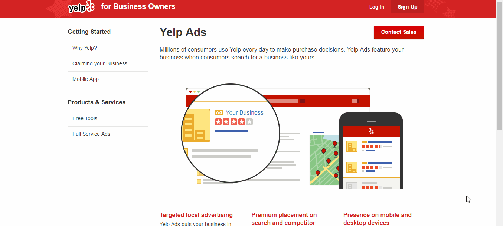

### **2\. Brownbook: [http://www.brownbook.net/](http://www.brownbook.net/)**

- Domain Authority:  56
- Page Authority:        63
- Alexa Rank:              82,939
- Listing:                      Free
- Country:                   Global

Brownbook is a global business listing website. Established in the year 2007, the website is considered as one the best listing database in the world. One can easily list down its business here. Moreover, one can also add images, videos and other business details to enhance online presence.

To submit your business, first click on _“Add A Business”_ button provided at the extreme top right, fill the required columns and finally click on the submit button. A verification link will be sent to the registered email address. To complete your listing, verify your account. Here is a Video that will help you in submitting your business at Brownbook.

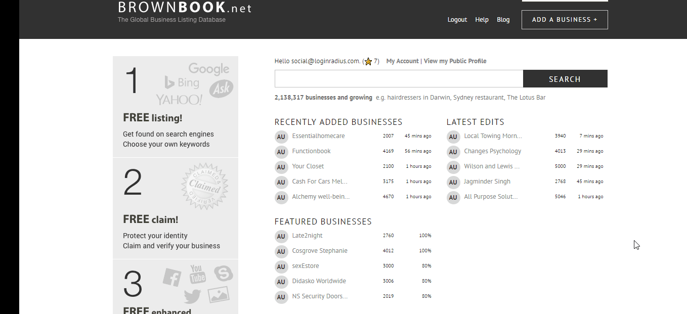

### **3\. StartLocal: [https://www.startlocal.com.au/](https://www.startlocal.com.au/)**

- Domain Authority:  45
- Page Authority:        40
- Alexa Rank:               186,096
- Listing:                       Free
- Country:                    Australia

StartLocal is an Australian business listing website with a wide range of categories. Users can choose any category that they belong to and that too from any region.

Submitting business info at StartLocal is quite easy. Just click, “Add Your Business Free”, and register yourself. Once you register, you get a verification link on your registered email. Check your mail and click on the link to complete the submission process. After filling the form with required details, click on the “Add Your Business” button.

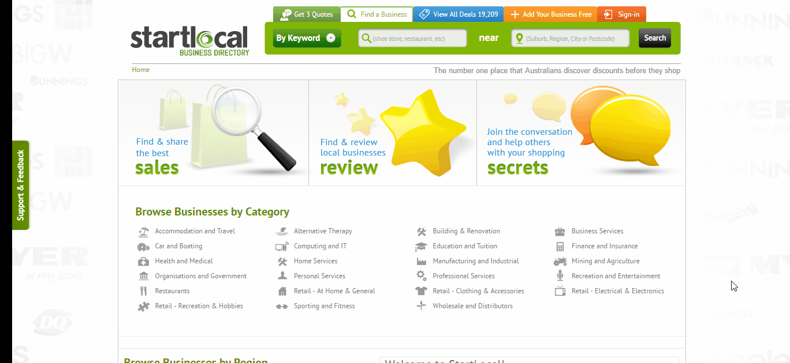

### **4\. Hotfrog: [http://www.hotfrog.com.au/](http://www.hotfrog.com.au/)**

- Domain Authority:  48
- Page Authority:        56
- Alexa Rank:              168,102
- Listing:                      Free
- Country:                   Global

Hotfrog is a big name when it comes to Australian business listing sites. It is present in 38 countries and helps over 120 million businesses to reach out their potential clients.

You can find “ Add your business” button at middle or top of the screen. When you click on it, you will find a long form asking for business details. Fill it and click on the submit button. Your listing will be live when you verify the link that is sent to your registered email. Here is a quick video to start.

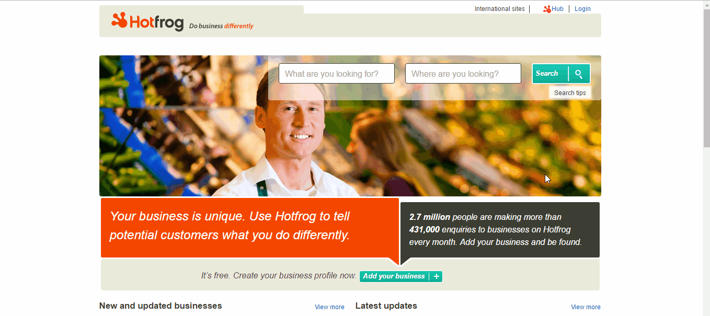

### **5\. Cylex: [https://www.cylex.com.au/](https://www.cylex.com.au/)**

- Domain Authority:  44
- Page Authority:        48
- Alexa Rank:              307,649
- Listing:                      Free and Paid (Contact for a quote)
- Country:                   Global

Cylex, one of the most popular business listing sites in Australia allows a business to display everything they want to show to customers. It is a perfect place where users can find products and services they want. Its basic listing is free but for a better result, you can also go with the paid version.

Here is a quick video explaining how you can submit your business on Cylex.

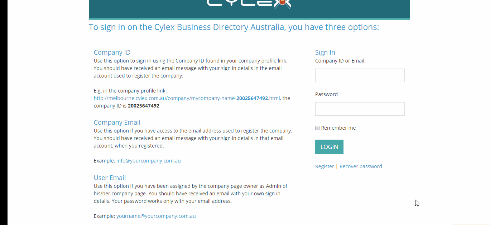

### **6\. Word of Mouth: [https://www.wordofmouth.com.au/](https://www.wordofmouth.com.au/)**

- Domain Authority:  44
- Page Authority:        48
- Alexa Rank:               307,649
- Listing:                       Free and Paid
- Country:                     Global

Word of Mouth is one of the most popular business listing sites in Australia. It is classified into multiple categories. One of the factors which make it different is, here the end users can also add their reviews regarding the businesses.

For submission, click on the “Register business”  button at the top and fill all the business details. Your business gets an instant approval as soon as you click on the submit button. The process is described in a short video below.

### **7\. PureLocal: [https://www.purelocal.com.au/](https://www.purelocal.com.au/)**

- Domain Authority:  35
- Page Authority:        45
- Alexa:                         848,280
- Listing:                      Free and Paid
- Country:                   Australia

If you are planning to drive large online viewership and reputed traffic to your business website, PureLocal is a great choice. The Australian business listing site is an effective place where users can find anything that they are looking for.

In the process of submitting business, you have to create an account first. Once you create an account, login to it and update business information and submit. Here is a video below that can help you out.

### **8\. AustralianPlanet: [https://www.australianplanet.com/](https://www.australianplanet.com/)**

- Domain Authority:  35
- Page Authority:        44
- Alexa Rank:              343,714
- Listing:                      Free
- Country:                  Australia

AustralianPlanet allows you to post a free classified ad, business, and even website or blog. Posting an ad on AustralianPlanet is very simple and free. It helps businesses to improve local business. Check out this short video to know more.

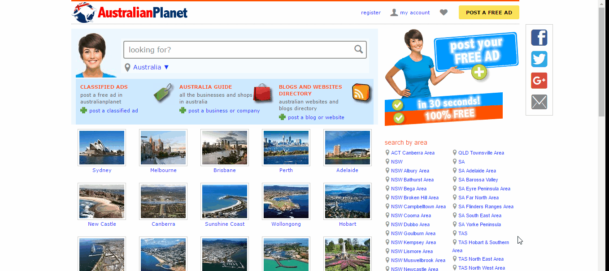

### **9\. Local Business Guide: [http://www.localbusinessguide.com.au/](http://www.localbusinessguide.com.au/)**

- Domain Authority:  34
- Page Authority:        44
- Alexa Rank:              388,162
- Listing:                      Free
- Country:                   Australia

The Local business guide allows you to gain new customers easily. It is divided into multiple categories that make users job easy in finding a business. The website also supports press release and article submissions. Check out the video to list down your Australian business here.

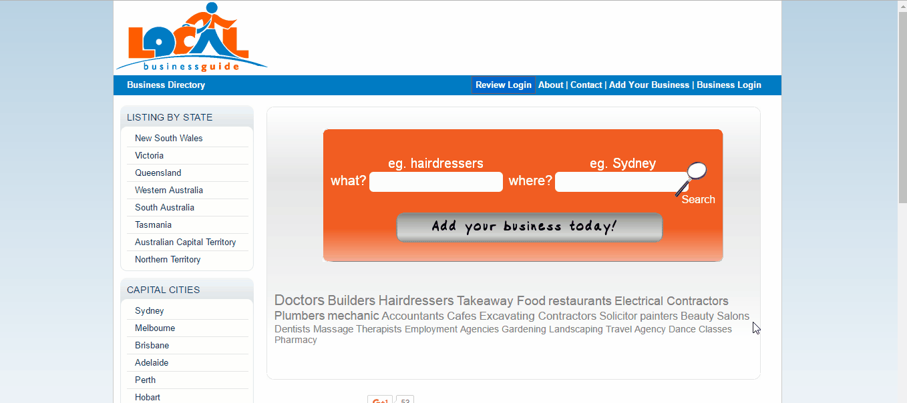

### **10\. Business listings: [http://www.businesslistings.net.au/](http://www.businesslistings.net.au/)**

- Domain Authority:  30
- Page Authority:        41
- Alexa Rank:              368,339
- Listing:                      Free
- Country:                   Australia

Businesslistings helps businesses to improve leads by providing customized information to the potential customers. It is indexed by most of the search engines like Google, Yahoo, and Bing. Additionally, the submission to this business directory is free. Click on the video below to know the process.

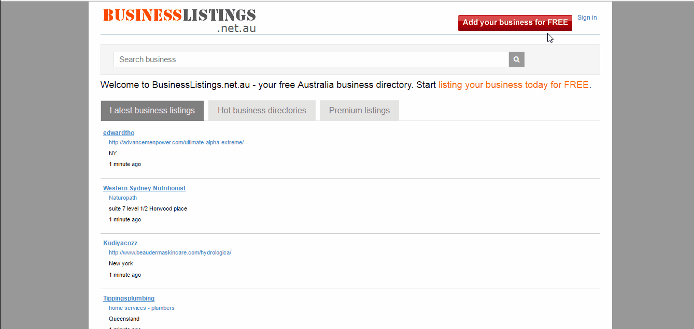

### **11\. Localbd: [http://www.localbd.com.au/](http://www.localbd.com.au/)**

- Domain Authority:  30
- Page Authority:        37
- Alexa Rank:              424,152
- Listing:                      Free
- Country:                   Australia

It is an another free and effective Australian business listing site. There are more than hundreds of categories, that means a wide range of options for users to find a business. By simply clicking on _“Add your business”_ button and filling business details, you can submit your business to one of the most searchable lists. The video below explains the whole submission process.

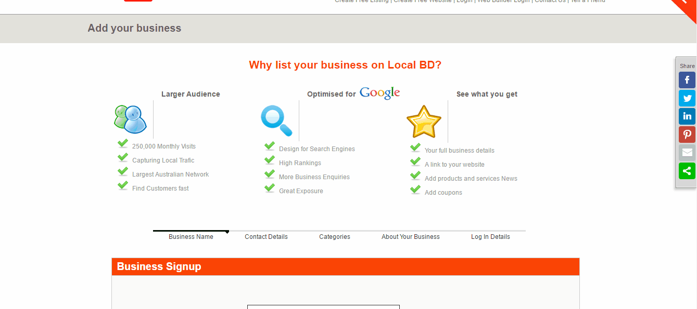

### **12\. Fyple:** [**http://www.fyple.biz/**](http://www.fyple.biz/)

- Domain Authority:  26
- Page Authority:        35
- Alexa Rank:              526706
- Listing:                      Free
- Country:                   Australia

Fyple is well classified into various categories and regions. Customers can find any business very easily over fyple. For submitting business, find the “Add your business for free” button in the middle of the screen, click on it and provide all the information related to your business. Click on submit and verify the link that is sent to your registered email.

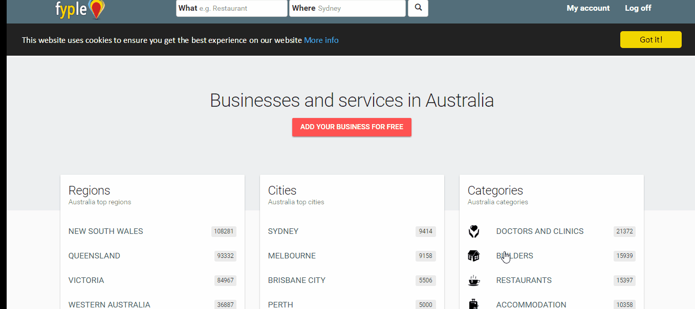

### **13\. Pinkpages: [http://pinkpages.com.au/](http://pinkpages.com.au/)**

- Domain Authority:  20
- Page Authority:        33
- Alexa Rank:              777,288
- Listing:                      Free
- Country:                   Australia

Pinkpages is a business listing website which is managing over 1.6 million listings across Australia. Listing on Pinkpages is totally free.

All you need to do is to create an account and click on the “Free Listings” button at the right top. Provide the required details and get an instant approval. The video explains in a better way.

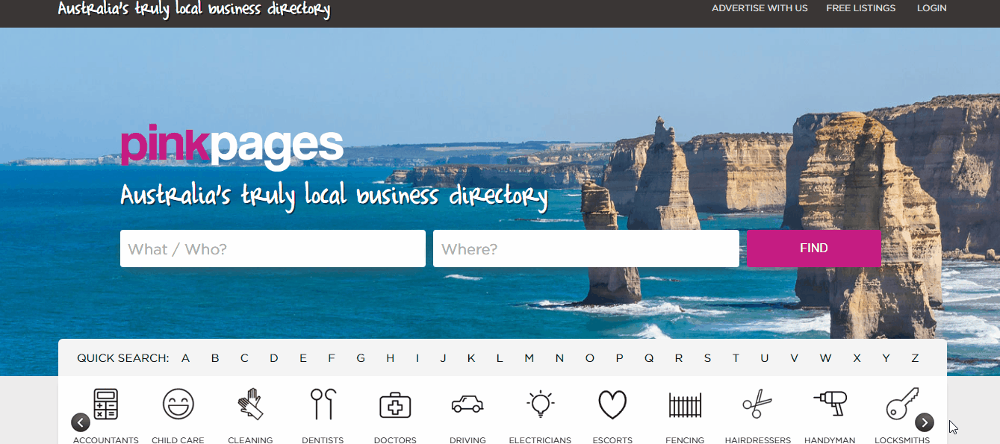

### **14\. Mumbrella: [https://mumbrella.com.au/](https://mumbrella.com.au/)**

- Domain Authority:  66
- Page Authority:        71
- Alexa Rank:              65,321
- Listing:                      Free and Paid (850$/Year)
- Country:                    Australia

Mumbrella is an Australian business listing website which is helping millions of customers to find their desired shops and businesses.

Follow the steps to submit your listing on Mumbrella.

Click on the more section> business directory>get your free listing>submit listing.

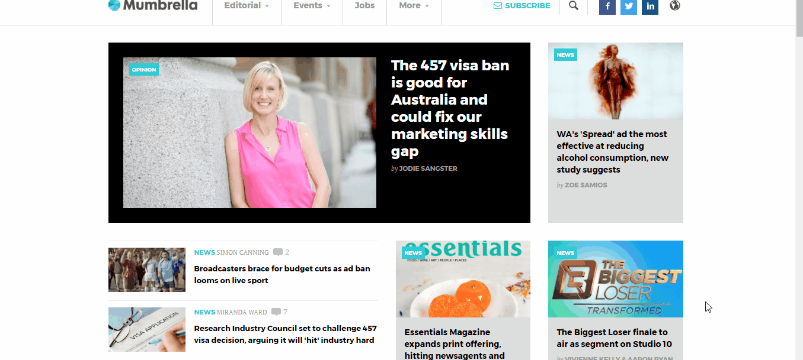

### **15\.  True Local: [https://www.truelocal.com.au/](https://www.truelocal.com.au/)**

- Domain Authority:  62
- Page Authority:       69
- Alexa Rank:             31,792 
- Listing:                     Free
- Country:                  Australia

True Local is helping Australians to find and experience local businesses since 2006. Each month millions of customers are finding their desired service and business through True Local. Customers can also enjoy True Local’s mobile app for more convenience. You can also add images and reviews. Check out the short video to know more.

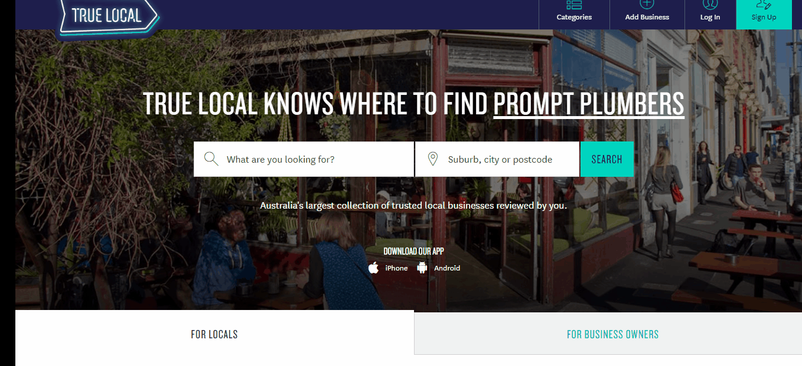

### **16\. Sensis:** [**https://www.sensis.com.au**](https://www.sensis.com.au)

- Domain Authority:  62
- Page Authority:       69
- Alexa Rank:             31,792
- Listing:                     Free
- Country:                  Australia

Sensis helps your business to grow locally. It provides online advice, an option of live chat if faced any problem, and even arranges workshops on online marketing strategies. Submitting on Sensis not only helps you in improving local presence but also in knowing latest marketing trends. The short video below explains how you can submit your business for free.

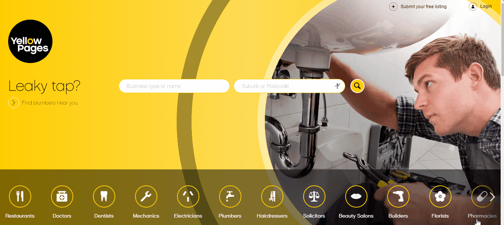

### **17\. dLook: [http://www.dlook.com.au/](http://www.dlook.com.au/)**

- Domain Authority:  51
- Page Authority:        59
- Alexa Rank:              237,100
- Listing:                      Free
- Country:                   Australia

dLook is a free Australian business submitting site. There is a wide range of classification and categories on dLook. You can submit your business by clicking on _“Add your business”_ on dLook for free button and then fill the detail form. Over 1.7 million businesses are online on dLook.

Watch the video to know the submission process.

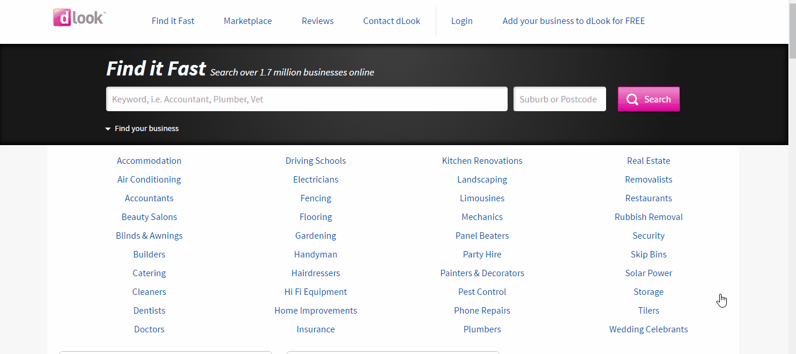

### **18\. ZipLocal: [http://ziplocal.com/](http://ziplocal.com/)**

- Domain Authority:  45
- Page Authority:        54
- Alexa Rank:              1,072,064
- Listing:                      Free
- Country:                   Australia

ZipLocal is an online business submission site aiming to drive potential customers. It is a free listing site and it also provides a free consultation. Thousands of customers are using ZipLocal every day to find businesses nearby.

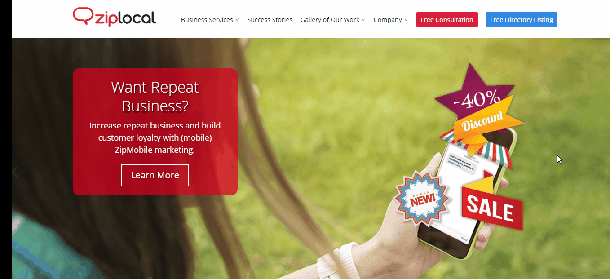

### **19\. Myhuckleberry:** [**http://australia.myhuckleberry.com/**](http://australia.myhuckleberry.com/)

- Domain Authority:  45
- Page Authority:        33
- Alexa Rank:              2,29,543
- Listing:                      Free
- Country:                   Global

Myhuckleberry is a great place to find a business globally. It has its own search algorithm that makes it different from other business listing sites.

To submit your local business, go to “start your free listing” section and register your business with a professional email address. Search for your business in the search section to find out if you are already listed on it. If it is not found, create your listing by clicking “create a new listing” button. Get into the short video to know more.

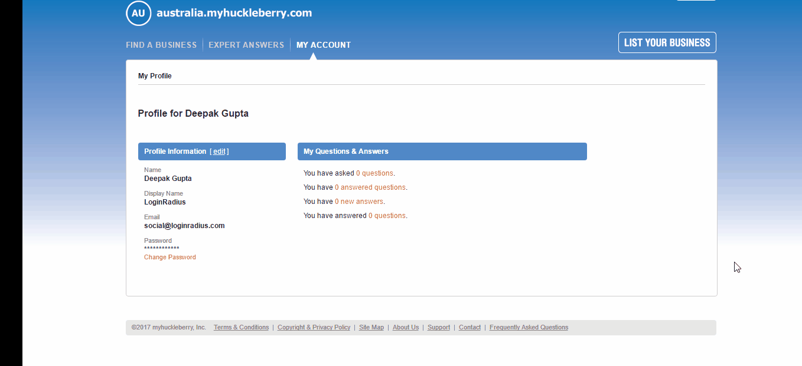

### **20\. My Sunshine Coast: [https://mysunshinecoast.com.au/](https://mysunshinecoast.com.au/)**

- Domain Authority:  43
- Page Authority:        51
- Alexa Rank:              709,595
- Listing:                      Free
- Country:                   Australia

My sunshine coast is a free Australian local listing site where you can find a great classification of categories. Go to “Businesses” at the left middle corner of the screen and then click on the “update your listing” button to submit your business. The short video below help you out in submission.

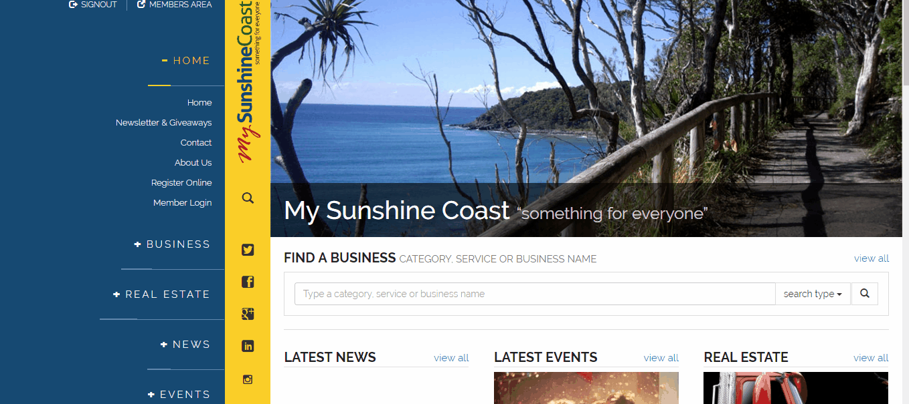

### **21\. Aussie Web: [https://aussieweb.com.au/](https://aussieweb.com.au/)**

- Domain Authority:  40
- Page Authority:        45
- Alexa Rank:               183,572
- Listing:                       Free
- Country:                    Australia

It makes listing and finding business easy and accurate. Aussie web is a great free Australian business listing directory that connects you directly with the thousands of customers and helps in generating more leads. The submission process is very quick and easy. Your listing will be live after clicking on the verification link sent to your registered email.

### **22\. AUBiz: [http://www.aubiz.org/](http://www.aubiz.org/)**

- Domain Authority:  36
- Page Authority:        44
- Alexa Rank:               1,370,145
- Listing:                       Free
- Country:                    Australia

Submitting your Australian business to AUBiz is a great way to drive local awareness and new prospects. The submission process is free and real quick. To know how to submit your business in AUBiz, check out this short video below.

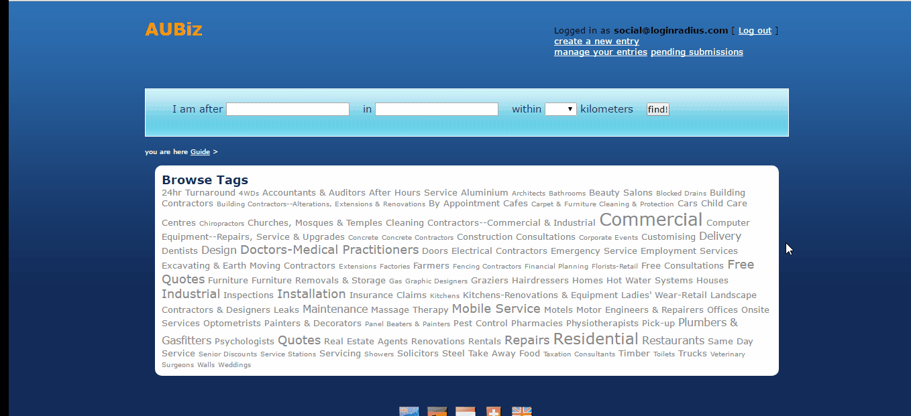

### **23\. SuperPages: [http://www.superpages.com.au/](http://www.superpages.com.au/)**

- Domain Authority:  31
- Page Authority:       42
- Alexa Rank:              578,930
- Listing:                      Free and paid (starts at $350/year)
- Country:                   Australia

SuperPages is one of the famous online business listing sites. For submission, click on the “Free Advertising” button provided at the bottom. Add your business contact number and then click on “find my business” button. A form will appear on the screen, complete it and enter submit button. After verification the link that is sent to registered email address, your listing is live for customers. Here is a short video.

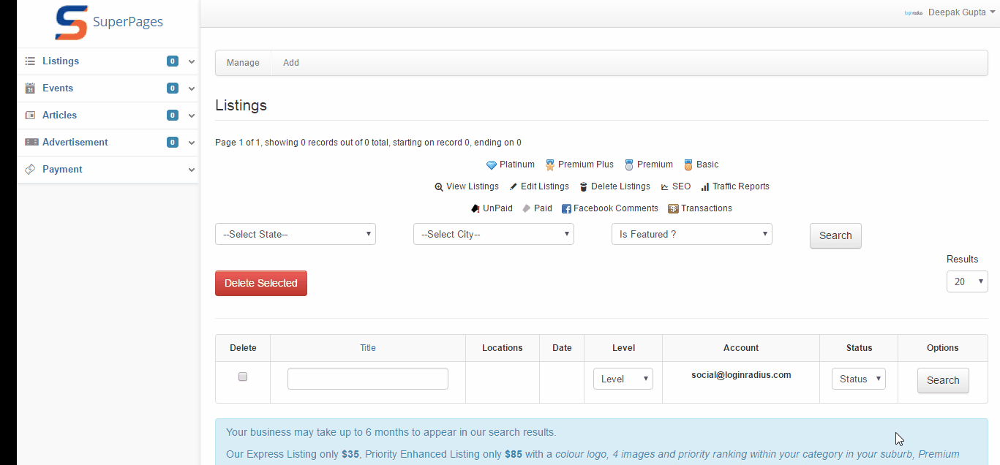

### **24\. Australian Guide: [http://www.australianguide.net/](http://www.australianguide.net/)**

- Domain Authority:  29
- Page Authority:        40
- Alexa Rank:              883,335
- Listing:                      Free
- Country:                   Australia

Australian Guide is a business directory where along with business you can also submit pages and blogs. You can find “submit” button at the top right corner. Click on it and provide all the needed information. Check out the video to understand the submission process.

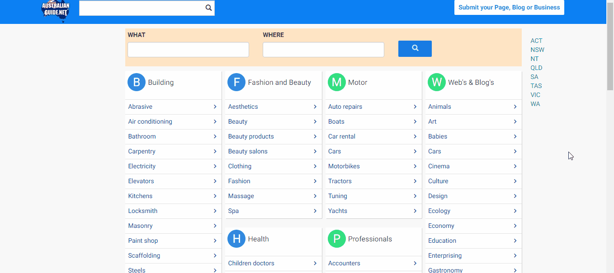

### **25\. BlueysPages: [http://www.localbluepages.com.au/](http://www.localbluepages.com.au/)**

- Domain Authority:  23
- Page Authority:        36
- Alexa Rank:              1,891,323
- Listing:                      Free
- Country:                   Australia

From over 21 years, BlueysPages is helping customers to find businesses. The listing is classified into several categories and it is hundred percent free.

Go to the “List Business” section on the top of the screen. Complete the details and submit. Your listing will be live within 2 working days. Check out the video here.

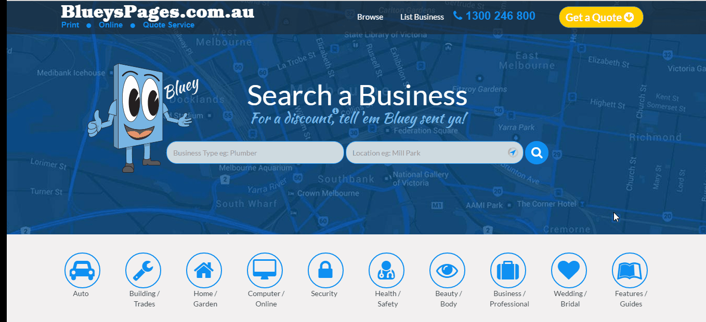

### **26\. POIDB: [http://www.poidb.com/](http://www.poidb.com/)**

- Domain Authority:  23
- Page Authority:        27
- Alexa Rank:              1,343,113
- Listing:                      Free
- Country:                   Australia

POIDB stands for Point of Interest Database. It has more than 300 categories. In this, the business information is stored in groups. It aims to be the largest poidb for Australia. The short video below will help you to submit your business in POIDB.

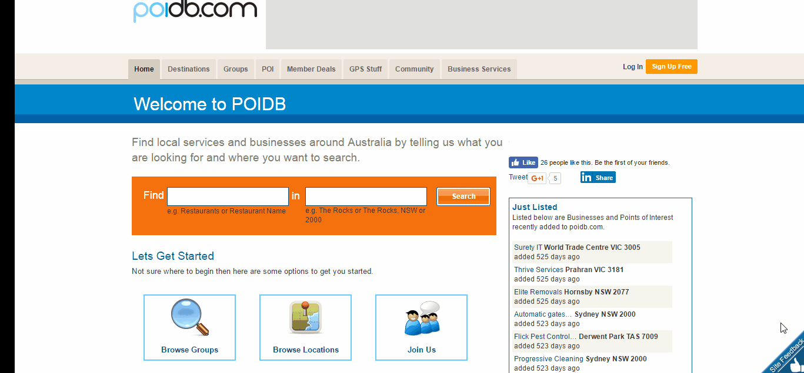

### **27\. Opendi: [https://www.opendi.com.au/](https://www.opendi.com.au/)**

- Domain Authority:  20
- Page Authority:        25
- Alexa Rank:               1,179,244
- Listing:                       Free
- Country:                    Global

Opendi is a free business listing site. It helps businesses to reach out more than 3 million visitors every month and increases your web presence locally.

Click “create a new listing” button at the top corner. Provide the required information and verify the account by clicking on the verification link. Here is a short video.

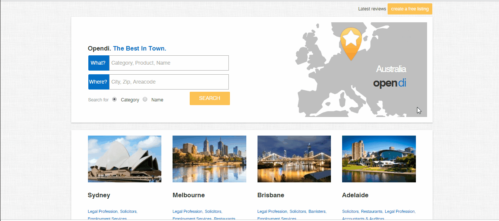

### **28\. White pages: [https://www.whitepages.com.au](https://www.whitepages.com.au)**

- Domain Authority:  75
- Page Authority:        79
- Alexa Rank:              43,258
- Listing:                      Free
- Country:                   Australia

To submit on White pages, go to the “Advertise with us” section. After clicking on the button, a form will pop-up where you need to fulfill all the required information. At last click on “Claim my ad” button to complete the submission process.

 

### **29\. Showmelocal: [http://au.showmelocal.com/](http://au.showmelocal.com/)**

 

- Domain Authority: 50
- Page Authority:       45
- Alexa Rank:              81,709
- Listing:                      Free
- Country:                   Australia, UK, US and Canada

One of the most popular australian business directory site, Showmelocal provides local businesses to promote themselves. Meanwhile, the site also provide customers to find the desired services in their area while finding amazing deals as well.

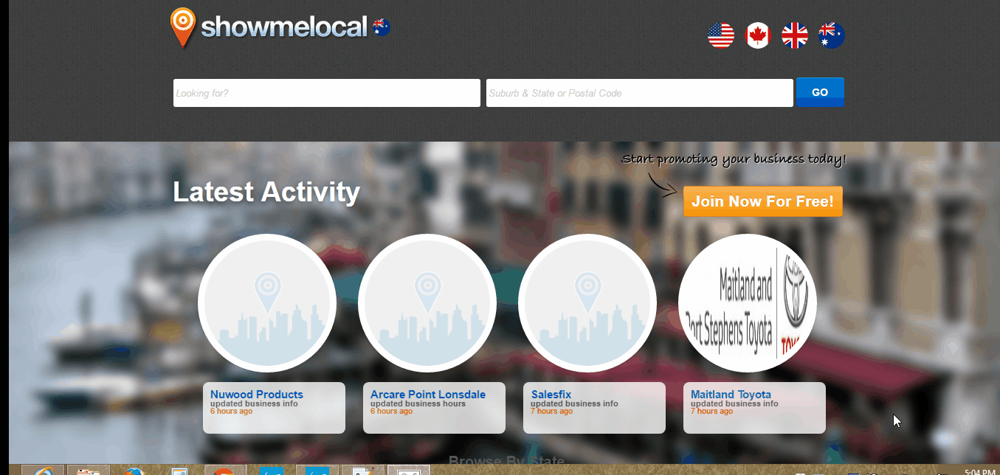

This was the list of website that I tested out. During the submission process, I also came across the local business listing websites that were not relevant to my business which is _**why are not practically implemented by me**_, but might help you out. 

Below is the list of those Australian business directory sites in the format - Website (DA, PA, Alexa, Category)

1. [Happycow](https://www.happycow.net/)  (63, 73, 48,960, restaurants and stores)
2. [Priceline](https://www.priceline.com.au/)  (60, 67, 40,139, hotels)
3. [Oneflare](https://www.oneflare.com.au/)  (57, 65, 83,879, plumber, electricians, painters etc.)
4. [agfg](https://www.agfg.com.au/)   (44, 53, 276,570, bar, wineries, travel etc.)
5. [Yalwa](http://www.yalwa.com.au/)   (38, 48,907, 198, Fashion, property tec.)
6. [Pinbud](http://www.australia.pinbud.com/)  (38, 35, 204, 759, B2C)
7. [Opentable](https://www.opentable.com.au/start/home)  (38, 48, 269,806, B2C -Hotels and Food)
8. [Wow city](http://au.wowcity.com/)  (37, 36, 64,918, B2C -Hotels and tours)
9. [Local](https://www.local.com.au/)  (34,43, 940,966, B2C -plumbing, AC repairing)
10. [Australian guide](http://www.australianguide.net/) (30,41, 904,504, B2C-Fashion, hospitals)
11. [atug](https://www.atug.com.au/)  (29, 41,1,645,155, B2C -Bars, real estates, construction)
12. [Live pages](http://www.livepages.com.au/listing_options.php)   (28, 33, 1,078,01, B2C -Beauty salons, household services etc.)
13. [Ozbusiness](https://www.ozbusiness.com.au/) (25, 37, 796,299, B2C -House cleaning, blacksmiths)
14. [Green finder](http://www.greenfinder.com.au/)  (28, 40, 1,573,871, B2B-Eco products)
15. [Nationwide](http://www.nationwide.com.au/)   (32, 42, 12,29,587, B2B -Tourism, education)
16. [Webnetwork](https://www.webnetwork.com.au/)  (28, 38, 737,109, B2C)
17. [Website link](http://websitelink.com.au/) (39, 37, 879,805, B2C -Floor construction, sports goods etc.)
18. [Ourpatch](http://www.ourpatch.com.au/)  (32, 37, 634,064, B2C)
19. [Indeedto](http://www.ineedto.com.au/) (19, 32 , 1,935,709, B2C)
20.  Mysherrifau (24, 34 , 974,287, Both B2B and B2C)
21. [Business listing now](http://www.businesslistingnow.com/) (26, 22, 877,624, B2C -Events related)
22. [Angloinfo](https://www.angloinfo.com/)  (52, 35 , 24,394, B2C -Marketing, office supplies)
23. [Product overview](https://www.productreview.com.au/) (48, 57, 15,068, B2C -Pet products, kitchenware etc.)
24. [National directory](http://nationaldirectory.com.au/) (34, 34, 887,934, B2C -fitness, advertising etc.)
25. [Clickblue](http://clickblue.com.au/)   (29, 33, 895,635, B2C -Real estate, household services)
26. [Comeonaussie](http://www.comeonaussie.com/) (38, 45, 662,883, B2C -Computer, health etc)
27. [Businesszoom](http://businesszoom.com.au/) (36 , 38, 1,234,600, B2C -Food, automotive etc.)
28. [Directory](https://directory.com.au/)  (39, 47, 1,043,819, B2C -Cafe, arts) Free
29. [Franchisebusiness](http://www.franchisebusiness.com.au/) (41, 36, 366,955, B2C -Pet care, finance)
30. [Atozpages](http://atozpages.com.au/)   (34 , 44, 952,821, B2C -restaurant, shopping etc.)
31. [Adelaide](http://www.adelaidebd.com.au/)    (31, 33, 1,499,222, B2C -computer support, paint service etc.)
32. [Locality list](http://southaustralia.localitylist.com.au/)  (39, 35, 2,227,402, B2C-Office services)
33. [Mactumbo](http://mactumbo.com.au/)       (25, 32, 5,012,844, B2C)
34. [My business central](http://www.mybusinesscentral.com.au/) (33, 35, 2,982,926, B2C -Home services)
35. [Kangaroobiz](http://kangaroobiz.com/) (12, 15, 3,229,078, B2C)
36. [Free directory](http://freedirectory.com.au/) (19, 32, 1,588,392, B2C -Auto repair, electrical services etc.)
37. [Australian manufacturing](http://australianmanufacturing.com.au/) (29, 29, 1,840,900, B2C)
38. [Gohospitality](http://hospitalitymagazine.com.au/)  (26, 31, 1,630,235, B2C -Bakery, housekeeping etc.)
39. [Searchmysubhurb](http://searchmysuburb.com.au/) (18, 25, 3,641,641, B2)
40. [Ilandscape](http://www.ilandscape.com.au/) (27, 38, 3,390,453, B2)
41. [Find business online](http://findbusinessonline.com.au/)      (42, 35, 3,900,387, B2C -Beauty, accommodation etc.)
42. [Bizdirect](http://bizdirect.com.au/)   (16, 17, 3,204,945, B2C)
43. [Findinaustralia](http://www.findinaustralia.com/)  (25, 38, 3,704,487 , B2C -Schools, jewellers etc.)
44. [Abpd](http://www.abpd.com.au/)   (18 , 30, 3,177,585 B2C)
45. [webfind](http://www.webfind.com.au/)   (26, 37, 5,335,311, B2C)
46. [Yourcity](http://www.yourcity.com.au/)   (24 , 33, 3,076,042, B2C -shops)
47. [Northlakes](http://www.northlakes.com.au/) (22 , 32,  2,371,622, B2C -tours & travels)
48. [visitlistmore](http://www.visitlismore.com.au/) (38 , 48, 3,121,185, B2C -Gift shops)
49. [Hawkesburry](http://www.hawkesbury.net.au/)  (31, 39, 2,785,139, B2C-hotels, bars etc)
50. [Canberralist](http://www.canberralist.com/) (21, 24, 9,526,799, B2C -home services)
51. [Architecture and design](http://www.architectureanddesign.com.au/home)    (56, 64, 163,911, B2C -home construction)
52. [Ferret](http://www.ferret.com.au/) (42, 52, 339,653, B2C- chemicals, automation etc.)
53. [Arabicpages](http://www.arabicpages.com.au/) (17,  25, 831,696, B2C- events)
54. [Adelaidsouthaustralia](http://www.adelaidesouthaustralia.net/tradesmen-online/)  (33,  32, 5,858,506, B2C)
55. [Yellowpages](https://www.yellowpages.com.au/)   (81, 57, 15,232, B2C and B2B)
56. [Oneflare](https://www.oneflare.com.au/)  (39, 38, 5,451,774 , B2C)
57. [Webwobet](http://www.webwombat.com.au/)   (57, 64, 384,417, B2C)
58. [Tupalo](http://www.tupalo.co/)   (36, 46, 44,1074, B2C -Cafe, pets etc.)
59. [Yellowbook](http://www.yellowbook.com.au/) (30, 40, 1,243,022 , B2C)
60. [2findlocal](http://www.2findlocal.com/en/au)   (56, 39, 116,071, B2B and B2C)
61. [Tuugo](http://www.tuugo.biz/)  (31, 31, 579,231, B2C -Hotels, education etc.)
62. [Addeals](http://www.addeals.com.au/) (15, 23, 11,505,633, B2C -Security, furniture etc.)

Go ahead guys! Submit your business to these Australian local business listing website and drive awareness, local reach and new customers :) Let me know in the comment box below if you have any query.
