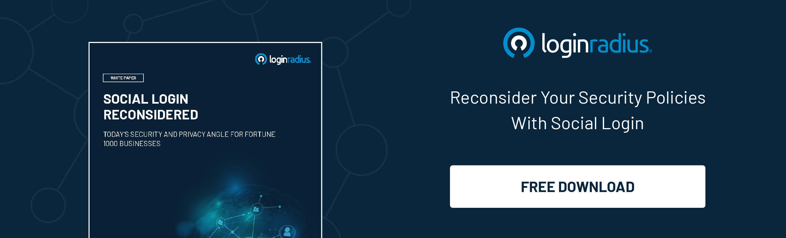

## Introduction
Authentication isn’t a 21st-century concept designed to offer secure access across diverse platforms, networks, and systems; it’s been there for decades to identify individuals they claim to be for several reasons. 

However, when we talk about today’s technologically-driven modern world, we’re all surrounded by digital experiences where we need frequent authentication to access our devices, applications, etc. 

Over the past years, the evolution of authentication portrays the risks associated with unauthorized access and the growing number of cybersecurity threats that leads to compromised user information and sensitive business data. 

Whether we talk about using conventional passwords or biometric authentication methods, we’ve come a long way to secure consumer identities and sensitive business information. 

Let’s look at the aspects of [authentication](https://www.loginradius.com/blog/identity/what-is-authentication/) and how it has evolved over a decade. 

## Why Are 20th Century Passwords Obsolete in the 21st Century?

Although businesses still rely on conventional passwords, most of them choose the next level of authentication through passwordless and [biometric  authentication](https://www.loginradius.com/blog/identity/what-is-mob-biometric-authentication/) mechanisms. 

However, things have changed rapidly, especially in the cybersecurity landscape. And the truth is, the password-based authentication approach was the ultimate solution when we talked about cybersecurity back in the early 2000s. 

With the surging number of websites, platforms, and devices, threats have also increased exponentially. Unauthorized access to consumer information like banking details and personal information through phishing or brute force attacks gave rise to the need for a more robust and reliable authentication mechanism. 

Hence, the traditional password-based authentication became outdated as attackers could easily compromise the passwords to exploit user information and sensitive business data. 

Apart from this, one of the significant issues with conventional passwords is that they’re hard to remember. And every individual has to remember several passwords, which hampers the overall user experience while interacting with a platform or a device. 

## The New-Age Authentication 

With consumers demanding an excellent user experience every time they interact with a brand, seamless authentication becomes the need of the hour. 

On the other hand, security is one of the major concerns among businesses, which is the reason why relying on old-school authentication methods seems risky. 

Since we’ve learned about the evolution of authentication, let’s look at the latest and most secure ways of authentication that can help businesses ensure robust security without hampering user experience. 

### #1. Social Login

Social login, also termed social sign-in or social sign-on, allows your consumers to log in and register with a single click on a website or mobile application using their existing accounts from various social providers. 

It simplifies the sign-in and registration experiences, providing a convenient alternative method to create an account where it is mandatory. 

For consumers, social login is a single-click login method for accessing the website and mobile application—one in which there is no need for excess credentials and allows consumers to skip traditional registration methods.

### #2. Passwordless Authentication

A passwordless authentication system swaps the use of a traditional password with certain factors. These extra-security methods may include a link, fingerprint, PIN, or a secret token delivered via email or text message.

Passwordless login eliminates the need to generate passwords altogether. There’s a lot of good in this new-age process for both users and organizations alike.

For users, since one needs not type passwords anymore, it leads to a better screen time experience. While for organizations, it will lead to fewer breaches and support costs.

The use of passwordless authentication in businesses is multifold. For example, you can go passwordless for internal security, online consumers, or even combine the two of them. 

A few use cases of [passwordless authentication](https://www.loginradius.com/passwordless-login/) include:

* Sign up for a service, or get a subscription.
* Let consumers log in to their online accounts.
* Make a secure payment online.

It is much easier to keep information about users safe and implement tighter security measures for employees with passwordless logins.

### #3. Adaptive Authentication/ Risk-Based Authentication

[Risk-based authentication](https://www.loginradius.com/blog/identity/risk-based-authentication/) is a non-static authentication system that considers the profile(IP address, Browser, physical Location, and so on) of a consumer requesting access to the system to determine the risk profile associated with that action. The risk-based implementation allows your application to challenge the consumer for additional credentials only when the risk level is appropriate.

It is a method of applying various levels of stringency to authentication processes based on the likelihood that access to a given system could be compromised. As the level of risk increases, the authentication process becomes more complicated and restrictive. 

RBA/adaptive authentication implementation follows the challenge and response process. One party presents a challenge (in the form of a question), and the other party provides a response (in the form of a response) as the second factor after submitting the username and password.

Whenever a system identifies any risk with a login activity, there can be multiple actions based on the configuration setup.

## The Bottom Line

The evolution of authentication has portrayed the need for stringent robust measures that help ensure the highest level of security for both consumers and businesses. 

And the crux of the matter is that businesses relying on old-school authentication methods should immediately put their best foot forward in incorporating a reliable authentication mechanism as mentioned above. 

Businesses leveraging cutting-edge authentication technologies always stand ahead of their competitors since their customers enjoy a seamless user experience reinforced by robust security. 

