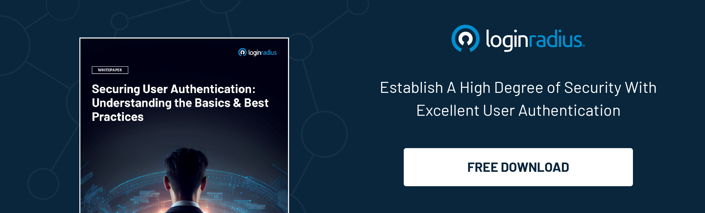

## Introduction

Your business is your most valuable asset. Ensuring that you are sensitive to the security of your customers and their information is essential to building a stable and healthy relationship with them.

Customer Authentication and Email Authentication are the two security provisions we will discuss in this blog. 

## What is Customer Authentication?

[Customer authentication](https://www.loginradius.com/blog/identity/what-is-authentication/) includes various methods aimed to verify an identity of a person. This is particularly important during digital interaction between the customer and business. 

If you are a customer, the authentication of your identity could contain various methods. You are either asked for something only you know, such as a password; something you have, such as an encryption token; or something you are, like the identity (User ID). 

When one of these methods is used in combination with the User ID, it is referred to as Single Factor Authentication. Single Factor Authentication is not bullet-proof, yet security professionals and regulators recognize the need to balance out security and convenience to match the mutual satisfaction between the business and the consumer. 

Using two of the above-mentioned three methods is called Dual Factor Authentication and is considered to provide far more security, yet is not considered cost-effective. Single Factor Authentication can be nonetheless strong, if the method is selected properly. 

Let us briefly discuss the above-mentioned three methods of customer authentication.

* **Password-based Authentication**

Password is the most common Single Factor Authentication method. Evidently, customers prefer to recall their passwords quickly, therefore often neglect complexity, which is a requirement to keep your account safe. 

It is recommended to keep the password case-sensitive with at least six characters long, while including at least two numbers and symbols. That kind of complexity ensures the security of your account, since the password will require the calculated amount of ten trillion attempts to crack, in case of an attack. This is why the debates are still being hold, whether customer-generated or provider-generated passwords are a better warrant of security.

* **Knowledge-based Authentication**

KBA, or Knowledge-based Authentication is a common method for securely aiding a customer in the recovery of their password. Since the challenge in this case lies in authentication, that the request of a password recovery was indeed submitted by the holder of the User ID. KBA asks a customer one or more questions to verify their identity.

* **Single Sign-On**

[Single sign-on](https://www.loginradius.com/single-sign-on/) or SSO, is mostly used by services using password as their main authentication method. SSO allows a customer to authenticate themselves once to use various accounts or systems. This provides comfort, as it eliminates the need to remember various passwords for various applications.

All of the three above-mentioned customer authentication methods present a challenge, where a business must determine a common ground between comfort and security.

## What is Email Authentication?

Email authentication is also a collection of techniques to keep customers’ messages secure. The main aim of email authentication is to provide verifiable information about the email message the recipient received. That information verifies the ownership of the domain of any Message Transfer Agent who participated in the email exchange. This reassures your recipients of the [authenticity of your email messages](https://www.loginradius.com/blog/identity/secure-email-address-website/), that you are indeed who you claim to be.

Originally, the Simple Mail Transfer Protocol had no solution to validate email messages. This was taken as an advantage by spammers, scammers, and spoofers to conduct various kinds of fraudulent activities. 

Evidently, many customers would leave businesses due to their affiliation with such activities. If I subscribe to a service providing the best deals for summer vacations, for example, shall a Nigerian prince email me the next day with a similar domain, urgently requesting my credit card credentials to bring fortune to his kingdom and my family?

To reduce the possibility of either of these fraudulent activities, many email authentication protocols have been developed. The ones used most are SPF, DKIM, and DMARC. They all serve a different purpose, but overall warrant email authentication.

## Authentication, Customer Acquisition & Retention

You can already see how these authentication methods greatly benefit customer acquisition and retention. If your customers have a guarantee, that by registering for your services and providing your servers with their contact information no spoofer, attacker,  or scammer shall reach them, that improves the business relationship. 

But as we were brief, how else can email authentication help customer acquisition and retention? 

With email authentication and email validation, you also greatly impact your email reputation. That in return directly affects your email deliverability rate. Of course, that is not the sole determining factor of your email deliverability rate. 

However, if your emails are authenticated and have less affiliation with fraudulent activities, that has a significant impact on the deliverability on its own. With a positive email reputation and email deliverability, your email campaigns reach your customers. And your emails have various objectives in terms of [customer acquisition and retention](https://www.loginradius.com/blog/growth/improve-customer-relation-brand-identity/).

Are you sending an email to present your customer with an exclusive offer to encourage them to prolong the business partnership, inform of a new feature, or simply aid them in updating their password? In this example, emails serve a different purpose, yet are united under the same aim - to retain a customer. With that in mind, how do we improve our email deliverability?

### Email Deliverability

Internet Service Providers enforce restrictions on reaching the recipients' main inboxes to fight the ongoing spam and scam. This works in favor of recipients, yet at times might work against them. They might miss important emails to update their password or check their product delivery status, however, that is a mistake on the sender’s end, not the recipient’s.

To improve your email reputation with ISP and therefore impact your email deliverability, consider the following points:

* Send emails only to users who want to receive them
* Make the unsubscription option easy to reach
* Remove emails with high bounce rates
* Be consistent with your email campaigns
* Integrate email authentication and email validation

These points do not summerize the entire [guide on email deliverability](https://mailtrap.io/blog/email-deliverability/), yet do overview them very briefly. Email authentication increases email deliverability, since it prevents fraudulent email activities, like spoofing, [phishing](https://www.loginradius.com/blog/identity/phishing-for-identity/), and more. Customers will receive your emails in their main inboxes and will know, that your emails are safe to interact with, as a legitimate source sends them.

In an otherwise scenario, not integrating email authentication and email validation results in poor email deliverability. To your customers, this is:

* Preventing them from regaining immediate access to their account
* Preventing them from being reminded of your existence
* Preventing from being notified of a new feature

## In Conclusion

We briefly overviewed the importance of customer authentication and email authentication. We learned what is customer authentication and email authentication, and mainly - how it impacts customer acquisition and retention.

Email campaigns certainly can be tricky, a lot of resources are invested in strategizing their content and delivery. With a good email reputation and email authentication, those emails will reach the main inboxes and fulfill their objective. Customer authentication, on the other hand, is a vital part in ensuring the safety of any sensitive data the customer entrusts with your business. 

With digital businesses taking over the entire industry, improving customer authentication and email communication with customers has never been more important to maintaining a successful business.

