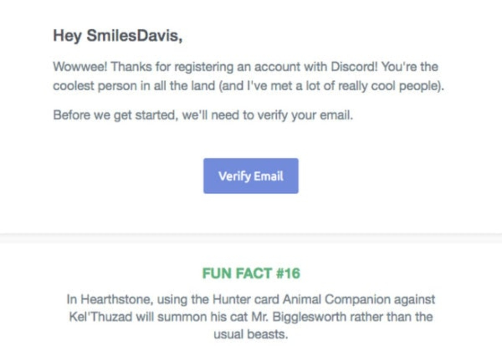
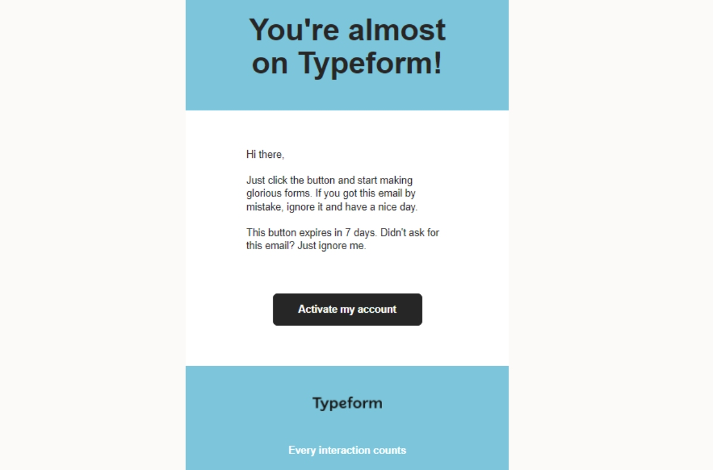
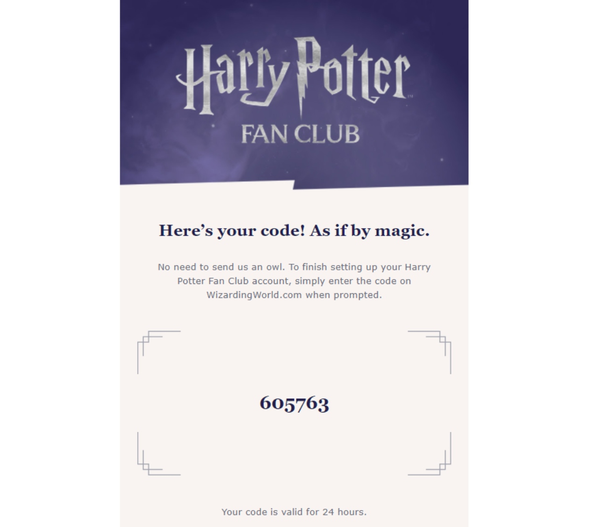

---
title: "Tips to Make Verification Emails Effective: Best Practices & Examples"
date: "2022-03-21"
coverImage: "verification-email.jpg"
category: ["all"]
featured: false 
author: "Maxim Grigoryev"
description: "The verification email can impact authentication, communication, and customer journey. Learn how to draft an effective verification email."
metadescription: "The blog will highlight the role of verification emails and offer ideas on how to make them reach the inbox and add to the customer journey."
metatitle: "Best Practices to Make Your Verification Emails Effective"
---

## Introduction

The verification email is a common type of identity validation within the CIAM concept. Even though it is a fundamental practice, with this authentication step, a company starts communicating with the customer. 

It means that, despite the security role, it can also provide some benefits for the brand's perception and customer journey. Moreover, it is in the company's interests to avoid spam traps, greet a customer and finish the authentication process. 

The blog will highlight the role of such emails and offer ideas on how to make them reach the inbox and add to the customer journey. 

## What is a Verification Email?

Verification email, also referred to as validation email, is a way to verify a user action, like authentication or registration on the website or app. Such an email relates to the message that the business party sends to the customer's inbox.

In terms of the [CIAM](https://www.loginradius.com/blog/identity/customer-identity-and-access-management/) concept, it ensures the ground for building relationships and establishing multi-factor authentication, passwordless login, and profiling. At the same time, validation emails add to the marketing efforts, opening the door for email marketers to the customer's inbox. From there, they would invite stakeholders to different stages of the sales funnel.

As a result, the verification email can impact: 

* **Authentification.** Becomes the initial step in applying [two-factor authentication](https://www.loginradius.com/resource/loginradius-ciam-two-factor-authentication/+) for privacy reasons or creating a unified system allowing integration of different devices.
* **Communication:** Starts communication with a customer and contributes to the company's image.
* **Customer journey:** Invites the customer to be an object of the marketing campaigns, events, and promotions upon their acceptance.

## How to Make Verification Emails Effective?

It is clear now that the verification emails can contribute to the overall relationships with the customer. To make them effective, or at least be pleasing to the customer, you take the subsequent actions:

### Keep in mind anti-spam practice

Sometimes the messages get under the spam filters set by Internet providers and hit the spam section instead of the inbox. To customers, it brings confusion that can result in failure to get the subscriber. What are the possible issues? They refer to the domain, message, or the specific filter the provider sets. That's why, to avoid the trap, you should consider the following:

* **Your domain reputation.** Whether you a new brand or the established one, your email domain impacts the deliverability of the emails. In this regard, it is worth implementing the precautionary actions that include checking your domain on the reports or warming up your domain.
* **Spam words.** Another factor that can bring adverse effects is the presence of spam words in the validation email. In most cases, such an issue does not refer to the latter. However, you should understand that the words that marketers use to push sales, like buy, now, etc., will make your letter go to the spam box. Thus, try to limit their usage.
* **Clarity.** Importantly, your verification email subject line should be clear and state the goal of the email. The creative elements can be inserted at the end of the email.

### Think of the proper tone of voice

It is crucial for the brand to start the email with the tone of voice reflecting your brand principles and making a specific impression. The choice of words is vital, especially when you want your customers to listen. The safest option for verification email would be a technical, neutral, and concise message. 

Nonetheless, choosing this way means you pick not to contribute to your marketing efforts and show why you are different. Depending on your marketing strategy, you can insert various elements, like informal greetings, fun facts, or images. The ultimate goal of such actions is to add integrity to your brand's actions.

### Apply personalization

Personalization seems to be crucial for any action related to building customer relationships. For instance, [around 70% of customers](http://www.forbes.com/sites/blakemorgan/2020/02/18/50-stats-showing-the-power-of-personalization/) only engage with personalized messages. In this regard, including at least a name in the verification email is a fundamental thing. 

At the same time, based on the information customers give and special software, the email marketers can devise a system that will automatically provide the emails to the customers where personalization is a key.

### Insert design and creative elements

Lastly, if you decide to create your confirmation letter that will contribute to the customer journey, you need to consider how to attract their attention. The best email verification practices contemplate using:

* **Images and visual elements.** Utilizing images can bring more engagement. In regard to verification emails, they can lead to better remembering of your brand. In particular, you can use a picture in your brand's colors or the one that will illustrate your values.
* **CTA buttons.** Confirm button is about making the life of your customers more convenient and can help in producing a particular impression. Designing an appealing CTA  button aims to be a bridge between business and customers.
* **Additional value.** To be unique, you can add some facts, advice, or even an entertaining piece that would be relevant to your audience. What can it be? Recommendations by industry leaders, excerpts from your materials, greetings, or the reviews of your customers about you. Much depends on the message you want to convey and your identity. 

Besides, doing a fair amount of research and testing is vital to connect with customers. For instance, if you want to get facts or advice from industry leaders, you may want to contact experts in the niche and interview them. For it, you can use an [email extractor plugin](https://getprospect.com/linkedIn-email-finder-chrome-extension) that allows getting information from other people from LinkedIn. Such a scenario can be very effective for B2B brands.

## Examples of Verification Emails 

Verification emails can be different. However, they all reflect the general practice that refers to the subject lines. The most common are the following:

* Confirm your email address
* Please verify your email for [name of your company]
* Welcome to [brand name] family
* Activate your [brand/company] account
* Please verify your email address.
* Almost there! 

Besides, the examples of validation emails often have information regarding their product and possible support.

Here is an example of how Discord used fun facts in their [validation emails](https://reallygoodemails.com/emails/verify-email) in 2019:

While these examples show the usage of call to action buttons and tone of voice to produce additional value when engaging with customers:

The first case illustrates how the brand uses colors to create a space and underline non-intrusive elements. The particular template is pretty straightforward and suits its purpose.

The second example has more to offer with regard to fonts, colors, and tone of voice. The portal uses words that reflect the experience “fan club” offers to the subscribers.

## Summing Up

The goal of the particular article is to convince you that verification emails should not necessarily be basic and boring. They can add to the marketing strategy and be a starting point for your engagement with the customer.

