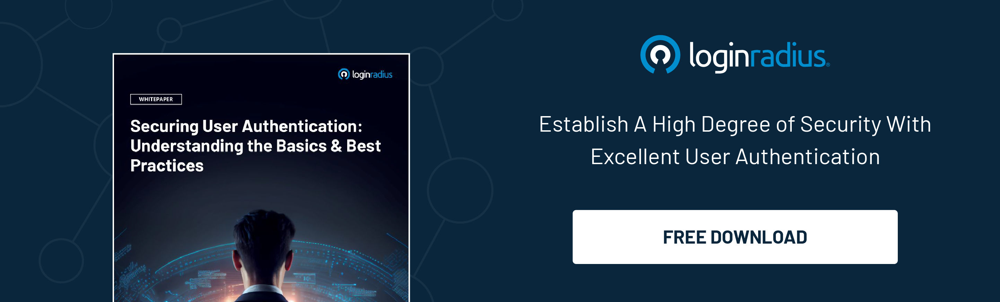

## Introduction

Today, when data breaches and cyber threats loom, the need for robust security measures has never been more pressing. However, in the pursuit of fortifying defenses, businesses often find themselves at a crossroads: enhancing security without compromising the customer experience (CX). 

This is where the innovative approach of behavioral biometric authentication steps in, offering a solution that bolsters security and seamlessly enhances the user experience.

Let’s understand behavioral biometric authentication and how it paves the way for seamless and [secure user experiences](https://www.loginradius.com/blog/growth/4-tips-secure-frictionless-ux/). 

## What is Behavioral Biometric Authentication?

Behavioral Biometric Authentication is a cutting-edge security method that utilizes unique patterns of human behavior to verify identities. 

Unlike traditional authentication methods such as passwords or PINs, which can be easily [forgotten, stolen, or duplicated](https://www.loginradius.com/blog/identity/common-vulnerabilities-password-based-login/), behavioral biometrics rely on the distinct characteristics of how individuals interact with devices. This includes factors such as typing rhythm, touchscreen gestures, and even the angle at which a device is held.

By analyzing these subtle behavioral cues, systems can create a highly accurate profile of a user's identity, making it significantly more challenging for unauthorized individuals to gain access. 

The beauty of behavioral biometrics lies in its unobtrusive nature – users simply interact with their devices as they normally would, without additional steps or interruptions.

## Enhancing Security with Behavioral Biometrics

The traditional approach to security often involves a trade-off between security and convenience. Lengthy passwords or frequent authentication prompts can frustrate users, leading to poor CX. 

However, with behavioral biometric authentication, this dilemma has been resolved. Users benefit from a seamless and frictionless experience, while businesses enjoy heightened security measures.

One of the behavioral biometrics' key strengths is its ability to detect anomalies in real-time. For example, if a user typically logs in from a specific location and at a certain time of day, any deviation from this pattern can raise a red flag. 

This proactive approach to security allows businesses to identify potential threats before they escalate, preventing unauthorized access and data breaches.

Moreover, behavioral biometrics offer [continuous authentication](https://www.loginradius.com/blog/identity/continuous-authentication/) throughout a user session. Unlike traditional methods that require a single login at the beginning, behavioral biometrics constantly monitor user behavior.

If behavior suddenly changes, indicative of a different user or a potential threat, the system can prompt for reauthentication, adding an extra layer of security without disrupting the user's flow.

## Improving Customer Experience with Seamless Authentication

In today's fast-paced digital landscape, users demand convenience and efficiency. Lengthy authentication processes or frequent password resets can lead to frustration and service abandonment. Behavioral [Biometric Authentication](https://www.loginradius.com/blog/identity/biometric-authentication-mobile-apps/) addresses these pain points by providing a seamless and intuitive user experience.

Imagine a user simply picking up their smartphone and typing a message. Unbeknownst to them, their unique typing rhythm and touchscreen gestures are being analyzed in the background. Within seconds, the system confirms their identity and grants access to the device or application – all without entering complex passwords or security codes.

This streamlined authentication process saves time and enhances the overall user experience. Customers feel more at ease knowing their interactions are secure yet effortless, increasing satisfaction and loyalty.

## Implementing Behavioral Biometrics: Best Practices

To fully harness the potential of Behavioral Biometric Authentication, businesses should consider the following best practices:

* **Transparency and Consent:** Clearly communicate to users how their behavioral data will be used for authentication. Obtain explicit consent and ensure compliance with data privacy regulations.

* **Multi-Factor Authentication:** While behavioral biometrics provide robust security, consider implementing [multi-factor authentication](https://www.loginradius.com/multi-factor-authentication/) for sensitive transactions. This could include a combination of behavioral biometrics, facial recognition, or fingerprint scanning.

* **Continuous Monitoring and Adaptation:** Regularly monitor the system for anomalies and adjust algorithms. Behavioral patterns may change over time, so staying agile and adaptive is essential.

* **User Education:** Educate users on the benefits of behavioral biometrics and how they can enhance their security and CX. Proactively address any concerns about privacy and data protection.

* **Integration with CX Strategy:** Integrate behavioral biometrics seamlessly into your existing CX strategy. Ensure that authentication processes align with the user journey and do not create friction.

## To Conclude

Behavioral Biometric Authentication represents a significant step forward in security and CX. By leveraging the unique patterns of human behavior, businesses can strengthen their defenses against cyber threats while providing users with a seamless and intuitive authentication experience. 

As the digital landscape continues to evolve, embracing innovative solutions like behavioral biometrics is not just a choice but a necessity for staying ahead of the curve and earning customer trust.

