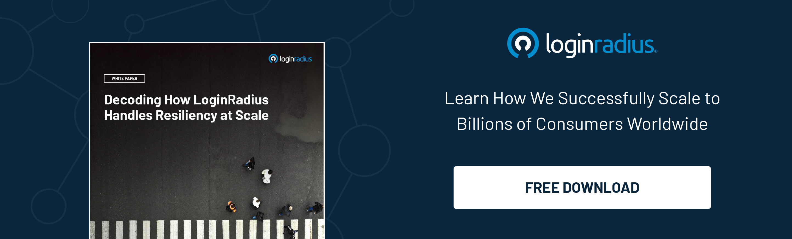

---
title: "Reaping the Benefits of the Cloud Beyond Marketing"
date: "2022-06-21"
coverImage: "cloud-marketg.jpg"
category: ["cloud computing", "marketing", "ciam"]
author: "Srishti Singh"
description: "Cloud computing offers more than just helping marketers plan and execute effective marketing campaigns. Let’s look at some advantages of adopting cloud computing and why enterprises should consider relying on cloud computing to thrive overall business success."
metadescription: "Cloud computing is becoming the preferred choice not just from a marketing perspective but for other aspects that drive business growth. Read on to know more."
metatitle: "Are You Reaping the Business Advantages of Cloud Computing?"
---

## Introduction

Over the past couple of years, [cloud computing](https://www.loginradius.com/blog/identity/what-is-cloud-computing/) has evolved leaps and bounds and has offered endless business opportunities to organizations striving for digital transformation. 

And when we talk about business marketing, businesses leverage the cloud to gather data from different sources and connect them to get valuable insights that further help make winning marketing strategies. 

However, cloud computing offers more than just helping marketers plan and execute effective marketing campaigns. 

Whether we talk about scalability, performance, or security, cloud computing is the one-stop solution for all your business needs. 

Let’s look at some advantages of adopting cloud computing and why enterprises should consider relying on cloud computing to thrive overall business success. 

### #1. High scalability

Scalability is one of the most important aspects of cloud computing. Online platforms handling millions of users per second are always ready to handle additional millions of users just because they have deployed their platforms on cloud servers. 

Auto-scalable cloud infrastructures help brands scale up to millions of users per second, which isn’t possible in the conventional in-house data servers with limited scalability. 

Hence, businesses that collect user information on online platforms or large amounts of user information should consider relying on the cloud to experience the next level of scalability. 

Cloud servers are made to support massive sign-ins and sudden, dramatic surges of user actions (during a major sports game or popular TV voting system).

The [LoginRadius Identity Platform](https://www.loginradius.com/) was designed with service provider-class scale in mind. The distributed CIAM network has regularly experienced peak transaction volumes of over 150,000 logins per second and typically handles 10,000 requests per second with less than 500 milliseconds latency. 

### #2. Highly secure

When it comes to securing crucial business data and sensitive customer information, nothing can beat cloud deployments.

Whether we talk about distributed system security or overall cloud security, businesses relying on the cloud are at the least risk of developing security threats. 

[Cloud security](https://www.loginradius.com/blog/identity/what-is-cloud-security/) (AKA cloud computing security) is a set of policies, technologies, applications, and controls that protect data and other material stored or run in the cloud. 

It’s safe because your files are stored on servers worldwide. This is called a ‘distributed system.’ Your data is encrypted when it travels over the internet, so it’s completely private and protected from hackers and thieves.

Luckily, SaaS companies like LoginRadius specialize in cloud security that keeps customer data secure and private. We also offer IDaaS with several user authentication services like multi-factor authentication, single sign-on, and identity management.

### #3. Lower operational costs

Typically, on-premises security solutions require a substantial investment to engineer and maintain. 

By contrast, you don't need to pay anything upfront with cloud computing. That's because cloud security tools are built and operated by a third-party vendor. You only pay for what you need or use through a monthly or annual subscription. 

### #4. Maintenance-free infrastructure

With cloud security, a third-party vendor is responsible for maintaining the system, not you. This vendor is the one spending their money and time on upgrading, integrating, and optimizing the system. 

The biggest problem with on-premise systems is that they require timely maintenance, increasing overall IT costs annually. However, in the case of the cloud, enterprises need not worry about timely maintenance. 

Apart from this, the vendor keeps the technology up-to-date, freeing you to focus on growing your business.

### #5. Compliance management

Any enterprise that stores customer data must comply with global privacy regulations. These regulations govern how you seek customer consent to use their data and what you do with that data.

The European Union's General Data Protection Regulation (GDPR) and [California’s CCPA](https://www.loginradius.com/blog/identity/ccpa-introduction/) are examples of this legislation. With cloud security, your third-party vendor is responsible for compliance and has the expertise to do so.

## Final Thoughts 

With the changing digital landscape, businesses relying on on-premise infrastructure wouldn’t be able to meet the pace of their competitors already depending on the cloud.

Hence, to ensure they stay ahead of the curve, businesses should put their best efforts into adopting the cloud since it’s secure, scalable, cost-efficient, and maintenance-free. 

