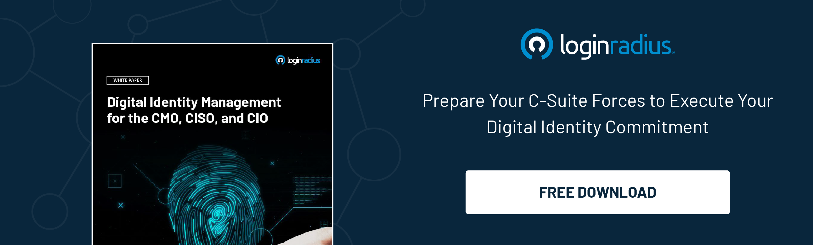

## Introduction

In the modern digital era of banking and e-commerce, the collection of customer data has become a strategic necessity. Companies must make sure their data is secure so they can retain their customers and increase revenue.

[Customer Identity and Access Management](https://www.loginradius.com/blog/identity/customer-identity-and-access-management/) (CIAM) systems offer a new way of looking at customer data, streamlining user interfaces, and enabling businesses to take their customer's data security to the next level.  CIAM also offers a host of other features, including: 

* Customer sign-in and registration
* Multi-factor sign-in authentication 
* Passwordless authentication
* User management
* Consent permissions
* Account settings and preference management
* Directory services

Essentially, the goal of effective Customer Identity and Access Management solutions is to provide a secure and seamless interface for the user on any channel that they may use (mobile, web, etc.) to engage with a brand.

Brands can achieve the goals of Customer Identity and Access management by using Change Management strategies. But before that, we must understand what change management is and what it can mean in the domain of digital security. 

## What is Change Management?

Change management is a systematic process that effectively transforms an organization's services, technology, or goals. The objective of change management is to analyze the situation and then accordingly implement strategies for undertaking change. 

The following are the common strategies implemented under change management:

* Planning and testing the visualized change.
* Creating a process for communication of change.
* Creating a system to schedule and implement change over some time.
* Setting up a documentation system for recording change.
* Establishing thresholds and standards to evaluate change.
* Ensuring [compliance with regulatory requirements](https://www.loginradius.com/compliances/).

## Implementing Change Management in Your Business in 3 Steps

Change management is an often-challenging endeavor that includes several steps, the first of which is securing customer identity. This is accomplished by carefully analyzing and investigating a customer’s behavior, as well as the details of their past interactions with the company.

The other steps include:

### 1. Enabling a holistic approach to change management.

Apart from the technology required in customer security, this strategy also focuses on the people implementing the technology. It does so by focusing on communication with the developers. A popular model for choosing the right developers is the skills, vision, incentives, and resources model. 

This essentially means choosing developers who either have these attributes, or creating a plan to instill these attributes into the developer. Here, the focus is on the skills and mindset of the developer. Along with this, incentives and appropriate resources are used to motivate the developer. 

### 2. Devising a concrete change management plan before implementation.

This strategy may seem obvious, but it is extremely necessary while undertaking change management in the IT sector. After steering up the goal of the change management process, it is necessary to devise a concrete management plan. 

This plan should take into consideration every possible requirement, outcome, and issue at every stage and accordingly create a structured resolution mechanism. This is essential because the implementation concerns [customer security](https://www.loginradius.com/customer-security/) and their data. If due to poor planning, a data breach occurs while undertaking change, it can affect the brand image, customer loyalty, and customer privacy. Thus, a well-constructed change management plan is key. 

### 3. Choosing the best leader.

Make a great plan, then manage it effectively. Choose the best leader to manage your plan, someone who can oversee the plan effectively. Effective oversight means following the change management procedure, from ensuring quality at each step to adequately resolving issues that arise.

Someone who understands the day-to-day operations of customer identity and access management is essential to a firm's customer security efforts. This person should also be able to visualize the impact of security on the brand, so that they can effectively implement necessary change management strategies.

## Benefits of Implementing Change Management in Customer Security

Here are some of the tangible benefits of implementing change management strategies in customer security:

* Compliance with regulatory protocols.
* Safety from data breaches that could otherwise lead to distrust in the brand.
* Prevention of loss of reputation due to poor security measures.
* Enterprises can establish emergency protocols in case of data theft.
* Reliable customer security can lead to trust in the enterprise, which can increase overall revenue.
* Lead to digital transformation for business growth.

## Conclusion 

Change management is the need of the hour in this internet driver business market. Enterprises can benefit a lot from focusing on customer identity and access management. A key part of this is ensuring customer security. The implementation of such change management strategies can also be outsourced to firms that specialize in [CIAM solutions](https://www.loginradius.com/), like LoginRadius. 

