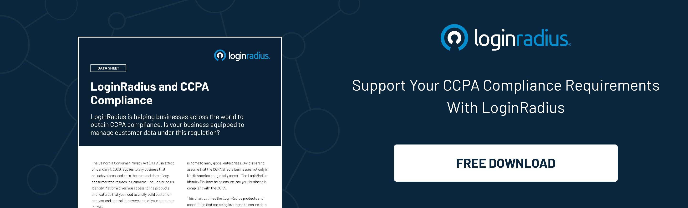

## Introduction
As more businesses move online, managing customer identities becomes increasingly complex, especially when most customers know the importance of their online privacy. 

Customers expect a seamless and secure experience across all channels, and businesses must be able to deliver this to build trust and loyalty. However, delivering a perfect symphony of customer experience and security harmony isn’t a piece of cake. This is where the critical role of [customer identity and access management](https://www.loginradius.com/blog/identity/customer-identity-and-access-management/) (CIAM) solutions comes into play. 

CIAM is a set of processes and technologies that enable businesses to manage customer identities, preferences, and resource access securely. By implementing CIAM solutions, businesses can provide a personalized and secure experience while improving operational efficiency.

Let’s figure out how businesses can leverage the true potential of a robust CIAM to build trust and loyalty. 

## How Does Customer Experience with Security Directly Influence Customer Trust & Loyalty?

We all love great user experience whenever we interact with a platform for the first time. But that doesn’t mean we’re offering consent to compromise our privacy and PII. 

Customers expect their personal information and transactions to be secure when interacting with a business, and any breach of that security can lead to a loss of trust and loyalty. 

A positive customer experience with security can increase trust and build loyalty. In this digital age, businesses need to ensure that their customers' data is protected, and Customer Identity and Access Management (CIAM) can play a vital role in this regard. 

By providing a seamless and secure user experience, CIAM helps to create a perfect harmony between security and user experience. This can increase customer trust and loyalty, as they feel confident that their data is safe while enjoying a smooth and hassle-free experience.

Ultimately, investing in CIAM can significantly [boost customer satisfaction](https://www.loginradius.com/blog/growth/how-to-improve-the-customer-xperience/), retention, and loyalty, which can help businesses grow and succeed in the long run.

Here’s the list of features that businesses can reap through a modern CIAM: 

### 1. Personalized Customer Experiences 

With CIAM, businesses can gather and store valuable information about their customers, such as their preferences, purchase history, and behavior. 

This information can be used to personalize the customer experience, making it more relevant and engaging. By providing a personalized experience, businesses can build a stronger emotional connection with customers, increasing loyalty.

### 2. Zero Compromise on Security

Cybersecurity is a top concern for customers and businesses that fail to provide a secure experience risk losing trust and credibility. 

With CIAM, businesses can implement strong authentication and authorization measures, such as [multi-factor authentication](https://www.loginradius.com/multi-factor-authentication/) and role-based access control, to protect customer data and prevent unauthorized access. This can help businesses build a reputation for security and reliability, which can, in turn, build trust and loyalty among customers.

### 3. Compliance

Many industries are subject to strict regulatory requirements around data privacy and security. CIAM solutions can help businesses ensure compliance with these regulations by providing tools for data management, consent management, and audit trails. 

By demonstrating a commitment to compliance, businesses can build trust and confidence among customers, who will feel reassured that their data is being handled responsibly.

### 4. Convenience 

Customers expect a seamless and hassle-free experience when interacting with businesses. CIAM solutions can help companies to deliver this by enabling [single sign-on](https://www.loginradius.com/single-sign-on/) (SSO) across multiple channels and applications. 

By eliminating the need for customers to remember multiple usernames and passwords, businesses can make engaging with them easier, leading to increased loyalty.

### 5. Transparency

Lastly, a CIAM solution can help businesses be more transparent with their customers about how their data is being used. By providing clear and concise information about data collection, storage, and usage, businesses can build trust and credibility with customers, who will feel more in control of their data and more confident in their interactions with the company.

## To Conclude 

CIAM is undoubtedly the need of the hour for businesses looking to build trust and loyalty with customers in an increasingly digital world. 

By providing a personalized, secure, compliant, convenient, and transparent experience, businesses can differentiate themselves from their competitors and build long-lasting customer relationships.

