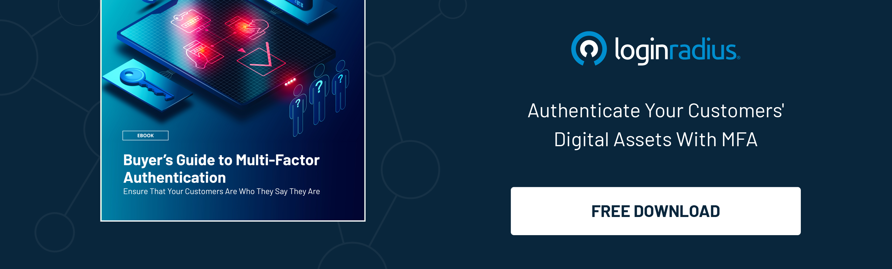

Identity is used by customer identity and access management platforms to generate a single, durable picture of customers, spanning various department silos within a firm. These platforms leverage data to develop profiles that enable CMOs to communicate more effectively and efficiently with their consumers. They also provide the chance to launch new [revenue-generating initiatives](https://www.loginradius.com/blog/identity/loginradius-roi-enterprises-infographic/) based on this customer data.

Historically, organizations depended on conventional identity and access management solutions, frequently cobbled together from various technologies. This strategy resulted in cumbersome "product suites" that were unnecessarily complicated and riddled with redundancy and compatibility difficulties. These solutions sometimes required years to develop and completely integrate, putting a crimp in potentially revenue-generating programs aimed at streamlining and speeding up sales. 

Niche CIAM players developed efficient solutions to certain business-related concerns, but without an overarching identity solution, CMOs had no means of meaningfully growing sales or seeing any significant ROI by using these identity solutions.

CMOs can deliver more efficient, secure, and relevant services and goods if they have a detailed grasp of who their customers are and what they require.

**CMOs are responsible for a variety of tasks, including:**

* CMOs' primary tasks
* Putting marketing strategy and campaigns into action to increase client adoption and sales
* Creating a market for products, goods, and services
* Providing great client service
* Customer lifecycle execution - from prospect to customer
* Creating the best digital and in-person experiences for different consumer groups

## What Exactly is CIAM

Organizations may use customer identity and access management (CIAM) to securely record and maintain customer identity and profile data, as well as regulate customer access to applications and services.

Customer registration, self-service account management, [consent and preference management](https://www.loginradius.com/consent-management/), Single Sign-on (SSO), Multi Factor Authentication (MFA), access management, directory services, and data access governance are some common elements of CIAM solutions. The top CIAM systems guarantee a safe, seamless customer experience at extreme size and performance, regardless of whatever channels customers choose to connect with a business (web, mobile, etc.).

## The Benefits of Consumer IAM

A contemporary consumer identity management platform collects and manages customer identification and profile data while also safeguarding network access to software, devices, and other services. This is why major corporate [CMOs, CISOs, and CIOs consider CIAM](https://www.loginradius.com/blog/identity/consumer-identity-management-cmo-ciso-cio/) for marketing a business enabler.

CIAM is the solution that directs your interactions with customers. Security, information, and marketing professionals in the C-suite push for CIAM solutions that are smooth and consistent across different devices and touchpoints.

Other characteristics they search for include:

### #1. A unified consumer view

The [CIAM platform](https://www.loginradius.com/blog/identity/customer-identity-and-access-management/) should not create data silos between repositories and departments. It should instead provide a unified, comprehensive view of customer identities and activities on its platform. For example, you should be able to develop a detailed profile of each consumer that includes information such as purchase histories, use, purchasing trends, and more.

### #2. Consumer experience through several channels

It entails a legitimate registration procedure that can be conducted and finished on numerous devices, as well as the establishment of credentials for login and authentication, which also works across different channels.

### #3. Enhanced security

The advancement of 2FA/MFA (multi-factor authentication) with features like biometrics, geolocation, face recognition, and so on has resulted in higher degrees of protection. These characteristics make it simpler to spot abnormalities and strange actions in a less time-consuming manner.

### #4. Privacy and regulatory compliance

As rules like the GDPR and CCPA gain traction, data privacy has become an essential component of a consumer identity management system. As a result, when executives seek one, they ensure that the platform gives customers control over their data and allows them to revoke any authorization depending on their preferences.

## CIAM for Marketing

Rapid technology breakthroughs in the CIAM market, such as the use of artificial intelligence and blockchain technology for access security and user authentication, are expected to provide various profitable chances to CIAM industry players in the coming years. Furthermore, the expanding budget for IT departments in small and medium-sized businesses, as well as the increased use of cloud computing management, are likely to support the performance of the CIAM market. However, the expansion of the global CIAM market is projected to be restricted by the risk associated with identity and access management technologies.

Finally, a CIAM product should include the following features:

* Onboarding and verification of users
* Management of users and attributes
* Adaptive and strong authentication
* Management of privacy and consent
* Services for self-care by customers
* Compatibility with business apps and tools
* Analytics and the detection of fraud

## The Bottom Line

The goal of digital transformation is to [improve the customer experience](https://www.loginradius.com/customer-experience-solutions/). Customers today, who are becoming more intelligent, see digital interactions as the primary means of interacting with products and services. They demand deeper online connections be provided simply, securely, and effortlessly. CIAM is critical in connecting apps and APIs to clients.

Consumer behavior and aspirations have never been static. A consumer identity management solution may be a valuable strategic asset for CMOs to utilize in their department. 

