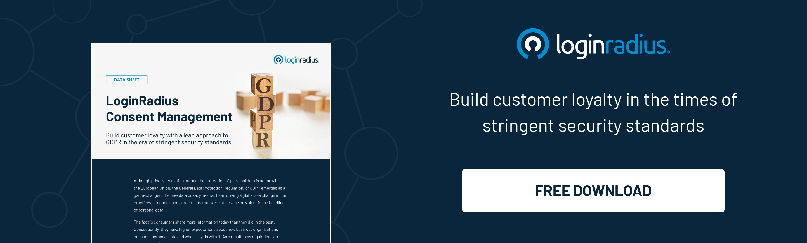

## Introduction

The role of consent in marketing can’t be overlooked in today's digital landscape, where consumers are more aware of their rights than ever before. Consent marketing, at its core, revolves around respecting individuals' preferences and choices.

It's not just a legal requirement under regulations like [GDPR and CCPA](https://www.loginradius.com/blog/identity/ccpa-vs-gdpr-the-compliance-war/); it's also a powerful tool for building trust and loyalty with your audience. 

Let's uncover more about consent marketing, exploring its nuances, benefits, and why it's become a cornerstone for businesses aiming to create meaningful connections with their customers.

## What is Consent Marketing?

At its essence, consent marketing is about seeking permission before engaging with individuals. It's a shift from traditional, often intrusive marketing methods to a more respectful and targeted approach. 

Instead of bombarding users with messages they didn't ask for, businesses using consent marketing understand the value of obtaining explicit consent. This ensures [compliance with data protection laws ](https://www.loginradius.com/compliances/)and fosters a relationship based on trust.

## The Endless Advantages of Consent Marketing

### Enhanced Trust and Brand Reputation

Today, when data breaches and privacy concerns dominate headlines, trust has become a precious commodity. Consent marketing is a powerful tool for businesses to demonstrate their commitment to respecting user privacy. When consumers feel in control of how their data is used, they are more likely to trust a brand. This trust translates into a positive brand reputation, which is invaluable in today's competitive market. 

Imagine a scenario where a user visits a website and is greeted with a clear, concise consent form. This form explains how their data will be used and gives them the option to choose what they're comfortable with. This transparency and respect for the user's choices go a long way in building trust. Users are more likely to engage with such a brand, knowing that their privacy is respected.

### Improved Targeting and Personalization

One of the key benefits of obtaining explicit consent is the ability to gather accurate data about user preferences. When users willingly provide information about their interests and preferences, businesses can use this data to tailor their marketing efforts effectively. 

Consent marketing allows for more targeted campaigns, ensuring that messages are relevant to the individual receiving them. For example, a clothing retailer can ask for consent to send updates about new collections or promotions. Users who opt-in are likely interested in fashion and are more receptive to these messages. 

This targeted approach improves engagement rates and enhances the overall [user experience](https://www.loginradius.com/blog/growth/4-tips-secure-frictionless-ux/). Users receive content that is meaningful to them, leading to higher conversion rates and customer satisfaction.

 

### Legal Compliance

The regulatory landscape surrounding data privacy is constantly evolving. Laws such as the [General Data Protection Regulation (GDPR) ](https://www.loginradius.com/gdpr-and-privacy/)and the California Consumer Privacy Act (CCPA) impose strict requirements on how businesses handle user data. 

Consent marketing ensures that businesses comply with these regulations by obtaining explicit consent before processing personal data.

Failure to comply with these laws can result in hefty fines and damage to reputation. Consent marketing provides a clear framework for businesses to follow, ensuring that they collect and use data lawfully and ethically. By making compliance a priority, businesses avoid legal troubles and build a reputation as trustworthy and responsible stewards of user data.

### Long-Term Customer Relationships

Building a loyal customer base is essential for sustainable growth. Consent marketing plays a vital role in fostering long-term relationships with customers. Users who know that a business respects their privacy and preferences are likelier to remain loyal.

Consider a scenario where a user receives personalized recommendations based on their past purchases and preferences. This level of personalization is only possible with explicit consent. Users appreciate the tailored experience and are more inclined to return to the brand for future purchases. Over time, this leads to a loyal customer base that trusts the brand to deliver value consistently.

### Transparent Communication

Consent marketing encourages open and transparent communication between businesses and consumers. When businesses are upfront about their data collection practices and seek permission before gathering information, it creates a dialogue based on mutual understanding.

Businesses can use consent as an opportunity to educate users about how their data is used and the benefits they receive in return. This transparency builds a sense of partnership between the brand and its customers. Users are more likely to engage with businesses that communicate openly and honestly, leading to stronger relationships and increased loyalty. 

## LoginRadius: Empowering Businesses with Consent Management

As businesses navigate the complexities of consent marketing, having the right tools is crucial. This is where CIAM (Customer Identity and Access Management) solutions like LoginRadius come into play.

LoginRadius offers a robust [consent management system](https://www.loginradius.com/blog/identity/guide-consent-management/) that allows businesses to easily collect, manage, and respect user consent preferences across their digital properties. With LoginRadius, businesses can:

* **Centralize Consent:** Streamline the consent process by centralizing it across all touchpoints. Whether on websites, mobile apps, or other platforms, LoginRadius ensures a consistent and compliant approach to consent.

* **Granular Consent Controls:** Empower users with granular control over their data. With LoginRadius' consent management, businesses can offer options for users to select the types of data they are comfortable sharing.

* **Automated Compliance:** Stay up-to-date with ever-evolving regulations effortlessly. LoginRadius keeps businesses compliant by automatically updating consent policies as laws change.

* **Seamless User Experience:** A smooth user experience is key to obtaining and managing consent effectively. LoginRadius' intuitive interfaces make it easy for users to understand and adjust their consent settings.

## To Conclude

Consent marketing is not just a legal requirement; it's a strategic approach that benefits both businesses and consumers. 

By respecting user preferences, businesses can create a more trustworthy and engaging brand image while fostering long-lasting customer relationships. With solutions like LoginRadius' consent management, businesses can navigate the complexities of consent marketing with ease, ensuring compliance and building customer trust every step of the way.  

