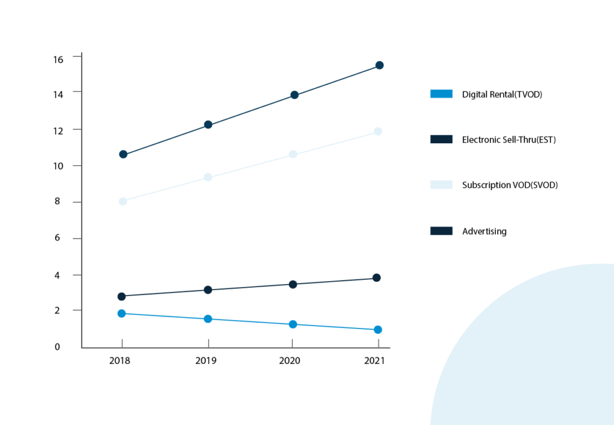

The global media and entertainment industry is undergoing a massive transformation at the moment. Interestingly, it is adapting itself to improve customer experiences like never before. 

Today, enterprises know that if they want to stay ahead of their competitors, they need to keep their customers happy.

So, how are they doing it? It's simple. They are focusing on generating more and more customer-centric content.

2019 (for that matter) experienced an intensifying wave of popularity for on-demand streaming sites like Amazon and Netflix. The recently launched [BritBox](https://www.loginradius.com/press/loginradius-powers-britbox-launch-high-performance-ciam/) also primarily focuses on driving better media experience for their customers.

LoginRadius explores these shifting expectations of the entertainment industry and tries to identify opportunities that are likely to drive popularity in 2020. Let's go through the top highlights.

## Over-The-Top Content Will Take a New Turn

Over-the-top (OTT) content in the media industry refers to audio or video streaming services (like Netflix, Youtube, Amazon) that are delivered to customers over the Internet without the involvement of any third party provider (generally cable or satellite providers).

Of late, the market has been witnessing a boost in mobile computing devices – leading to a disruption in the broadcast television era. It has been creating more opportunities for independent artists to leverage the technology and cast themselves in front of a wider audience.

These independent artists decide how to use, sell, or distribute their content online. They are solely responsible for offering a more personalized, attention-grabbing, valuable, and relevant experience for their audience.

Are you wondering how this sudden turn of events will influence the number game?

According to an estimation by Strategy Analytics, revenue from OTT video in the US alone will exceed the [$30 billion mark in 2020](https://www.strategyanalytics.com/strategy-analytics/blogs/tv-media-strategies/2016/03/31/subscription-vod-and-advertising-drive-ott-video-revenue-growth-in-the-u.s#.V7RJmph95hE).

These figures grab attention and are hard to ignore.

Data source: Strategy analytics OTT video forecast

## Personalization Will Make the Media Smarter

Technology will make deeper connections and drive higher profitability through the personalization of content in the media industry.  

Expect media houses to focus on creating **smarter content** that connects with audiences on a deeper level.

Rather than offering free content to the audience in general, with the power of analytics, AI, and machine learning, the media industry will produce more content niches that resonate with viewers.

## Privacy Regulation Will Rebuild Trust in the Media Industry

There is still a constant fear of identity theft, unauthorized use of data, and financial loss among customers. No wonder, data privacy, and security will be the top priority for media companies in 2020. 

Speaking of securing data, the EU's General Data Protection Regulation (GDPR) was the first high profile regulation that the world came across. It rightfully set exemplary standards for media houses (and all organizations in general) and showed how to conduct business and [store customer data](https://www.loginradius.com/blog/2018/03/gdpr-will-affect-companies-use-data-target-customers/). 

Following suit came the [California Consumer Privacy Act (CCPA)](https://www.loginradius.com/blog/2019/05/ccpa-introduction/) that officially took effect on January 1, 2020. CCPA, too, is expected to give individuals more control over how their data is being used. 

But will it hit the right chords among organizations and individuals? Only time will tell.

## 5 Technologies That Will Impact User Experience in Media and Entertainment Industry

### **1\. Blockchain** 

A market synopsis by America News Hour reports that the global blockchain media industry "registered 32.94% CAGR during the forecast period between 2018 and 2024," and they predict it could reach USD 1.54 billion by 2024.

So, if you think blockchain is only about cryptocurrency, think again!

Within the media and entertainment industry, [blockchain can be used to secure data transactions](https://www.csoonline.com/article/3279006/4-reasons-blockchain-could-improve-data-security.html) and improve digital advertising efforts.

### **2\. AR and VR**

Pokémon Go is the [perfect example](https://www.forbes.com/sites/bernardmarr/2020/01/24/the-5-biggest-virtual-and-augmented-reality-trends-in-2020-everyone-should-know-about/#62543f5924a8) of a new medium of entertainment that lifts the spirit of AR and VR – leaving users wanting more. The combination of real-world elements in the game is truly immersive and magical.

With the recent interest in AR and VR from Silicon Valley giants like Google and Facebook, it seems like innovations in mobility, pricing and accessibility are on the cards.

Be it through story-driven content or experience-driven entertainment. They are expected to boost customer experience in the media industry like never before.

### **3\. Voice Search Technology**

Innovation in voice search technology is changing how we conduct our day-to-day activities. 2019 was the year of Alexa and Google Home that made [smart homes accessible](https://www.digitaltrends.com/home/google-home-vs-amazon-echo/) than ever.

The combination of AI, machine learning, and advanced analytics will continue to optimize content making customer experiences more personalized, compelling, and transparent.

### **4\. Cloud Security Management**

Cloud security management solutions will be back in the spotlight. The security of data will be a primary area of focus in 2020. Factors like data encryption and cloud workload security will take center stage as more and more media houses migrate to the cloud in the public environment.

### **5\. Facial Recognition**

Facial Recognition is swiftly turning into one of the most common forms of biometric authentication. The use of facial recognition in digital advertising and the media industry will [continue to grow](https://www.gemalto.com/govt/inspired/biometrics). 

For instance, it will identify individuals in-store and offer purchasing recommendations based on their demographic.

## How will CIAM solutions gain momentum in the media and entertainment industry?

[Customer identity and access management (CIAM) solutions](https://www.loginradius.com/blog/2019/06/customer-identity-and-access-management) will help companies in the media and entertainment industry understand their customer base and offer them a unique and engaging experience.

As we enter 2020, here's what businesses can expect from a CIAM solution. 

### **Increase in subscription rates.**

One of the biggest benefits of online media content is that it's available in different formats across multiple platforms. However, users dislike logging in to various platforms or filling in multiple registration forms. This can lead to abandonment or customer churn.

By implementing [Single Sign-On](https://www.loginradius.com/blog/2019/05/what-is-single-sign-on/) (SSO), media houses can create a connected user experience across all its platforms. Viewers can access multiple channels using a single identity, and turn more visitors into subscribers.

### **Creation of relevant content with user profiling.**

The digitization of media content has also changed the way companies earn revenue. Mostly, customers are looking for content that appeals to their interests and habits. A CIAM solution can help media platforms achieve that.

A [CIAM platform like LoginRadius](https://www.loginradius.com/blog/identity/perfect-ciam-platform/) can record the preferences of their audience in unified customer profiles and generate relevant content.

### **Frictionless customer interaction.**

Audiences are no longer passive consumers. Instead, they are actively engaged in the content they read, watch, and even produce it themselves.

LoginRadius’ industry-leading peak load capabilities, makes it an ideal CIAM provider for companies dealing with large amounts of customer engagement in a short period.

### Conclusion

With a large scale roll-out of the technology, 2020 promises to be the year of digital transformation in the media and entertainment industry.

Amidst the ever-changing regulatory landscape, there are high chances that new opportunities are waiting to be capitalized. _Now_ is your chance to reap the benefits.

