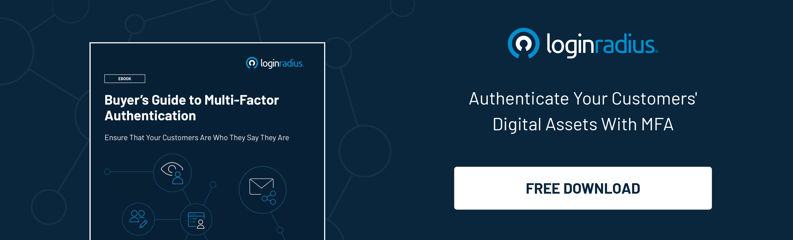
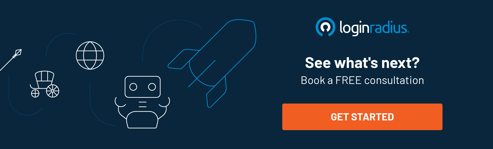

---
title: "How Customer Identity Solution Drives Digital eCommerce Success"
date: "2021-07-10"
coverImage: "ecommerce-digital-identity-solutions.jpg"
category: ["loginradius"]
featured: false 
author: "Vishal Sharma"
description: "Learn how a CIAM solution paves the path for an eCommerce business success and why enterprises thinking to step into the eCommerce world should leverage a cutting-edge CIAM solution."
metadescription: "A Consumer Identity and Access Management (CIAM) solution can do wonders for the eCommerce industry. Learn how eCommerce players can benefit from a CIAM."
metatitle: "How Customer Identity Solution Drives eCommerce Success?"
---

In an era when everyone is locked inside their homes amid the global pandemic, businesses at a halt, and vaccination becoming the only ray of hope, numerous eCommerce businesses have flourished across the world.

As the lockdown and social distancing became the new normal, businesses adopted [digital transformation](https://www.loginradius.com/blog/start-with-identity/what-is-digital-transformation/).

Whether we talk about online groceries or telemedicine, the world faced the paradigm shift and adopted digital platforms for almost every day-to-day task that otherwise required them to step out of their homes.

So what’s the reason behind the immediate success of new players in the eCommerce space while others were still left with abandoned carts?

Not many of you would be aware that consumer identity and access management (CIAM) solutions played a crucial role in enhancing eCommerce business success.

From collecting insightful information from users to offering behavioral analysis, a CIAM solution has always been the key to win trust when it comes to pushing carts to final checkouts.

In this post, we’ll learn how a CIAM solution paves the path for an eCommerce business success and how enterprises thinking to step into the eCommerce world could leverage cutting-edge CIAM solutions to scale business growth.

## Authentication Coupled with a Perfect Harmony of Security and User Experience (UX)

Did you know [65% of eCommerce shoppers are likely to end their relationships](https://www.pymnts.com/news/security-and-risk/2021/consumers-will-drop-a-merchant-over-a-single-data-breach/) with online merchants after experiencing even a single instance of data theft or even a payment fraud?

In a world when data and identity thefts lead to losses worth millions of dollars, securing consumer identities and sensitive information isn’t a feature. It’s a compulsion.

Adding more robust authentication layers, including multi-factor authentication (MFA) and [risk-based authentication](https://www.loginradius.com/blog/start-with-identity/risk-based-authentication/) (RBA) to log in and sign-up procedures, can help secure consumer data and prevent a breach.

Also, these secure authentication practices help enterprises to verify the individuals quickly they say they are.

Additionally, security backed with a better user experience helps build consumer trust that further paves the path for a smoother onboarding.

Yes, a CIAM solution like LoginRadius not just offers robust security but eventually provides a seamless [eCommerce consumer experience](https://www.loginradius.com/blog/fuel/improve-customer-experience-ecommerce/) while user's sign-up for your website/application through various authentication methods, including Social Login, Passwordless Login, and Single Sign-On (SSO).

The combination of security and user experience makes a CIAM the need of the hour for every [B2C enterprise](https://www.loginradius.com/b2c-identity/) seeking substantial growth by winning consumer trust.

## A Deeper Understanding of Who is Interacting with Your Brand

If your eCommerce website isn’t generating revenues, it doesn’t necessarily mean that you don’t have visitors!

Yes, the visitor to conversion ratio is something that brands should immediately work upon.

As per recent stats, [2.17 percent of global e-commerce website visits were converted into purchases](https://www.statista.com/statistics/439576/online-shopper-conversion-rate-worldwide/). This means that roughly two visitors out of 100 would be converted on your eCommerce platform.

So how could a business enhance conversions? Or what’s the best way to analyze visitors and monitor their behavior to figure out what needs to be done?

Well, here’s where a CIAM like LoginRadius comes into play.

With LoginRadius CIAM, you can successfully target your customer base with data collected and organized in the Admin Console.

The LoginRadius Identity Platform makes complex customer analytics easy to understand via detailed graphs and customer insights.

Moreover, you can leverage the power of data with over 30 charts within customizable date ranges. Expand your understanding of customer activity over different periods of your sales or season cycles.

This not only helps you in understanding your visitors but eventually makes it easier for you to plan your marketing around aspects that would promote conversions.

You can [Book a Quick 30-Minutes Demo](https://www.loginradius.com/live-demo2/) to know how LoginRadius would specifically empower your eCommerce business.

## Getting Customer Data with Customer Consent

The concept of progressive profiling is getting a lot of attention these days. So, what is it, and why do retailers need it?

Progressive profiling collects information about your customers using dynamic web forms throughout the purchase journey.

Here's how this works. For example, you want some details from your customers to customize the end-user experience, or you want their consent to use some of your services, but you are afraid of losing them by asking them to fill a long registration form.

[Progressive profiling](https://www.loginradius.com/progressive-profiling/) will do wonders here. For instance, when the customer has placed the first three orders, you can ask them to fill in a small questionnaire. They will more likely answer about their preferences at this stage rather than during the registration.

## Final Thoughts

Ecommerce is the new normal in a pandemic era and beyond. Businesses that are swiftly adopting the new age of selling products and services must emphasize delivering a seamless and secure user experience.

A consumer identity and access management solution is undoubtedly the key to win consumer success as enterprises can identify their visitors and [build personalized experiences](https://www.loginradius.com/customer-experience-solutions/) around foremost touchpoints, including research, purchase, discovery, and more.

