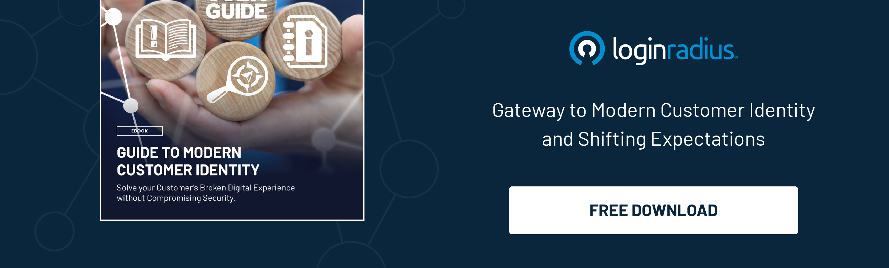

## Introduction

Understanding your customers is no longer just an advantage – it's a necessity. Companies constantly seek ways to enhance customer experience, build brand loyalty, and boost their bottom line. 

However, unveiling the customer identity base case is the key to achieving these goals. This strategic approach goes beyond demographics and purchase history to create a holistic view of the customer.

In this blog, we will dive into the intricacies of the customer identity base case, exploring its significance and providing actionable strategies for success.

### Understanding the Customer Identity Base Case

The customer identity base case is the foundation for successful customer relationships. It involves gathering and [analyzing data from various touchpoints](https://www.loginradius.com/blog/growth/omnichannel-customer-experience/) to create a comprehensive profile of each customer.

This goes beyond basic demographics, encompassing preferences, behaviors, and interactions across different platforms. By unveiling the customer identity base case, businesses can personalize their marketing efforts, predict customer needs, and tailor their products or services accordingly.

### The Significance of Customer Identity Base Case

#### 1. Personalization and Enhanced Customer Experience

By understanding individual customer preferences, businesses can create personalized experiences, leading to higher customer satisfaction and loyalty.

#### 2. Targeted Marketing Campaigns

Businesses can craft targeted marketing campaigns with detailed customer insights that resonate with specific customer segments, resulting in [higher conversion rates and ROI](https://www.loginradius.com/resource/how-ciam-increases-roi-for-your-enterprise/).

#### 3. Fraud Prevention

A robust customer identity base case helps detect fraudulent activities by flagging unusual behaviors, ensuring a secure online environment for businesses and customers.

#### 4. Improved Product Development

By analyzing customer data, businesses can identify gaps in the market, leading to the development of products or services that meet customer demands effectively.

### Leveraging Customer Identity Base Case in the Future of Business

As we move into an era dominated by digital interactions, the importance of the customer identity base case will only intensify. Businesses that invest in understanding their customers at a granular level will be better equipped to navigate the evolving market dynamics. 

Emerging technologies like the Internet of Things (IoT) and augmented reality are reshaping customer interactions, providing even more touchpoints for data collection. By embracing these technologies and integrating the insights gained into their customer identity base case, businesses can create seamless, omnichannel experiences that delight customers across various platforms.

Moreover, the rise of ethical consumerism underscores the significance of transparent data practices. Companies that prioritize customer privacy and utilize data responsibly will not only comply with regulations but also earn the trust and loyalty of their customer base.

### The Path Forward: Embracing Customer-Centricity in Business Strategies

Incorporating the [customer identity base case into the core of business strategies](https://www.loginradius.com/blog/growth/identity-at-centre-of-your-customer-strategy/) signifies a paradigm shift. It means recognizing that every data point represents a human with unique preferences, desires, and expectations. 

Embracing a customer-centric approach is not just about making sales; it's about building lasting relationships. Businesses should continuously gather feedback, iterate their strategies, and adapt to changing customer needs. By fostering a culture of empathy and curiosity within the organization, companies can ensure that their products, services, and marketing efforts resonate authentically with their customers. 

In this customer-driven landscape, those who genuinely understand and value their customers will survive and thrive, setting new benchmarks for success in the customer identity base case age.

### Strategies for Unveiling the Customer Identity Base Case

#### 1. Data Integration

Integrate data from various sources – website interactions, social media, mobile apps, and customer support – to create a unified customer profile. Utilize advanced analytics tools to gain meaningful insights.

#### 2. Consent-Based Data Collection

Respect customer privacy by collecting data through opt-in methods. Transparency and consent are essential in building trust with customers ensuring compliance with [data protection regulations](https://www.loginradius.com/blog/identity/consumer-data-privacy-security/).

#### 3. Utilize Artificial Intelligence

Leverage AI algorithms to analyze vast amounts of customer data swiftly. AI-driven insights can uncover patterns and trends that may be challenging to identify through manual analysis.

#### 4. Continuous Monitoring and Analysis

Customer preferences and behaviors change over time. Regularly monitor and analyze customer data to stay updated, allowing businesses to adapt their strategies accordingly.

#### 5. Implement Robust Security Measures

Ensure the security of customer data through encryption, [multi-factor authentication](https://www.loginradius.com/multi-factor-authentication/), and regular security audits. Building customer trust is paramount in the digital age.

#### 6. Collaboration Across Departments

Foster collaboration between marketing, sales, customer support, and IT departments. Sharing customer insights across teams ensures a consistent approach and enhances the overall customer experience.

### Final Thoughts 

The customer identity base case is the cornerstone of a successful business strategy in today's competitive market. By investing in data-driven insights and personalization, businesses can forge meaningful customer connections, increasing loyalty and revenue. 

Embracing these strategies and understanding the value of the customer identity base case will undoubtedly pave the way for long-term success in the digital realm.

