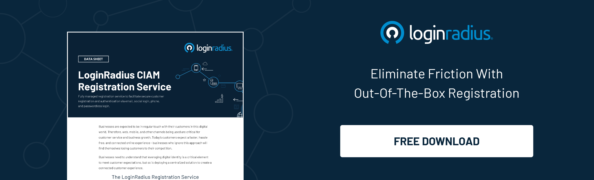

---
title: "Driving Success Through Customer Onboarding: The Role of Marketing Strategies"
date: "2023-05-24"
coverImage: "customer-onboarding.jpg"
tags: ["customer onboarding","customer experience"]
author: "Yash Rathi"
description: "Explore the role of marketing in enhancing customer onboarding. Learn practical strategies like personalized communication, clear materials, streamlined experience, and continuous support for successful onboarding."
metadescription: "Discover how marketing strategies can optimize the customer onboarding process that further helps enhance lead generation and conversion rates."
metatitle: "How Marketing Strategies Optimize Customer Onboarding"
---

## Introduction

You’ve heard many times before that first impression is the last, isn’t it? And businesses catering to their customers online may not even realize that the first impression begins when a customer lands on their website. 

Hence, businesses must craft seamless customer experiences right from the start. Everything must work like a breeze, whether it’s the user’s first interaction with the platform or the entire onboarding process. 

And when it comes to building [successful customer relationships](https://www.loginradius.com/blog/growth/customer-relationship-business/), the onboarding process plays a vital role. It is the critical stage where businesses have the opportunity to make a positive first impression and set the foundation for long-term customer satisfaction and loyalty. 

So, if you wish to enhance your lead generation and conversion rates, you must ensure your onboarding isn’t bothering your customers. 

Let’s explore the significance of optimizing the customer onboarding process and dive into six effective marketing strategies that can drive improvement and enhance overall customer experiences.

## Optimizing the Customer Onboarding Process With 6 Marketing Strategies

### 1. Personalized Communication

Effective communication is critical to ensuring a smooth onboarding process. By leveraging marketing strategies, businesses can personalize their communication to address individual customers' unique needs and preferences. 

This can involve sending personalized welcome emails, tailored messages, or targeted content that highlights the value proposition of the product or service. [Personalization](https://www.loginradius.com/blog/growth/consumer-identity-rule-personalized-marketing-2022/) helps create a sense of connection and demonstrates that the business values its customers, setting a positive tone for the onboarding experience.

### 2. Clear and Comprehensive Onboarding Materials

Marketing is crucial in creating clear and comprehensive onboarding materials that guide customers through the initial stages of using a product or service. 

These materials can include user guides, tutorials, videos, or interactive demos that provide step-by-step instructions and highlight key features. By leveraging marketing expertise, businesses can ensure their onboarding materials are visually appealing, engaging, and easily accessible, enabling customers to understand and navigate the product or service quickly.

### 3. Streamlined User Experience

Marketing strategies contribute significantly to creating a streamlined user experience during onboarding. By implementing user-centric design principles, businesses can simplify complex tasks and eliminate potential barriers or friction points that may hinder customer progress.

This can involve optimizing the user interface, refining the registration process, and incorporating intuitive navigation elements. A seamless user experience enhances customer satisfaction and reduces the likelihood of customers abandoning the onboarding process prematurely.

### 4. Continuous Support and Education

An effective customer onboarding process extends beyond the initial stages of engagement. Marketing strategies can be leveraged to provide ongoing support and education to customers, ensuring their success in utilizing the product or service. 

This can be achieved through various means, such as regular newsletters, blog articles, webinars, or dedicated customer support channels. 

By continuously engaging with customers and providing valuable resources, businesses can foster a sense of trust, promote product adoption, and [increase customer loyalty](https://www.loginradius.com/blog/growth/ciam-improves-customer-trust-and-loyalty/).

### 5. Leveraging Data and Analytics

Marketing strategies can harness the power of data and analytics to optimize the customer onboarding process. By analyzing customer behavior, preferences, and engagement patterns, businesses can gain valuable insights into the effectiveness of their onboarding efforts. 

This data can be used to identify areas for improvement, refine messaging and content, and make data-driven decisions to enhance the onboarding experience. 

Furthermore, marketing analytics can help businesses track critical metrics such as conversion rates, time to onboard, and customer satisfaction, enabling them to measure the success of their strategies and make informed adjustments as needed.

### 6. A/B Testing and Iterative Improvements

Marketing strategies emphasize the importance of continuous improvement through A/B testing and iterative iterations. By implementing A/B tests during onboarding, businesses can experiment with different approaches, messaging, or design elements to determine what resonates best with their target audience. 

By measuring the impact of these variations on key performance indicators, businesses can identify the most effective strategies and refine their onboarding process accordingly. 

This iterative approach allows for ongoing enhancements and optimization, ensuring the customer onboarding process remains dynamic and aligned with evolving customer needs.

## Conclusion

Optimizing the customer onboarding process requires a strategic and holistic approach, leveraging marketing strategies to drive improvement. 

By focusing on personalized communication, explicit onboarding materials, streamlined user experience, continuous support, education, data, analytics, A/B testing, and iterative improvements, businesses can create a seamless onboarding experience that sets the stage for long-term customer satisfaction and loyalty. 

Investing in these strategies benefits the individual customer and contributes to business growth, increased customer retention, and a strong brand reputation. Businesses can pave the way for success in today's competitive landscape by optimizing the customer onboarding process.

