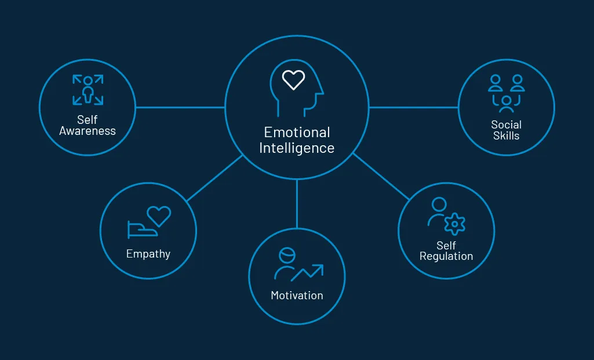
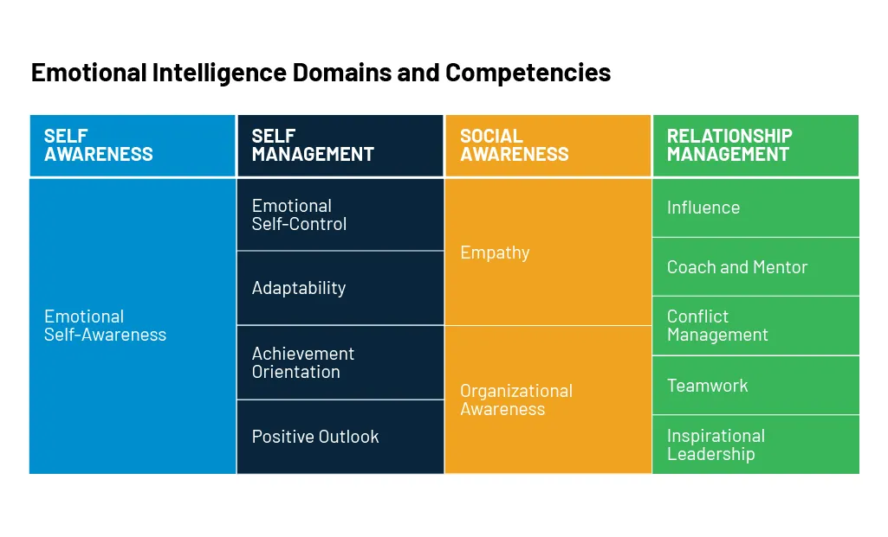

---
title: "Steps to Grow Your Emotional Intelligence for Better Consumer Relations"
date: "2021-03-31"
coverImage: "emotional-intelligence-loginradius.webp"
category: ["loginradius"]
featured: false 
author: "Lesley Vos"
description: "Steps to Grow Your Emotional Intelligence for Better Consumer Relations | LoginRadius."
metadescription: "Steps to Grow Your Emotional Intelligence for Better Consumer Relations | LoginRadius."
metatitle: "Steps To Grow Emotional Intelligence | LoginRadius"

---

Consumer relations are about engaging with their audience at every level of a sales funnel to improve consumer experience. And you are only as good as your emotional intelligence.

  

Since marketing and sales teams are mostly responsible for building it, consumer relations is most prevalent in the support department.

  

A pitch-perfect communication with consumers on the phone, via email, in person, or live chats can contribute more than one might think.

  

The **[consumer experience](https://www.loginradius.com/customer-experience-solutions/)** and service industry requires agents to have the ability to relate to people on a personal level. Consumers need to feel as if they communicate with someone who genuinely cares and wants to solve their problem.

  

It's not about hard skills but emotional intelligence (EI) of your agents, which you’re responsible for helping them develop.

  
  

## Emotional Intelligence: The Basics

Emotional intelligence helps people to communicate and resolve conflicts. It determines how teams work together efficiently and how they stay motivated to work better.

  

The concept surged in popularity in the 1990s after the [Emotional Intelligence](http://www.danielgoleman.info/topics/emotional-intelligence/) book by Daniel Goleman got published.

  

Psychologist and science journalist, Goleman examined EI with application to leadership and workspace. He revealed direct links between the emotional intelligence of entrepreneurs and their business.

  

It appeared that the [top five components of EI](https://www.cognitiveinstitute.org/get-smart-about-emotional-intelligence/) — self-awareness, self-regulation, motivation, empathy, and social skills — result in an influence on business communication.

In plain English, emotional intelligence is "the ability to perceive, control and evaluate emotions – in oneself and others – and to use that information appropriately." ([Source](https://www.psychologytoday.com/intl/blog/your-mind-your-body/201201/10-ways-enhance-your-emotional-intelligence))

  

That's how Goleman explained the growing interest in emotional intelligence in the workplace:

  

"It stems from the widespread recognition that these abilities – self-awareness, self-management, empathy, and social skill – separate the most successful workers and leaders from the average. It's especially true in roles like the professions and higher-level executives, where everyone is about as smart as everyone else, and how people manage themselves and their relationships gives the best and edge." ([Source](https://positivepsychology.com/emotional-intelligence-workplace/))

  

He described EI with four domains and [twelve competencies](https://hbr.org/2017/02/emotional-intelligence-has-12-elements-which-do-you-need-to-work-on) a person needed to develop to become emotionally intelligent:

Today, experts agree on two statements:

  

1.  Emotional intelligence is possible to grow and improve with practice.
    
2.  Emotional intelligence impacts a job performance.
    

  

Managers must pay attention to their agents' EI skills and help to grow them for improved consumer service.

  
  

## Why Emotional Intelligence Improves Consumer Relations

  

Emotional intelligence helps agents develop consumer service skills like empathy, adaptability, self-control, teamwork, and willingness to improve. Having emotional self-awareness and the ability to admit they don't have the answer improves communication.

  

Consumer satisfaction and **[consumer retention](https://www.loginradius.com/blog/fuel/2021/03/how-customer-retention-can-help-businesses-grow/)** increase with emotionally intelligent support teams.

  

According to studies, [61% of consumers](https://info.microsoft.com/rs/157-GQE-382/images/2018StateofGlobalCustomerServiceReport.pdf) won't buy from a company providing them with poor consumer experience. On the contrary, 60% of consumers will work with a business handling consumer service well, even if the outcome isn't what they expected at first.

  

The emotional intelligence of consumer service agents give insight into problems because their conflict [**management and communication skills**](https://www.loginradius.com/blog/fuel/2021/03/8-effective-communication-strategies-for-internal-alignment-and-growth-in-2021/) encourage consumers to share feedback. Better individual interactions with consumers influence their buying decisions over time.

  

So, why not foster positive consumer relations by helping your agents become more emotionally intelligent?

  
  

## How to Help Agents Grow Their Emotional Intelligence

Start by growing a culture of emotional intelligence in your organization. Follow an education plan for why agents need EI and how it helps them build better consumer relations.

  

-   Introduce the core principles of EI and discuss them during business meetups or team building events.
    
-   Suggest [books](https://bookauthority.org/books/new-emotional-intelligence-books) or [critical essays](https://bid4papers.com/blog/critical-essay/) on the topic.
    
-   Visit seminars and workshops with your support team or organize your own in the company.
    
-   Recommend [TED talks](https://www.inc.com/justin-bariso/5-more-brilliant-ted-talks-that-will-boost-your-emotional-intelligence.html) or educational [podcasts](https://blog.feedspot.com/emotional_intelligence_podcasts/) about EI.
    

  
  

When talking to consumers by phone or in live chats, consumer service agents need to stay engaged and adapt quickly. Implement simple tactics to ensure emotional intelligence success.

  

-   Preparation. Motivate agents to improve by encouraging their participation in business processes.
    
-   Training. Set clear goals and be a smart leader who fosters a positive relationship between team members. But make sure the goals and rules you establish for agents connect to your values. The guidelines need to support both business and team members' beliefs; only then, your agents will accept and approve the rules you set.
    
-   Support. Encourage your agents to self-educate and learn new things, and create the conditions for efficient team collaboration.
    

  

Setting up your team to succeed also requires some larger strategies.

### Workspace Organization

Work environment matters for EI growth. It can influence health, mood, and motivation. It can boost productivity and help to control emotions. Organize the workspace for your consumer service agents so they could feel comfortable there.

  

Think of a proper temperature level in the office. Consider light, comfortable furniture, and ventilation; also, make sure that every member of your team has an intimate environment. Remember to train them on hard skills too like using business software and understanding the product to improve consumer relations.

### Social Responsibility

Encourage the social responsibility of your consumer support agents if possible. It's one of the highest emotional intelligence levels, so it would be a good thing to develop it in your team.

  

Let them participate in volunteer events, encourage to make donations to charity, and promote positive changes in a non-intrusive way. The big chances are that most of your consumer support agents are Millennials, so they are a generation who's more concerned about doing something meaningful rather than earning money only. They'll support such an initiative by all means!

  

Social responsibility is about what a business can contribute to others. In the context of emotional intelligence, it's a chance to train self-awareness and self-control of your agents.

  

### Stress Management

Building and supporting consumer relations are time- and energy-consuming. It requires creativity and the ability to be flexible, which is stressful and can lead to the agents getting burned out. When in stress, they will hardly think of being emotionally intelligent in communication with consumers.

  

Use simple tactics to keep the stress levels down.

  

-   Don't let them work overtime. Stick to schedule and share tips on how they can get more energy at work.
    
-   Encourage your agents to take breaks and rejuvenate. Consumer relations won't win if building them with tired and frustrated call center operators or live chat agents.
    
-   Resolve conflicts. Address issues before they disrupt the healthy atmosphere in the office. Conflict management is among EI competencies for both managers and support agents to have
    
-   Forget about multitasking. This technique doesn't work and impacts [time management skills](https://bid4papers.com/blog/time-management-for-college-students/) of your consumer support agents. Encourage them to focus on one thing at a time, as multitasking doubles the time it takes to complete tasks.
    
-   Be empathetic. Grow the skills of treating your people with respect, kindness, and professionalism. Understand their needs and viewpoints. Forget about a one-size-fits-all approach to interacting with consumer support agents.
    

### Giving a Voice

Stellar communication skills are a must for your consumer support agents to have. These skills are not only about the ability to talk via phones, chats, or emails but also about active listening, gaining a better understanding of body language, and the opportunity to express frustrations and concerns. Help your consumer service team develop them.

  

Allow your team to share their ideas with you. Organize brainstorming sessions, present a storyboarding technique to them, and ask how they would solve problems.

  

## Appeal to Agents' EI for Better Communication for Positive Consumer Relations

The way your agents talk to consumers impacts your business reputation so be sure to appeal to their emotional intelligence.

  

Emotional intelligence addresses such consumer service skills as persuasion and the ability to communicate clearly, use positive language, and "read" the consumer's current emotional state.

  

Use the appropriate tone and style during phone calls or live chat communication with consumers.

  

Encourage best practices with your consumer service agents like:

  

-   Use positive language and tone of voice when speaking to consumers. Create a style guide they could use in communication: It's the list of dos and don'ts of your **[brand communication](https://www.loginradius.com/industry-media-and-communications/)**. Encourage your agents to use the vocabulary of phrases that reflect your brand identity and values.
    

  

-   Adapt to consumers' communication styles. It's the EI capability giving your agents the understanding that they should mirror a consumers’ mood in the messages. For example, when talking to an angry person, there's no place for smiles but delicacy. And when a consumer is excited about something, it's okay to maintain the same mood in communication with him.
    

  

-   Offer listening indicators. Encourage [consumer service agents](https://www.nicereply.com/blog/customer-support-agents-productivity/) to use so-called listening signals when communicating with consumers. Phrases like "Okay," "Oh, I see..," "I understand," and others are indicators of empathy. They signal to consumers that an agent is on the same track with them.
    

  

## Conclusion

  

Emotional intelligence is the ability to control emotions and relate well to others. Incorporating EI training into their management programs and encouraging the staff to grow EI builds a more robust business.

  

It takes commitment and time but yields loyalty. Grow the emotional intelligence of your agents, be emotionally intelligent yourself, and implement them across business communication systems for productive consumer relations.

