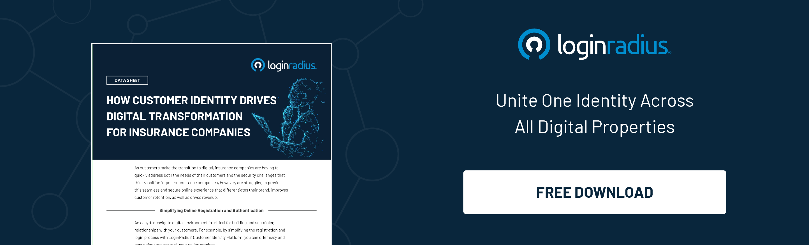

---
title: "Enhance Your Consumer Experience in Insurance Companies With CIAM"
date: "2021-08-09"
coverImage: "couple-meeting-with-insurance-agent.jpg"
tags: ["loginradius"]
featured: false 
author: "Deependra Singh"
description: "Unaided consumer interactions are a lost opportunity. The main goal of an insurance company should be to reduce the time taken in all their consumer interactions and increase the consumer experience level. This can only happen by implementing excellent systems and processes, which is where a CIAM comes into play."
metadescription: "Prioritize consumers in insurance companies by adapting to the digital transformation with CIAM for improved consumer experience and enhanced frictionless service."
metatitle: "How to Enhance CIAM Experience in Insurance Companies"
---

When it comes to finding and interacting with insurance carriers, consumers have high expectations. They demand a secure and reliable consumer experience in addition to excellent coverage and competitive costs. Savvy online consumers expect the same individualized attention they get when chatting with a live agent over the phone due to digital transformation. They demand that experience be consistent no matter which device they use.

  

A [consumer identity and access management](https://www.loginradius.com/blog/start-with-identity/customer-identity-and-access-management/) (CIAM) solution is vital for insurance businesses aiming to develop trusted digital connections with their users and deliver tailored experiences that enhance revenues, build brand loyalty, and expedite internal processes.

  

## Concerns of Insurance Companies

  

The seamless user onboarding of new consumers, the overall [consumer experience](https://www.loginradius.com/resource/how-customer-identity-drives-digital-transformation-for-insurance-companies-2/), and good authentication services and identification process when individuals use their online apps are some of the primary concerns. Other issues include managing multiple brands within a single organization and managing personal data both within and outside the company.

   

## What Businesses Use CIAM

  

Businesses use Consumer Identity and Access Management (CIAM) systems to manage social networks and associated features. Consumers may sign up for and log in to online apps and services using CIAM solutions. They aid in protecting data privacy and preventing identity theft and other forms of corruption and theft.

  

## How CIAM can Assist Insurance Companies

  

A CIAM platform helps with smooth and safe experiences throughout the online insurance lifecycle. It can assist in the following ways:

  

### Access Management

Create and manage secure IDs for your prospective consumers for easy, frictionless access to insurance information across all platforms and touchpoints.

-   With single sign-on and multi-factor authentication, you can simplify and secure access to digital assets.
    
-   With extensive preferences and [consent management](https://www.loginradius.com/consent-management/) solutions, you can improve consumer connections.
    
-   Use real-time consumer profile information to provide customized user experiences.
    

  

### Smooth User Interaction

Users must have a smooth integration when retrieving their data once they have created an account that provides access to their online insurance resources. The authentication procedure should provide for just-in-time, just-enough verification without interfering with the user's journey or jeopardizing security.

  

The proper CIAM solution combines authentication flexibility with cutting-edge technologies such as [password-less authentication](https://www.loginradius.com/blog/start-with-identity/passwordless-authentication-the-future-of-identity-and-security/), reauthentication, step-up, and platform independence.

  

### Secure Consumer Data

With complete authentication, access management, and data governance capabilities, you can safeguard your company's reputation. Reliable CIAM software follows the industry's best security and privacy best practices.

-   [Multi-factor authentication](https://www.loginradius.com/multi-factor-authentication/) demands an extra layer of security for additional safeguard.
    
-   Rigorous data analysis and scoped permissions, such as role-based and attribute-based access control (RBAC/ABAC), can help reduce risk.
    
-   The consumer care portal's features can streamline user provisioning, consumer service, and consumer support.
    

  

### Services to multiple users

An insurance company gears the majority of its information towards average end users like us. However, insurance firms also service businesses and frequently work with agents and brokers to generate new business.

  

Businesses usually employ a mandate model, in which they provide permissions to specific people within their organization to manage insurance company relationships, which necessitates access to the insurance company infrastructure. Likewise, agents require access to essential applications in order to submit orders and assist the end-user.

  

You want to encourage business users and agencies regardless of the business agreement; you don't want to have the regulatory burden while still being in charge. Business users and agents can establish and manage users within their designated scope by assigning authority and approvals.

### Frictionless Consumer On-boarding

  

Organizations must understand consumers' channels of engagement for getting products and services to develop a best-in-class safe consumer experience. It all starts with  [user onboarding](https://www.loginradius.com/blog/fuel/importance-customer-onboarding/) for new consumers with a seamless user journey tailored to the specific demands of the brand with which the user is registering.

  

Because there are various points of interest in the [onboarding process](https://www.loginradius.com/blog/start-with-identity/user-onboarding-revamp-application/), it always necessitates a meaningful discussion. On the one hand, the onboarding and signup process must be seamless in order to provide a positive consumer experience. On the other hand, the need for the appropriate level of security is pressing.

  

Insurance companies will have to make trade-offs between protection and the client experience when developing the secure trip. Users get a smooth journey—creating better economic opportunities for digital banking. If they strike the appropriate balance, it [reduces the risk](https://www.loginradius.com/blog/start-with-identity/risk-based-authentication/) of opportunistic attackers.

  

## Bottom line

  

Insurance companies often operate in a fast-paced environment, serving both consumers and businesses. They also deal with a complex IT infrastructure resulting from the multiple acquisitions that make up a typical contemporary insurance company.

  

[Implementing the right CIAM](https://www.loginradius.com/) solution is critical in the digital world of insurance firms in order to achieve their objectives and go above and beyond. This [CIAM digital strategy](https://www.loginradius.com/blog/start-with-identity/digital-transformation-consumer-iam/) can assist in the transformation of a conventional life insurance product into a more modern digital banking offering geared at wider consumer segments while still utilizing the traditional agent channel.
