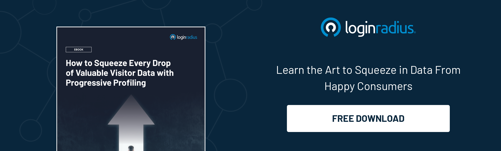

## Introduction

In today's fast-paced digital world, customer experience (CX) has emerged as a crucial differentiator for businesses across industries. 

With consumers demanding seamless and personalized interactions, organizations are under increasing pressure to deliver exceptional CX at every touchpoint. 

Conversely, Chief Marketing Officers (CMOs) are turning to innovative solutions such as [Customer Identity and Access Management](https://www.loginradius.com/blog/identity/customer-identity-and-access-management/) (CIAM) and data-driven insights to revolutionize their CX strategies and meet this challenge. 

Let’s dig deeper into this and learn the importance of a robust CIAM in streamlining user experience. 

## The Power of CIAM in CX Enhancement

In CX enhancement, CIAM stands out as a powerful tool for creating seamless and secure digital customer experiences. 

By centralizing identity management processes, CIAM enables businesses to offer [frictionless registration and login processes](https://www.loginradius.com/authentication/), personalized interactions, and robust data protection measures. This enhances customer satisfaction and fosters trust and loyalty, driving long-term business success.

## Leveraging CIAM for Seamless Digital Experiences

CIAM plays a pivotal role in shaping modern CX initiatives by providing a unified platform for managing customer identities across various channels and devices. 

Whether it's a website, mobile app, or IoT device, CIAM ensures that customers can access services securely and effortlessly. By streamlining the authentication process and offering [single sign-on](https://www.loginradius.com/single-sign-on/) capabilities, CIAM simplifies the user experience, reducing friction and enhancing engagement.

## Enhancing CX Through Data-Driven Insights

However, the true potential of CIAM in enhancing CX lies in its ability to generate valuable data insights. By analyzing customer data collected through CIAM platforms, businesses can gain a deeper understanding of customer behavior, preferences, and trends.

These insights empower CMOs to personalize marketing campaigns, tailor product offerings, and optimize service experiences to meet the evolving needs of their target audience.

## Integrating CIAM for Comprehensive Customer Understanding

One of the key advantages of CIAM is its integration capabilities with other business systems such as CRM platforms, marketing automation tools, and analytics solutions. By integrating CIAM with these systems, CMOs can gain a comprehensive view of the customer journey, from initial interaction to post-purchase engagement. 

This holistic understanding enables organizations to identify areas for improvement, optimize touchpoints, and deliver consistent and personalized experiences across all channels.

## Proactive Customer Engagement with Real-Time Insights

Furthermore, CIAM empowers CMOs to approach customer engagement proactively by leveraging real-time data insights. 

By monitoring customer interactions and behaviors in real time, businesses can anticipate needs, identify opportunities, and deliver relevant and timely communications. 

Whether personalized recommendations, targeted promotions, or proactive support, CIAM enables organizations to engage with customers meaningfully, enhancing CX and driving loyalty.

## Driving CX Innovation with Continuous Improvement

Continuous improvement is essential for staying ahead in the ever-evolving landscape of CX. By leveraging CIAM and insights, businesses can drive CX innovation by implementing iterative enhancements based on customer feedback and market trends. 

Whether refining user interfaces, introducing new features, or expanding service offerings, organizations can continuously iterate and optimize the customer experience to meet evolving expectations and maintain a competitive edge.

## To Conclude

In conclusion, combining CIAM and data-driven insights offers a powerful framework for transforming customer experience. 

By leveraging CIAM to create seamless digital experiences and harnessing data insights to personalize interactions, businesses can differentiate themselves in a competitive market and build lasting customer relationships. 

As CX continues to evolve, CMOs must embrace innovative solutions like LoginRadius CIAM to stay ahead of the curve and deliver exceptional experiences that drive growth and loyalty.

