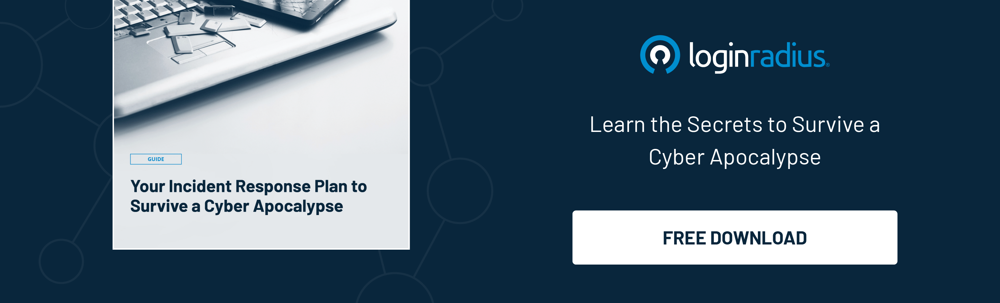

## Introduction

The CEO of an enterprise navigating the digital landscape can feel like embarking on a thrilling yet perilous expedition. It promises growth and innovation but is tempered by the looming specter of cyber threats partly because enterprise-level security breaches are often.

Cybercriminals keep developing new ways to breach the digital defenses of even the most well-fortified organizations. Therefore, CEOs intending to protect the company's valuable assets must remain ahead of the curve in understanding [cybersecurity developments](https://www.loginradius.com/blog/identity/tips-from-loginradius-security-expert-2022/).

A CEO can formulate security policies, adopt the right security tools, implement cloud security posture management, and even adopt security trends.

In this article, we'll explain on five key enterprise-level security trends every CEO must know to successfully chart a course through the unpredictable waters of the cyber world.

## 5 Key Enterprise-Level Security Trends Every CEO Should Know

### 1. Securing cyber assets is a top priority 

With the increasing reliance on technology and data to drive business growth, protecting digital infrastructure, systems, and sensitive information has never been more critical.

Often, the CEO employs a [zero-trust security](https://www.loginradius.com/blog/identity/beginners-guide-zero-trust-security/) policy that operates on the "never trust, always verify" principle. Zero trust security emphasizes stringent access control and continuous authentication to minimize risks.

Due to the rising number of target-based cyberattacks, the zero-trust security industry has grown. [Markets & Markets predicts](https://www.marketsandmarkets.com/Market-Reports/zero-trust-security-market-2782835.html) a 17.3% CAGR from 2022 to 2027, growing from USD 27.4 billion to USD 60.7 billion.

Here are the key aspects that CEOs should consider to leverage zero trust security:

* **Ensure regulatory and compliance fulfillment:** The introduction of the General Data Protection Regulation (GDPR), the [California Consumer Privacy Act](https://www.loginradius.com/blog/identity/ccpa-introduction/) (CCPA), and other similar laws have placed additional responsibilities on organizations to protect user data and ensure digital infrastructure security.
* **Assess the scope of the current security:** Evaluate the organization's security measures, identify vulnerabilities, and understand the potential risks and threats of cyber assets.
* **Strategy and vision:** A CEO must define and communicate the organization's top priority of securing cyber assets while aligning it with overall business goals. This helps create a clear understanding of the approach and fosters easy adoption of security architecture and solutions across the organization.

### 2. AI-enabled threat detection systems are being used to detect data breaches

Market and Market shares that the industry size of AI in cybersecurity is around $22 Billion (in 2023). It also predicts that the same will rise to $60 Billion by 2028 at a CAGR above 21%. 

Implementing AI and ML for organizational security is a complex task that requires a CEO's close attention to various aspects. 

Here are some key areas that need CEO’s consideration:

* **Address potential biases:** AI and ML algorithms may inadvertently learn and perpetuate biases present in the training data. CEOs should proactively address potential biases and establish processes to monitor and mitigate them.
* **Assess risks:** Continuously evaluate potential risks and vulnerabilities associated with AI and ML. It includes checking for algorithmic bias and adversarial attacks and identifying over-reliance on automated systems.
* **Resources allocation:** Implementing AI and ML for organizational security requires hardware, software, and personnel investment. A CEO should ensure leveraging security tools, including skilled data scientists, engineers, and security experts.

### 3. Businesses are building a dedicated board-level cybersecurity committee

A gradual transition towards a robust security culture signifies the importance of integrating cybersecurity awareness. As a result, many organizations are now building dedicated board-level cybersecurity committees to better address this growing concern.

CEOs should consider some key aspects when building a dedicated board-level cybersecurity committee.

* **Top-down approach:** A security culture must be driven from the top down, with the CEO and executive team demonstrating a commitment to security. This helps set a strong example for the rest of the organization.
* **Incident response plan:** A CEO must approve a comprehensive incident response plan that outlines steps to be taken in case of a security breach, including communication, containment, and recovery.

* **Review and evaluation:** The committee periodically reviews and evaluates the organization's cybersecurity posture, including the effectiveness of its risk management strategies, incident response plans, and overall security controls.

### 4. Businesses are investing in customer IAM solutions 

CIAM (customer identity and access management) is a comprehensive solution that enables organizations to manage customer identities, authenticate users, and control their access to digital resources. As a business facilitator, CIAM ensures compliance and enhances the user experience by streamlining customer login processes and delivering customized services to specific client needs.

A CEO may address several types of risk in light of business objectives regarding consumer satisfaction. They should consider the following aspects to ensure a successful implementation:

* **Scalability and performance:** Choose a CIAM solution that can [scale with your organization's growth](https://www.loginradius.com/scalability/) and handle large numbers of customer identities without compromising performance or security.
* **Business objectives:** Align CIAM implementation with overall business goals, such as enhancing customer experience, improving security, ensuring compliance, or increasing operational efficiency.
* **User experience:** Design user-friendly interfaces and processes that streamline customer registration, [authentication](https://www.loginradius.com/authentication/), and profile management. Consider implementing Single Sign-On (SSO) and social login options for a seamless experience.

### 5. Investment in privacy-enhancing computation (PEC) is rising

Gartner mentions that by 2025, 50% of major enterprises will employ privacy-enhancing computing. This will be done to handle data in untrustworthy environments and multiparty data analytics use cases.

PEC technologies enable secure data sharing, analysis, and processing while preserving privacy, which is increasingly important in today's data-driven world. 

Implementing PEC requires the CEO's consideration of the following:

* **Scalability:** Evaluate PEC solutions' scalability to ensure they accommodate the organization's growing data processing needs without compromising performance or privacy.
* **Future-proofing:** CEOs should keep tabs on emerging PEC technologies and industry trends to stay ahead of the curve. This ensures that the organization's privacy measures remain effective and up-to-date.
* **Integration:** Assess the ease of integrating PEC technologies into the existing infrastructure, including compatibility with legacy systems and third-party services.

## In Conclusion

Cybersecurity is no longer just an IT concern but a top strategic priority for every business, regardless of size or industry. As a CEO, staying informed about enterprise-level security trends is critical to protect your organization from potential threats and vulnerabilities. 

Remember, a robust security posture prevents potential attacks and demonstrates to customers, investors, and stakeholders that your organization is committed to ensuring the highest levels of trust and confidence.

