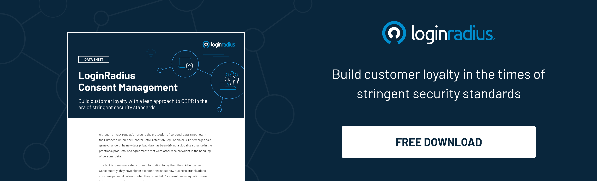

---
title: "Your Digital Identity Is Changing - So, What Does It Mean For Customer Experience?"
date: "2022-12-16"
coverImage: "digital.jpg"
tags: ["digital id", "cx", "customer identity"]
author: "Rakesh Soni"
description: "Now, more than ever, customer experience is baked into every business. That means that as a business owner, you need to deliver great digital experiences and customer interactions every time. This blog covers some of the important aspects of an effective digital strategy."
metadescription: "The importance of customer identity in the changing digital landscape is irreplaceable, and to build trust online, we need digital identity in our lives."
metatitle: "Embracing the Evolution of Digital Identity for Better CX"
---

## Introduction

In today's world, where we need to be able to authenticate our identity at a moment's notice, it's essential to understand the role of digital identity in our day-to-day lives. 

To establish trust with other parties online, we need to prove who we are through a [digital identity](https://blog.loginradius.com/growth/digital-identity-key-to-economic-growth/) that both sides of the conversation can trust; this is where the concept of digitalization comes into play. 

A strong digital presence will help you engage with your customers effectively and build trust among them, eventually leading to increased sales and profits for your business.

In this blog, we will explore the importance of customer identity in the changing digital landscape and why you should care about it if you are not already doing so.

## Why Is First-Party Data An Important Trend For Customer Engagement?

Today's brands are constantly looking for ways to engage with their customers in a personalized and meaningful way. With the rise of AI and machine learning, companies are able to collect new types of data and use it to create better experiences for their customers. 

Customer identity is a new and emerging area of data management. First-party data management refers to the collection, use, and maintenance of customer information that your company has collected about customers. This can be anything from data about how website visitors browse your website to transaction data about what visitors have purchased.

As third-party cookies fade into obscurity, first-party data is emerging as a viable alternative for businesses seeking greater insight into their customers and as the trendsetter for enhanced customer experiences, leading to increased customer engagement.

## How Customer Data Impacts The Future Of Customer Identity?

As more customers are shopping online, it’s more important for businesses to know their [customer’s habits and preferences](https://blog.loginradius.com/growth/lead-era-customer-centric-marketing/) to offer them products and services that will help them achieve their goals. For that, the most efficient method is customer data management.

Below are the four principles for improving your customer data management:

### 1. Visualizing a data governance strategy.

Many organizations struggle with [data governance](https://blog.loginradius.com/identity/data-governance-best-practices/) because they don't have a clear strategy for how they will handle their customer's data. They may have a strategy in place, but they don't have a system that allows them to execute their strategy. That's where data governance comes in. 

Data governance is the very first principle of good customer data management because it will help you identify what data you will collect and how it will be collected. It'll also keep all employees on the same page about your customer data management plan.

### 2. Data security is imperative.

Data protection is one of the most critical aspects of customer data management. You may have a lot of data, but if you can’t protect it well enough, your customers will be wary of sharing anymore. It’s not just about protecting their information from hackers; it also means protecting their information from being misused by your company or an outside source. 

Data security means "protecting data from unauthorized access, use, change, disclosure, and destruction." Implementing a security program means that customer data is constantly being reviewed, refined, and improved. These checks and balances are essential for protecting consumers' personal data and ensuring that any collected information remains secure.

### 3. A procedure for ensuring data accuracy.

Data accuracy is a key component of good customer data management. A company’s ability to manage its data accurately will help it improve its customer relationships and allow a business to take advantage of opportunities that otherwise would be missed. The accuracy of your data can be affected when you collect it, but it can also be affected months or years down the road because data can change over time. This is known as data decay.

Data decay is a significant problem for companies today. Inaccurate data can greatly affect your customer experience. When managing customer data, it’s important to remember that, over time, data can become inaccurate. It happens when there are changes in emails, phone numbers, physical locations, and more. 

Clearing up the data decay can be simple as dumping data from prospects and customers who haven’t engaged with your company in a certain number of months or years. You can also start by eliminating duplicate records and ensuring that each record's information is consistent across all systems.

### 4. Comply with data regulations.

When it comes to customer data management, laws are changing fast. New regulations require companies to consent before collecting any data about their customers. In the past year, many governments have enacted laws similar to GDPR and CCPA. You can expect that trend to continue as data privacy becomes more important to the public. 

While this may seem to be a lot of work, your business must comply with new laws and regulations. While collecting data from your website, you will need to know how to get consent from your visitors and store that information securely.

## How To Learn From Customer Behavior And Stay Ahead Of Evolving Needs?

It’s no longer a secret that the world of customer service is changing rapidly. Thanks to the rapid evolution of technology, customers expect results at the click of a button. When they don’t get those results or feel their needs aren’t being met, they will be quick to share their disappointment with the world via social media. They are no longer limited to picking up the phone or sending an email to get in touch with you. They can tweet, post on your Facebook page, message you via Skype, etc. The options are endless. 

And that's why it's so essential for your customer support team to be available via multiple channels like telephone, email, Skype, live chat, Twitter, and more so that your customers can get in touch with you whenever they want.

Secondly, the most important factor in running a successful business is the need to provide a high-quality service that meets your customer’s needs. 

Achieving this requires having an effective customer support team in place that can respond to issues raised by customers quickly and efficiently. It’s also vital that you get their issues resolved within a short period of time. 

Also, while it may seem like investing in your team is an unnecessary expense, it's one of the most necessary things you can do for your brand. As technology continues to evolve and change over time, it remains essential that your team is able to appropriately and successfully tackle issues quickly and seamlessly using such technology. 

When you invest in proper training and technology, your team will be empowered to find appropriate solutions for your customers without taking too long. This, in turn, enables them to move on to the next customer faster than ever before, reflecting positively on your brand and contributing to [positive brand perception](https://www.loginradius.com/blog/growth/how-consumer-identity-influence-brand-recognizability/).

## Final Words

By looking at customer identity, both online and off, you should be able to create a connection with customers you could not have made before. This improves understanding between your brand and your audience and provides an insightful picture that can help build stronger relationships for more tremendous digital success.

