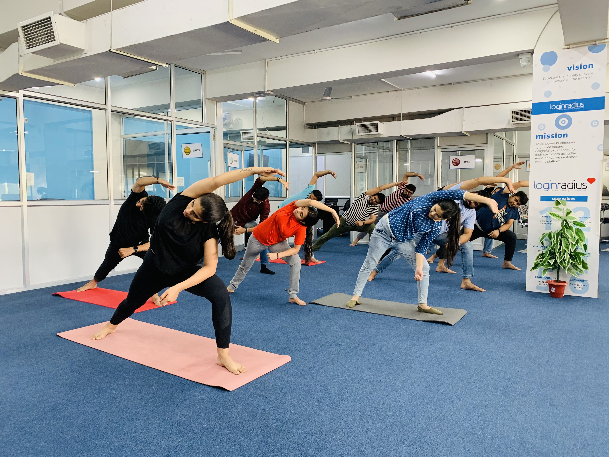
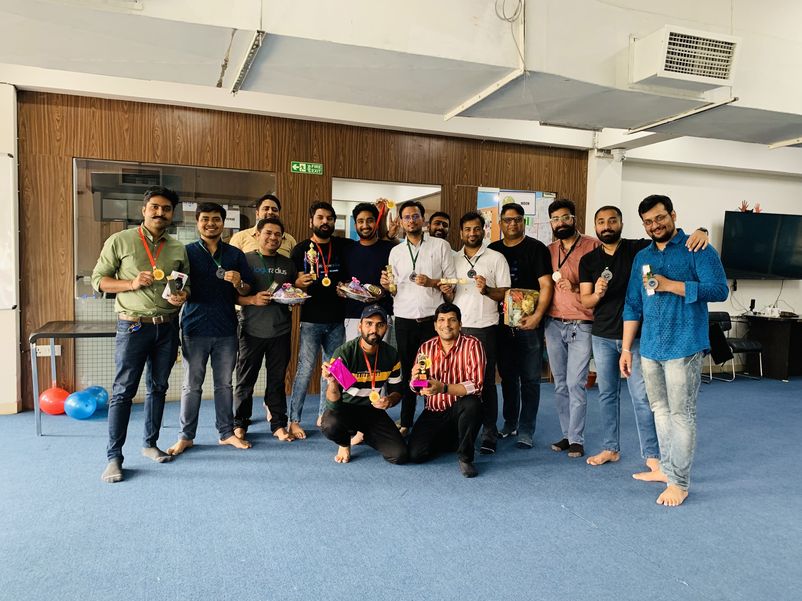

---
title: "Flexible Work Culture: A Game-Changer for LoginRadius and its Employees"
date: "2023-07-13"
coverImage: "flexible-work-culture.jpg"
tags: ["flexible work culture","work life balance","LoginRadius"]
author: "Azharuddin Mohammad"
description: "At LoginRadius, we believe that good work comes from a healthy work-life balance. That's why we've created a flexible working environment that allows our employees to make the most of their time and energy while they're at work. But what does it mean to have a flexible work culture, anyway? Let's dig in."
metadescription: "LoginRadius is helping its employees live the dream of a flexible work culture. So, let's dive in and learn more about this exciting culture."
metatitle: "Flexible Work Culture: How LoginRadius Is Making It Happen"
---
## Introduction

As an employee who has been part of the LoginRadius family for the past four years, I am thrilled to share how our flexible work culture has revolutionized our professional lives. 

In this blog, I want to provide insights into the transformative power of our flexible work model and highlight the incredible initiatives that LoginRadius has implemented to support our well-being. This include daily virtual zumba sessions, month end celebrations and team parties, to name a few. 

## The Rise of Flexible Work: Redefining Work-Life Integration

Post COVID-19 pandemic, LoginRadius swiftly embraced a flexible work model, blending the best aspects of remote and in-office work. This innovative approach provides the flexibility to work both from the office and remotely.

## Strengthening Bonds: Work-Life Balance and Collaboration in Harmony

The flexible [work culture at LoginRadius](https://www.loginradius.com/blog/growth/loginradius-employee-perks/) has been a game-changer when it comes to achieving work-life balance. Having the option to work from the office for a portion of the week allows us to collaborate in person, engage in face-to-face meetings, and strengthen our connections with colleagues. 

On the other hand, the flexibility to work remotely provides us with the opportunity to manage personal commitments, minimize commuting time, spend time with loved ones and create a harmonious integration of work and personal life. 

The combination of in-office and remote work at LoginRadius has successfully fostered collaboration and connectivity among employees. When we gather in the office, we can engage in spontaneous discussions, brainstorming sessions, and effective collaboration that is sometimes challenging to replicate in a remote work setting.

## Daily Virtual Zumba Sessions: Shake, Sweat, and Smile!

In addition to providing flexibility and autonomy, LoginRadius has taken employee well-being to another level by organizing daily virtual Zumba sessions. These fitness sessions are a testament to the company's commitment to fostering a healthy and vibrant work environment. The virtual Zumba sessions offer a fun and energetic outlet for us to stay active, destress, and recharge our minds. It's an opportunity to connect with colleagues virtually, share positive energy, and build camaraderie.

## LoginRadius TT League: Smash, Spin, and Connect!

LoginRadius TT League is an interdepartmental table tennis league that brings out the competitive spirit and camaraderie within our teams. It is a time for friendly matches, cheering each other on, and building connections beyond our usual work interactions. During the league, we gather to showcase our table tennis skills, engage in thrilling matches, and support each other with cheers and encouragement. This league adds an extra dose of fun and excitement to our work environment, and it is just another way LoginRadius nurtures a positive and engaging culture for its employees.

## Celebrate You: Let's Party!

LoginRadius understands the importance of celebrating milestones, recognizing achievements, and fostering a sense of community among its employees. To honor our hard work and create memorable experiences, LoginRadius organizes Celebrate You: Month End celebrations. These celebrations encompass a range of activities, including team-building exercises, recognition ceremonies, and engaging games. It's a time to come together as a team, celebrate our collective achievements, and forge deeper connections.

And the fun doesn't stop there! Our monthly team lunch parties add an extra sprinkle of joy to our work life. These gatherings are a time for us to come together, share a delicious meal, and enjoy informal conversations outside of work tasks. Whether we are enjoying a catered meal or ordering from our favorite local restaurants, these lunch parties create a warm and inclusive atmosphere where laughter and conversation flow freely.

## In Conclusion

LoginRadius' adoption of a flexible work culture has proven to be a game-changer. It aligns our professional and personal lives, nurtures our well-being, and strengthens our sense of community and connection.

As an [employee at LoginRadius](https://www.loginradius.com/careers/), I am grateful to be part of an organization that prioritizes the holistic development and happiness of its employees. The flexible work model, combined with these initiatives, exemplifies the company's commitment to fostering a positive and engaging work culture.

Together, we are embracing the exciting future of flexible work at LoginRadius, where collaboration, well-being, and celebration go hand in hand.

