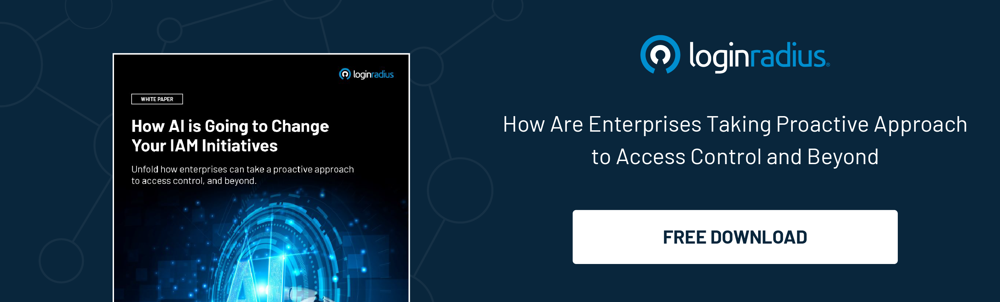
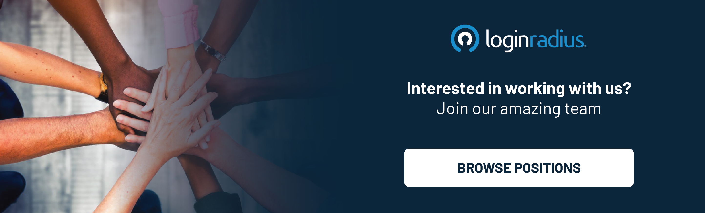

---
title: "Happy Birthday, LoginRadius: One Year Away from the Big Teen Milestone!"
date: "2024-07-20"
coverImage: "bday-cover.jpg"
tags: ["LoginRadius birthday"]
author: "Rakesh Soni"
description: "As LoginRadius celebrates its 12th anniversary, we reflect on a year filled with significant milestones and innovations. From groundbreaking features like Push Notification MFA and Passkeys to impactful CSR initiatives, we continue to set new standards in digital identity and social responsibility. Join us in celebrating our journey, and looking forward to an exciting future."
metadescription: "LoginRadius turns 12! Explore our journey, milestones, innovations, and CSR activities as we shape the future of digital identity."
metatitle: "Happy 12th, LoginRadius: A Year of Innovation and Growth"
---
## Introduction

As we celebrate the 12th anniversary of LoginRadius, I find myself reflecting on our remarkable journey. 

When we first set out, we had a vision to revolutionize digital identity and streamline the user experience. Today, as we stand on the cusp of our teenage years, it’s incredible to see how far we’ve come and exciting to envision the road ahead.

Let’s have a quick glimpse of this incredible journey and learn more about our accomplishments over the past year. 

## The Early Days: A Dream Takes Shape

The inception of LoginRadius was fueled by a simple yet powerful idea: to make online identities secure, seamless, and user-friendly. 

Back in 2012, we noticed a gap in the market—a need for a comprehensive identity solution that could cater to businesses of all sizes. Armed with this insight and driven by a passion for innovation, we embarked on a mission to fill this void.

## Overcoming Challenges: Resilience and Adaptability

The path to where we are today was far from smooth. We faced numerous challenges, from technological hurdles to market competition. 

However, each obstacle served as a learning experience, strengthening our resolve and shaping our strategy. Our resilience and adaptability allowed us to navigate these challenges and emerge stronger.

## Innovation at Our Core: Milestones and Achievements

Innovation has always been at the heart of LoginRadius. Over the past 12 years, we have achieved several significant milestones that have propelled us forward:

* **“Overall Leader” in 2024 KuppingerCole Leadership Compass Report for CIAM:** KuppingerCole has named LoginRadius as an “Overall Leader” in the 2024[ KuppingerCole Analysts Leadership Compass Report for CIAM](https://www.loginradius.com/resource/analyst-report/kuppingercole-names-loginradius-top-ciam-platform-2024/). This acknowledgment reaffirms LoginRadius’ position as a top-tier provider of CIAM solutions, demonstrating its excellence in Product, Innovation, and Market Leadership. Compared to its contemporary vendors in the market, LoginRadius is also rated  Strong Positive in Security, Functionality, Deployment, Interoperability, and Usability.

* **CIOReview Names LoginRadius “Top Customer IAM Platform for 2024”:** CIOReview recently recognized LoginRadius as the “[Top Customer IAM Platform for 2024” by CIOReview Magazine](https://magazine.cioreview.com/magazines/March2024/CIAM_Platform/), a leading US print and digital magazine for decision-makers, C-suite executives and industry experts. The magazine recently evaluated LoginRadius’ capabilities in offering cutting-edge no-code  CIAM and empowering brands with unparalleled scale, seamless implementation, and top-notch system performance.

* **Product Evolution**: From basic social login features to a robust identity platform, our product has continuously evolved to meet the changing needs of our clients.

* **Global Expansion**: What started as a small operation has now expanded to serve clients across the globe, with offices in multiple countries and a diverse, talented team.

* **Cutting-Edge Features**: We have introduced numerous features, such as adaptive authentication, advanced security protocols, and, most recently, our Identity Orchestration and passkeys, which simplify complex identity workflows for businesses and enhance customer authentication experience. 

Here's a comprehensive overview of our recent innovative features from the past year, designed to help our partners stay ahead of the curve:

### 1. Push Notifications MFA 

LoginRadius has introduced a revolutionary feature: [Push Notification MFA](https://www.loginradius.com/push-notification-mfa/). Delivering SMS and email OTPs can be cumbersome, and entering TOTPs often creates friction for your customers. 

With Push Notification MFA, you can streamline the authentication process by sending notifications directly to your customers' Android and iOS devices, allowing them to approve or deny access with just a tap.

### 2. Passkeys 

LoginRadius has unveiled an innovative feature: [Passkeys](https://www.loginradius.com/passkeys-login-authentication/). Passkeys revolutionize your customers' authentication experience by enhancing security and simplifying the process. They represent the future of secure and user-friendly authentication—quick to implement, reliable in performance, and scalable to meet enterprise demands. 

By eliminating the need for passwords, LoginRadius is setting a new standard in customer identity and access management.

### 3. Voice OTP

LoginRadius has introduced an innovative feature: [Voice OTP](https://www.loginradius.com/resource/datasheet/voice-otp). Voice OTP provides users with a secure and convenient method to receive one-time passcodes via voice calls, ensuring robust authentication and verification. 

Voice OTP enhances account security while simplifying the user verification process. 

## Celebrating Our People: The Heart of LoginRadius

None of this would have been possible without the incredible team behind LoginRadius. Our success is a testament to their hard work, dedication, and unwavering belief in our mission. 

From our engineers, who tirelessly innovate, to our customer support and marketing teams, who ensure our clients receive top-notch service, each member plays a crucial role in our journey.

## Looking Ahead: 

As we stand on the brink of our teenage years, the excitement is palpable. The next phase of our journey promises to be filled with even greater innovation and growth. Our focus will be on expanding our capabilities, exploring new markets, and continuing to provide unparalleled value to our clients.

We are committed to staying ahead of the curve, leveraging cutting-edge technologies like AI and machine learning to enhance our platform. 

Our goal is to make digital identities even more secure, user-friendly, and efficient, empowering businesses to thrive in the digital age through the advancement of AI. 

 

## Gratitude and Reflection: A Heartfelt Thank You

On this special occasion, I want to extend my heartfelt gratitude to everyone who has been a part of the LoginRadius journey.

To our clients, partners, investors, and team members—thank you for your trust, support, and belief in our vision. Each one of you has contributed to making LoginRadius what it is today, and for that, I am deeply grateful.

## Our CSR Activities for the Year 

Alongside our overall growth and achievements over the past year, LoginRadius has maintained a steadfast commitment to its social responsibility. Here’s a quick overview of our recent CSR initiatives:

* **Sanitary Pad Donation Drive:**
Essential sanitary pads were provided to underserved communities, aiming to enhance hygiene and support women’s health and dignity.

* **Old Cloth Reusable Drive:** By collecting and distributing old clothes, we promoted sustainability and provided warmth and comfort to families facing financial hardships.

* **Shakes Distribution:**
Nutritious shakes were distributed to local shelters and community centers during the peak summer, offering a boost of nourishment and energy to those in need.

* **Blanket Donation Drive**
Our blanket donation drive aimed to ensure warmth during the colder months, helping individuals in need access essential comfort.

* **Apna Ghar Secret Santa Drive for NGO Children:** 
A Secret Santa drive was organized to bring joy and festive cheer to children supported by NGOs, making their holiday season brighter.

## Final Thoughts: A Journey Worth Celebrating

As we celebrate our 12th birthday, we not only look back at our achievements but also look forward to the exciting future that lies ahead. One more year to teenagehood, and the best is yet to come. 

Here’s to many more years of innovation, growth, and success. Happy Birthday, LoginRadius! 

