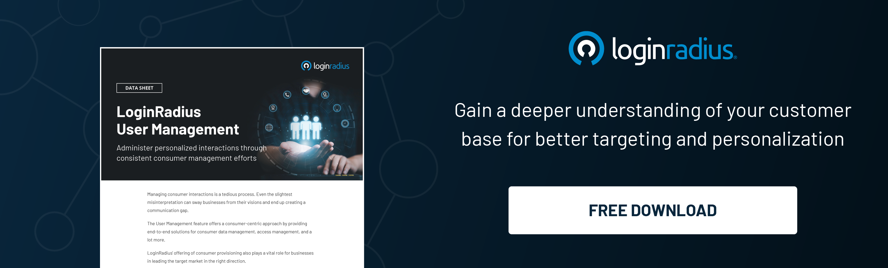

## Introduction

“We see our customers as guests at a party, and we are the hosts. It's our daily job to make every important aspect of the customer experience better.” - Jeff Bezos

Any successful business knows that an excellent customer experience is essential; thus, a customer's needs and expectations are of utmost priority. But, as users become more digitally acquainted and perceptive, you are challenged to provide smooth, secure, and personalized transactions.

This article will help you explore the perks of integrating Customer Identity and Access Management (CIAM) and Customer Relationship Management (CRM) systems. It will also provide seven tips to [optimize consumer experiences](https://www.loginradius.com/blog/growth/how-to-improve-the-customer-xperience/) and boost customer-centric strategies.

## Understanding CIAM: Key Concepts and Trends

[Customer Identity and Access Management](https://www.loginradius.com/blog/identity/customer-identity-and-access-management/) (CIAM) is an advanced solution that addresses both the demands of enhanced security and exceptional user experiences. Unlike traditional Identity and Access Management (IAM) systems that fundamentally focus on internal workforce management, CIAM solves the primary hindrance of managing identities and regulating access for external customers engaging your brand. CIAM ensures solid security and provides smooth interactions across many applications and platforms.

Modern businesses incorporate CIAM as it provides some valuable features, including:

* The Unified Customer Profile collects data from various sources, allowing applications to deliver consistent, multi-channel experiences for each of your consumers.
* Features like [Single Sign-On](https://www.loginradius.com/single-sign-on/) (SSO) and multi-factor authentication (MFA) boost security without compromising convenience. CIAM's adaptive authentication personalizes security measures based on user preferences and behavior, striking the delicate balance between safety and ease of access.

## Exploring the Integration of CIAM and CRM

The integration of CIAM and CRM systems is where the magic truly happens. Customer Relationship Management (CRM) platforms excel in managing customer interactions and relationships. By combining the capabilities of CIAM and CRM, you can improve your knowledge and acquire a comprehensive insight into your customers' preferences, behaviors, and needs.

CIAM and CRM integration provides some other convincing advantages, including:

### 1. Personalized Interactions

Your business can create highly personalized experiences by efficiently sharing customer data between CIAM and CRM systems, creating a good customer relationship, and [increasing brand loyalty](https://www.loginradius.com/blog/growth/ciam-improves-customer-trust-and-loyalty/).

### 2. Seamless Access to Portals and Services

Integrating CIAM and CRM ensures easy access to customer portals and services, improving user experiences and reducing some hassle.

### 3. Enhanced Authentication and Security

Incorporating CIAM's security features boosts CRM's authentication processes, safeguarding your customer data and privacy through risk-based approaches.

### 4. Leveraging Insights

CRM insights refine CIAM strategies, optimizing how your brand interacts with customers. Similarly, CIAM data enriches CRM strategies, providing a comprehensive view of your customers.

### 5. Real-time Data Sync

The integration enables real-time synchronization of customer information between CIAM and CRM, reducing data discrepancies and enhancing data accuracy.

### 6. Efficient Sales and Marketing

CIAM-enhanced CRM ensures accurate customer data for your targeted sales and marketing efforts, thus, improving your conversion rates.

### 7. Streamlined Engagement

CIAM's multi-channel integration streamlines your service access, optimizing users' activities while maintaining security.

## Best Practices for Implementing Customer-Centric Strategies through CIAM and CRM Integration

Now we have a brief understanding of the numerous benefits of integrating Customer Identity and Access Management (CIAM) with Customer Relationship Management (CRM) systems. To fully capitalize on the potential of combining these incredible solutions, your brand should adhere to these effective strategies:

### 1. Comprehensive Integration Roadmap

You can begin by designing a comprehensive integration roadmap to merge CIAM and CRM systems smoothly. This roadmap should outline your objectives, create realistic timelines, and allocate the necessary resources to ensure a successful [integration process](https://www.loginradius.com/cloud-integrations/).

### 2. Cross-Functional Collaboration

Facilitate collaborative synergy among IT, marketing, and customer service teams. With cross-functional collaboration, you can ensure the smooth alignment of technical processes with marketing strategies and customer engagement, leading to an organized integration.

### 3. Utilizing Customer Insights for Continuous Improvement

Utilize customer insights and feedback to adjust and optimize your CIAM and CRM strategies continuously. You should also be mindful of the evolving customer preferences and behaviors and be proactive in keeping your approach relative.

### 4. Harnessing Emerging Technologies for Elevated Experiences

Embrace emerging technologies like biometric authentication to improve your customer experiences. Pioneering advanced authentication methods enhance security, [boosts customer trust](https://www.loginradius.com/customer-security/), and reflects that you're a thought leader in the industry.

### 5. Aligning Data-driven Personalization

Efficiently integrate CIAM and CRM systems to enable data-driven personalization. Your collected comprehensive customer profiles can help you customize interactions, promotions, and support services to individual market segments.

### 6. Establishing Continuous Training and Support

Ensure ongoing training and support for employees to maximize the potential of integrated systems. You can utilize a professional [video editor](https://www.loginradius.com/customer-security/), to create training videos and webinars. Alternatively, AI-powered tools online can automatically generate AI avatar demos.

### 7. Monitoring Metrics for Optimization

Research and implement valuable metrics and key performance indicators (KPIs) to monitor the result of your integration efforts. Regularly analyzing these metrics allows you to identify areas of improvement, adjust strategies, and optimize the benefits derived from CIAM and CRM integration.

## Takeaways

In conclusion, customer-centric strategies are essential for your business or any brand aiming for success. The integration of CIAM and CRM provides valuable compatibility, enabling you to boost consumer experiences while maintaining solid security measures.

The future holds exciting potential for CIAM and CRM integration. As digital innovations continue to appear, your company should embrace them or, better else, pioneer them. Consistently deliver excellent value and exceptional customer service.

