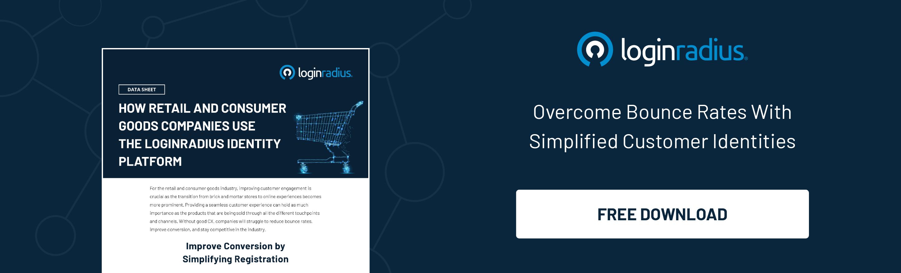

---
title: "How Can Retailers Lead The Experience Economy While Securing Consumer Identities?"
date: "2022-02-23"
coverImage: "retailers-balance.jpg"
category: ["security"]
featured: false 
author: "Rakesh Soni"
description: "Retail businesses must leverage cutting-edge technology that helps them attract users that convert into buyers. Identity management in the retail industry is a seamless, secure, and scalable solution to identify and protect customer data and ensure that they can easily access any information they need."
metatitle: "How Retailers Can Balance Security and User Experience"
---

## Introduction

Consumers in the ever-expanding digital world demand rich experiences at every touchpoint, which is perhaps the reason why retailers should stress the importance of offering a flawless experience to their users. 

However, [user experience](https://www.loginradius.com/customer-experience-solutions/) without the reinforcement of stringent security is of no use. And businesses should focus on delivering a perfect harmony of user experience and security. 

Consumers are well aware that their identity and personal information’s security matters, and it’s the vendor's responsibility to have adequate security measures to safeguard their digital identity. 

[Stats](https://www.statista.com/statistics/786778/worldwide-fraud-detection-and-prevention-market-size/) reveal the fraud detection and prevention (FDP) market is estimated to soar at 63 billion U.S. dollars in 2023, which was 19.5 billion U.S. dollars back in 2019. 

Yes, if a retail business needs to stand ahead of the curve, it must leverage cutting-edge technology that helps them attract users that convert into buyers without any friction. 

Here’s where the role of identity management comes into play! 

[Identity management in the retail industry](https://www.loginradius.com/industry-retail-and-ecommerce/) is a seamless, secure, and scalable solution to identify and protect customer data and ensure that they can easily access any information they need.

Let’s uncover the critical role of identity management in the retail industry and how businesses can scale growth without compromising consumer identities. 

## What is Identity Management? Why does it matter in the Retail Industry? 

Identity management in cybersecurity refers to the security framework and disciplines for managing digital identities. It regulates the responsibilities and access privileges associated with individual consumers and the conditions in which such privileges are allowed or denied.

Organizations can use identity management solutions to detect unauthorized access privileges, validations, or policy violations under a single system. Moreover, they can also ensure that the organization meets necessary regulatory and audit requirements.

When it comes to the retail industry, businesses can’t ignore the endless possibilities with an identity management solution that thrives on business success. Here’s what identity management in the retail industry offers: 

* Ensures security compliance
* Eliminates duplicate identity data
* Simplifies the customer registration process
* Creates a unified customer profile
* Collects more customer purchase and interaction data
* Stores customer data in a secure cloud directory.

When combined, these aspects could do wonders for retailers by improving user experience from the moment a user interacts with their brand and enhancing conversions. 

These are opportunities ready to be grabbed. But are retailers ready to incorporate identity management into their workflow? If not, it is high time that they should.

****

## How Does a Consumer Identity and Access Management (CIAM) Solution Help Retailers?

### 1. Robust security

Poor security and data management are the most underestimated aspects that badly impact sales and tarnish brand reputation.

Online retailers that cannot protect consumer identity and personal information are prone to losing loyal consumers and would undoubtedly fail to attract potential customers.

Adding stringent layers of security is a must for any retailer seeking substantial growth in the ever-expanding competitive business landscape.

Whether it’s multi-factor authentication (MFA) or [risk-based authentication](https://www.loginradius.com/blog/start-with-identity/risk-based-authentication/) (RBA), enterprises need to adopt advanced security measures to safeguard consumer information to prevent financial and reputational losses.

### #2. Multichannel buying experience 

Modern consumers always expect a multichannel experience where they’re catered with the services across different touchpoints.

Moreover, consumers balance offline and online shopping by spending a good time researching to buy a particular product at the best price.

Now the ball would certainly be in the court of the retailers and e-commerce owners who offer seamless experience right from the beginning.

This means the consumer, if onboarded rightly, would certainly finalize a purchase if they are served with the right product at the right time and the right place.

### #3. Shoppers’ insights

One way to increase brand loyalty is by combining a 360-degree view of the customer demographics with their behavior and personal preferences. This helps retailers and e-commerce owners tweak how they interact with their brands.

With a CIAM in place, retailers can derive valuable insights from shoppers’ data that can be further utilized to create winning strategies that pave the path for more conversions and lead generations. 

Hence, centrally managed identities can primarily enhance the customer experience and build better relationships.

## The Bottom Line

With consumers demanding an excellent user experience backed with adequate security, incorporating a cutting-edge identity management solution is swiftly becoming the need of the hour for retailers. 

Moreover, to meet the stringent [data regulations and compliances](https://www.loginradius.com/compliances/) across the globe, businesses can’t overlook the importance of a reliable CIAM. 

A consumer identity and access management (CIAM) solution can help retailers meet their security and user experience-related requirements like a breeze without compromising compliances and regulations. 

