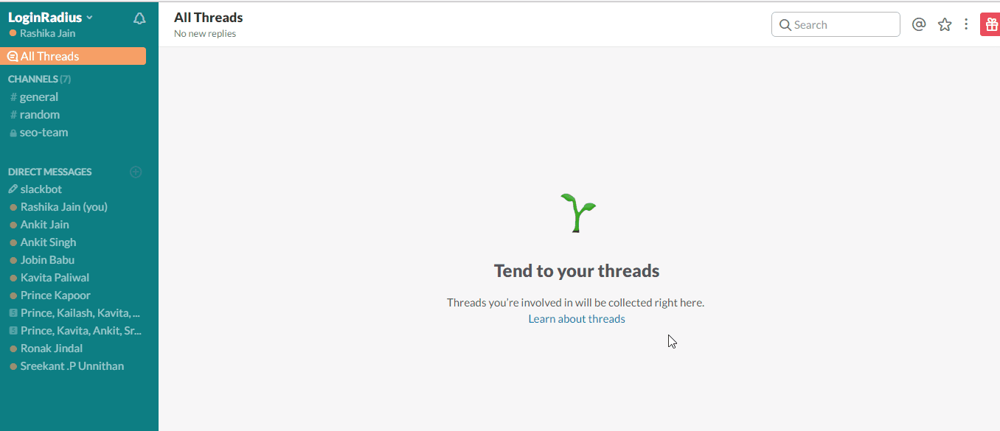

Team communication has always been a matter of concern for many of the employers. The major challenge is to keep all communication in one place while not affecting the productivity. This also gets very crucial if there are remote teams involved. 

### **Slack is the answer**

Disclaimer: Slack fanboy here. But it was not as the same before. I first heard about slack when it was being implemented at LoginRadius. Been using skype, hangouts in past for team communication, I was quite skeptical. But after using slack for an year, I must say that not only, it is one of the best tools for team communication but also it takes productivity to a whole _wow_ level.

### **Why Choose Slack over Skype, Hangout or others?**

There are enough reasons of why one should choose Slack over other communication tools.

- You can easily communicate with your teams using Slack’s internal channels.
- Slack is more secured as a technology for your organization than Skype or Hangout because only your team members are allowed to join your Slack team. It discourages outsiders to join.
- You can easily integrate your favorite apps with Slack. Slack has a huge directory of apps which can be integrated.
- You need to check unread messages on all your devices on Skype. This doesn’t happen with Slack. Moreover, Slack does not drain your mobile’s battery life unlike Skype and Hangout.

So, for people who are still struggling with Slack at their workplace, this article is going to help them to pick up some tips and tricks which can make them a real pro at Slack in 6 simple steps. Go ahead with the list:-

### **Works on browser and app both, YAY!**

Well, there are two ways to access Slack: via browser and via app. But, everything gets faster and automatic with Slack desktop app.

[**Source**](https://www.windowscentral.com/sites/wpcentral.com/files/styles/xlarge/public/field/image/2015/03/slack-windows.png?ver=1553881376?itok=aTD2os-J)

Slack app launches itself automatically by default every time you start your system. Thus, no need to open your browsers to use Slack from now.

### **Give your touch to Slack app**

Foremostly, explore Slack. Leave your mark on your desktop app by uploading your profile picture. Also, ensure that your job title, name and username are set. It is very important to mark your online presence when face to face meetings and phone calls are being replaced by digital communication. Co-workers will recognize “_your name_” much easier than any “synonymical name”.

Also do not forget to pick your favorite theme for your Slack app.

- Click on your **_profile name_** at top left corner of Slack window.
- Click on **_preferences_**. A new tab opens up which shows preferences with your team name.
- Click on **_sidebar theme._**
- Select your various themes from the list.

_**Note**:- You can even customize your own theme and enjoy sharing it with others. The option is available on the same page._

### **Create/choose your channels**

Feel free to create your channels (_all members can do_ [_that_](https://get.slack.help/hc/en-us/articles/201402297-Create-a-channel)) on your Slack. And if you feel a channel remains unused, you can always delete it (_team owners and admins can do_ [_that_](https://get.slack.help/hc/en-us/articles/213185307-Delete-a-channel)). Now, a wise way to create channels will be creating it according to teams (team-oriented updates) and locations (for location-oriented updates). Also, provide a channel for newsroom (general updates). Besides this, Slack starts off with common channels like **_#general_** and **_#random_**. Everyone is automatically added to **_#general_** as soon as he or she joins the team. Hence, **_#general_** can be used for important announcements for everyone. **_#random_** is created for random conversations (_well, that’s obvious_).

Well, now coming to joining/choosing channels, you can join any channel that seems relevant to you and you can control your notifications for those channels in Slack. Want to know how? Keep reading.

- Mark a star to the channels in which you _interact the most_ so that they can appear at the top of your sidebar list.
- You can also select ‘show any kind of activity’ for your favorite channel while you can select to show notifications only if it has your mention or highlighted words.  Let’s see how to do it!
    - **Step 1:** Go to your channel’s **_notification preferences_** through settings (gear icon on top right corner).
    - **Step 2:** Select “mention of my name or highlights” for getting notifications related to your name or highlighted words.

**Note:** _You can mute a channel through “mute this channel” option. Moreover, you can clear all unread messages through **SHIFT + ESC.**_

### **Use of “Highlight word” notification**

Slack will notify you whenever your name is included in a message but if you want it to notify you some highlighted phrases and words, you can do it through **_notification_** settings.

**Method**

- [Click](https://get.slack.help/hc/en-us/articles/201398467-Highlight-word-notifications) your **_team name_** at the top left corner.
- Select **_preferences._**
- Click **_notifications_** tab.
- Fill the **_highlight words_** box with your choice of highlighted phrases or words.

### **Make SlackBot your multi-tasking friend:**

**_About Slackbot_**

Slackbot is your best robot friend in Slack. It can help you to add new apps, integrate setup, help to complete your profile and set reminders for you.

**How can Slackbot be useful?**

**Use Slack to set reminders**

Neither you nor your team can forget a thing when Slackbot is here. Set reminders for your whole team or for you for an important event. Here are some examples for the commands:-

**_Method :-_**

- Type ‘/remind \[#channel, a coworker, or yourself\] + \[the work\] + \[time\]. Press Enter.

- Slackbot will respond to your message.

_The response will be exclusively for you. So, your little secret about you ‘forgetting things’ will always remain a secret with Slackbot :D_

**_Note:-_** _Now, if you want to see your list of reminders for today. Just type “/remind list” and press Enter. You can also alter your list by deleting reminders or marking them as complete._

**_Some examples on how to set reminders:-_**

_Remind me to call Jessica at 3 pm_

_Remind @jessica to attend meeting after 4 hours._

_Remind #seo-team to party at 6 pm_

### **Customize Automatic responses through Slackbot**

Slackbot is a witty bot but you can make it wittier by customizing its responses. Here is how you can make your Slackbot sound cooler:-

- [click here](http://slack.com/customize/slackbot). 
- Click the “**\+ Add new response”** button
- Type your message there in response to certain phrases or words. Now, see Slackbot send the messages you have typed.

For example I always forget where we keep our list of “top citation sites” to list our business. So to help me out, my team admin has set up the following Slackbot response whenever someone says “top citation sites”:

### **Integrate your useful apps into Slack**

Integrate your favorite apps like Google Calendar and Google Drive in Slack.

**Method**

- Click on your profile name at top left corner
- Click on Apps & Integrations which will redirect you to [https://slack.com/apps](https://slack.com/apps)

Here you’ll get a vast directory of apps which can be used with Slack.

**For example:-**

You can add Twitter from the list of apps in the Slack directory and dedicate a channel for tweets. Hence, now you can watch over your competitors’ tweets through the channel.

Now let’s see how you can integrate Google Drive with Slack:-

- Paste a link to the message box in Slack.
- Slackbot will automatically identify the file and guide you through the process of integration for Google
- It will ask for permission. Click ‘Yes’ and next time, Slack will show a preview for your file.

OR

You can [install Google Drive](https://get.slack.help/hc/en-us/articles/205875058-Google-Drive-for-Slack) through App directory. Follow these simple steps:-

- Visit the [Google Drive](https://slack.com/apps/A0F7YS32P-google-drive) App Directory page.
- Click on your team name and click on the **_install_** button.
- Click on **Authenticate your Google Drive account**.
- **_Sign in_** to Google Drive and click **_Allow_** to authenticate with Slack.

### **Some Communities you can join**

You can find potential team members, partners and mentors in these communities. Here are some communities in Slack which can be beneficial to every professional:-

**For a startup founder**

Are you a startup founder? Join #Startup. You find more than 2100 members in #Startup. Discussions range from Q&As or “Ask Me Anything” questions. Well, traditional conversations are also encouraged in this channel. After joining, you can get feedbacks for your newly launched products, seek advice, expand your team and what more. Please note, there is an application process and fee applicable for joining the group.

**For a creative person**

#Launch is a community which will support your inner cravings to discuss entrepreneurship, sales, programming and design. You can join it free though there is an application process for joining it.

**For a marketer**

Join #CreativeTribes to grow your reach or business. The community has 300 entrepreneurs, marketers and other creatives and the group will help you to learn new techniques and experiences. The community does not have any membership fee but still you need to go through an application process.

**For an Internet marketer**

Join #OnlineGuinesses to discuss anything about online marketing. Professionals from different niche such as CRO, PPC, SEO and social media marketing represent the channel. The members come from Google, Macy’s, Amazon, Best Buy and Facebook. No application process or fee for this community.

**For a software programmer**

Join #CodeNewbie for hanging out with other coders who are mad about coding. You can discuss new trends, software updates, tough problems and anything about coding. The community is free but consists of an application process.

### **Some bonus tips**

- You can use quick switcher to jump quickly from one channel to another. It can be performed by pressing “Ctrl + K” in windows.

 **_Note:-_** _Replace “Ctrl” with “COMMAND” for all commands in Mac._

- You can avoid typos by editing your messages. Simply click on  ‘gear icon’ and Select Edit. Up arrow to edit your last message.

 

- You can also adjust your sound alerts accordingly. Go to _preferences,_ Click on _notification > notification settings and_ ****select sounds or mute them all as per your preference.You can also change the display location and duration and of flash message from the same window.
    
    ****_**Note:-** You can set “do not disturb” to disable notifications for a given time. Go to “**do not disturb**” option in the same window and set time according to your time zone._

- **You can Search anything with Ctrl + F in Slack :** Now, don’t waste time by moving your pointer to find things. Just do Ctrl + F to open search dialogue and search your desired files and messages all over Slack.
- You need to love and learn shortcuts at least when you work on Slack.You don’t need to learn all but even a handful of them can make working on Slack simpler.Check the list for shortcut keys through **Ctrl + /**.

- Using emoji can be really fun and an art worth mastering. There are two ways to use emoji in Slack. You can type the name of emoji starting with “:”. It will raise a menu

Or else just click on the smiley face in message box section to select your favorite emoji.

Now, here I have discussed 10 simple steps to master Slack at your workplace but there are still plenty of things which we can do with Slack. Check out the [custom Slack integrations](https://loginradius.slack.com/apps/build) to know more. Do you love our Slack hack or have your own set? Let us know in the comments below.

Thanks, [Stewart Butterfield](https://en.wikipedia.org/wiki/Stewart_Butterfield)!
