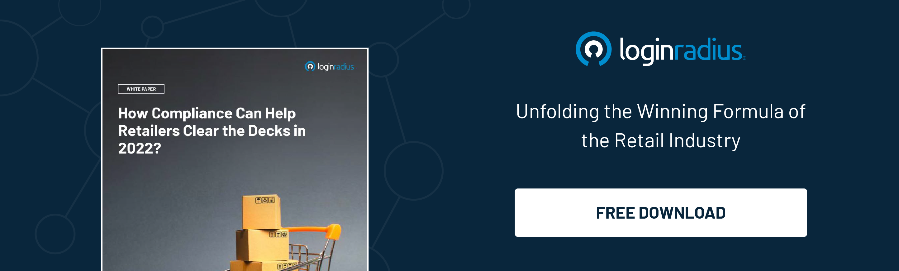

---
title: "The Right Way to Use Identity Marketing in a Privacy-Centric World"
date: "2022-02-15"
coverImage: "identity-marketing.jpg"
tags: ["identity management","compliance","cx"]
author: "Navanita Devi"
description: "There are numerous ways that you can use identity marketing to strengthen your business reputation. With the right techniques, you can make this an extremely powerful strategy. The points mentioned in this blog will help you to understand how identity marketing has transformed the modern digital age."
metadescription: "Identity marketing is becoming a powerful tool to boost your brand recognition and drive traffic to your business. Learn how to use it in a privacy centric world."
metatitle: "How to Use Identity Marketing in a Privacy-Centric World"
---

## Introduction

Thanks to the internet, businesses can collect data on a global scale. These can be demographic, psychographic, behavioral and transactional, location-based, and/or historical usage data. This information is used to better understand customers, which in turn allows companies to improve their products and services, as well as develop new ones. The more you know about your customers the more specific your marketing strategy can be.

But then, if you don’t keep this information private, it can be used against you in ways you didn’t imagine. Even if you are a small business, that doesn’t mean that identity thieves aren’t targeting you. While there are many ways to protect your customers from identity theft, some methods are more effective than others. 

 

This blog will outline how you can utilize identity marketing in a privacy-centric world. Let's begin with the major regulations out there. 

## The EU’s GDPR and California’s CCPA

So, we've all been hearing a lot about the GDPR and CCPA. What's going on?

The GDPR, or the European Union General Data Protection Regulation, is a set of regulations that ensure that all data is handled with the highest levels of privacy and security protection or face financial consequences. In 2018, it became a law that companies must comply with or face harsh consequences. 

The CCPA or the California Consumer Privacy Act ensures that consumers are informed of the types of personal data being shared, the purpose of the sharing, and the fact that they can opt-out of the sharing.

### Impact of GDPR and CCPA on Identity Marketing

The [GDPR and CCPA](https://www.loginradius.com/blog/identity/ccpa-vs-gdpr-the-compliance-war/) have a significant impact on identity marketing.

First, there's the issue of data protection. The GDPR requires businesses to give their customers access to the data they store (and avoid storing in the first place), and requires that customers be informed about how those data are being used. The CCPA requires business owners to inform their customers of their rights under the law so they can choose whether or not they want their information shared with third parties.

Second, businesses need to rethink how they use their systems and communicate with their customers. The good news is that many of the issues can be resolved simply by taking an extra minute to verify if the legislations' conditions are met.

## Exploring the Concept of Incrementality 

Incrementality in identity marketing in a strategic way can be defined as the ability to create and deliver value that is not only addictive but also meaningful to the customer. It refers to the idea that marketers should continually strive to add value to their customers, beyond what they are currently receiving from their current brands or products.

This is a challenging task, as it requires marketers to think about how they can best serve their customers and provide them with new and innovative ways of experiencing their brands or products. To do this, marketers must have a clear understanding of their customer's needs and wants, as well as the competitive landscape. 

Once marketers have a good understanding of these factors, they can begin developing strategies that will enable them to add value to their customers in a way that is both relevant and valuable. This process can be facilitated by using tools like segmentation analysis and customer research.

## Can User Management Contribute to Identity Marketing?

The answer is yes! [User management](https://www.loginradius.com/user-management/) “can'' contribute to identity marketing  and in several ways. First, it can help you manage and track the interactions your customers have with your brand. This information can be used to improve customer retention rates and understand how best to serve them. 

Second,user management can help you identify and segment your target market. You can create targeted ads that are more relevant to your customers. By understanding their interests and preferences, you can create ads that are more likely to convert.

Third,user management can help you determine which users are likely to churn or abandon your product or service. This information can be used to develop strategies that prevent these users from leaving your product or service.

## Scalar Utilization is Also Effective

There is great power in scalar utilization when it comes to Identity-Marketing in a strategic way. It refers to the use of multiple forms of marketing, such as social media, email marketing, and search engine optimization (SEO), to reach and engage customers.

In identity marketing, scalar utilization can be used strategically to create better customer experiences. By understanding how customers interact with your brand across different channels, you can create a more [holistic customer experience](https://www.loginradius.com/customer-experience-solutions/) that leads to increased loyalty and advocacy. 

For example, if you sell products online, you might want to consider using social media as a way to connect with your customers. You could also use social media platforms to promote your products and services, respond to customer questions, and build relationships with your customers. This type of strategic scalar utilization can help you build stronger relationships with your customers and improve the overall customer experience.

## Conclusion

As mentioned above, there are many things that you might want to do with your consumers' identity. It is important to understand how useful the collected information is and what should be used to manage a good marketing campaign. You will always have a lot of information regarding the consumer because of their interaction but you need to collect it at the right time. 

Another important point is that you need to understand when you are asking questions and gathering information from your consumers as well. All these aspects should be discussed with [privacy policies](https://www.loginradius.com/blog/identity/privacy-policy-management/) so that consumers know what they are doing in regards to your brand identity.

