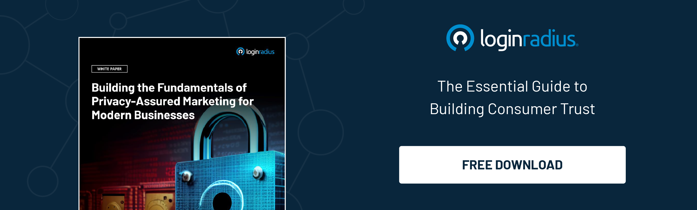

## Introduction 

Organizations constantly seek innovative ways to gain a competitive advantage in today's hyper-competitive business landscape. While still valuable, traditional marketing strategies often must catch up with rapidly evolving consumer expectations and behaviors. 

This is where identity convergence comes into play. Identity convergence is not just a buzzword; it's a revolutionary approach that can transform how businesses interact with their customers. 

By merging various aspects of customer data into a unified profile, companies can achieve unprecedented levels of personalization and efficiency, driving market dominance. In this blog, we'll delve into the intricacies of identity convergence and explore how it can be leveraged to achieve superior business outcomes.

## Understanding Identity Convergence

Identity convergence refers to integrating various aspects of a customer’s identity – including [demographic, psychographic, and behavioral data](https://www.loginradius.com/customer-insights/) – into a cohesive profile. By synthesizing this data, businesses can comprehensively understand their customers, allowing for more personalized and effective marketing strategies.

Identity convergence is about creating a unified view of the customer. This means combining data from different sources, such as social media activity, purchase history, and online behavior, to form a detailed picture of the customer and what they want.

## The Competitive Edge of Identity Convergence

### 1. Enhanced Customer Experience

With identity convergence, businesses can tailor their interactions to meet the specific needs and preferences of each customer. This level of personalization enhances the customer experience, leading to increased satisfaction and loyalty. When customers feel understood and valued, they are more likely to remain loyal to a brand and recommend it to others.

* **Personalized Recommendations:** By leveraging detailed customer profiles, businesses can offer personalized product recommendations that align with individual preferences, driving higher engagement and sales.

* **Improved Customer Support:** Identity convergence enables customer service teams to access comprehensive customer histories, allowing for quicker and more effective resolutions to inquiries and issues.

### 2. Targeted Marketing Campaigns

Identity convergence allows for the creation of highly targeted marketing campaigns. By understanding different customer segments' nuanced preferences and behaviors, businesses can design campaigns that resonate more deeply with their audience. This improves conversion rates and ensures a [higher return on investment](https://www.loginradius.com/blog/identity/loginradius-roi-enterprises-infographic/) for marketing efforts. 

* **Segmentation and Customization:** Marketers can segment their audience [based on their roles](https://www.loginradius.com/role-management/) more precisely and customize messaging to fit the unique characteristics of each segment, resulting in higher engagement and conversion rates.

* **Predictive Analytics:** By utilizing predictive analytics, businesses can anticipate customer needs and behaviors, enabling proactive marketing efforts that capture attention at the right moment.

### 3. Improved Product Development

By analyzing the comprehensive data provided by identity convergence, businesses can identify trends and preferences that inform product development. This insight helps in creating products and services that are more closely aligned with customer needs, leading to higher satisfaction and reduced time-to-market.

* **Customer-Centric Innovation:** Product development teams can leverage customer insights to drive innovation, ensuring new products and features resonate with target audiences.

* **Feedback Loop:** Continuous data collection and analysis create a feedback loop where customer feedback directly influences product improvements and new offerings.

### 4. Streamlined Operations

A unified view of customer data also streamlines internal operations. Departments can share insights and work collaboratively towards common goals, reducing redundancy and improving efficiency. This cohesive approach ensures that all customer touchpoints are consistent and aligned with the overall brand strategy.

* **Cross-Departmental Collaboration:** Identity convergence fosters collaboration across marketing, sales, customer service, and product development teams, ensuring a unified approach to customer engagement.

* **Operational Efficiency:** By centralizing customer data, businesses can eliminate silos and redundancies, leading to more efficient processes and resource utilization.

## Implementing Identity Convergence

### Step 1: Data Collection and Integration

The first step towards identity convergence is collecting data from various sources. This includes demographic information, social media interactions, purchase history, and more. Integrating this data into a single platform is crucial for [creating a unified customer profile](https://www.loginradius.com/unified-customer-experience/).

* **Comprehensive Data Gathering:** Utilize various data collection methods such as surveys, customer feedback, transaction records, and social media monitoring to gather a broad spectrum of customer information.

* **Data Integration Tools:** Invest in robust data integration tools that can seamlessly combine disparate data sources into a cohesive and accessible format.

### Step 2: Data Analysis

Once the data is integrated, it must be analyzed to uncover patterns and insights. Advanced analytics tools can help identify trends and segment customers based on their behaviors and preferences.

* **Advanced Analytics Solutions:** Employ machine learning and AI-driven analytics platforms to process and interpret vast customer data, providing actionable insights.

* **Behavioral Analysis:** Focus on understanding customer behavior patterns, preferences, and pain points to tailor marketing and product strategies effectively.

### Step 3: Personalization

Businesses can use the insights gained from data analysis to create [personalized marketing](https://www.loginradius.com/blog/growth/how-to-make-personalized-marketing-effective-with-consumer-identity/) messages, offers, and experiences. This personalization should extend across all customer touchpoints, ensuring a consistent and engaging experience.

* **Customized Content:** Develop personalized content strategies that deliver relevant and engaging information to each customer segment.

* **Omnichannel Approach:** Ensure that personalization efforts are consistent across all channels, from online platforms to in-store experiences, to create a seamless customer journey.

### Step 4: Continuous Improvement

Identity convergence is an ongoing process. Businesses must continuously collect and analyze data to refine their understanding of customers and adjust their strategies accordingly. Regularly updating customer profiles ensures that the information remains accurate and relevant.

* **Regular Data Audits:** Regularly audits your data collection and analysis processes to ensure data quality and relevance.

* **Agile Adaptation:** Be prepared to adapt your strategies based on new insights and changing customer behaviors, maintaining a dynamic approach to customer engagement.

## Conclusion

In an era where customer expectations constantly evolve, identity convergence provides a robust framework for understanding and meeting those expectations. By leveraging the power of identity convergence, businesses can enhance the customer experience and gain a significant competitive advantage.

By creating a unified view of the customer, companies can develop more effective marketing strategies, improve product development, and streamline operations. In doing so, they unlock the secret to dominating the market and achieving sustained success.

Identity convergence is more than a buzzword; it's a strategic approach that can transform businesses' interactions with their customers and drive long-term growth. Embrace identity convergence today and watch your competitive edge soar.

