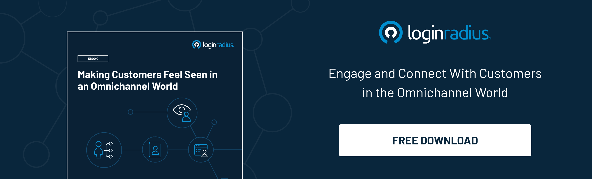

## Introduction

In today's digital world, you need to do more than just secure your digital channels against malicious attacks. You also need to make sure that your [customers feel safe](https://www.loginradius.com/blog/identity/digital-transformation-safeguarding-customer-experience/) and empowered when they use your website or application.

Off late, we’ve seen a dramatic shift in the way customers engage with businesses and brands. The proliferation of social media and other digital channels has changed the way people view companies and their products. However, many companies are still struggling to create a strong identity security strategy that can help them safeguard their most critical assets, like sensitive customer data.

In this blog post, we'll help you figure out how to use digital identity to improve your relationships with customers and make them feel more confident in their interactions with you.

## What Do Your Customers Expect From You?

Customers want to be able to find information quickly, easily, and intuitively. A CIAM ensures that they can do just that. Let's learn more about the role of CIAM and how it helps you meet your customer's needs. 

### 1. Security

When it comes to security, people are not just concerned about the product itself, but also about the company that is providing the product. They want to know that they can trust the company and have confidence in their ability to deal with any breach that might arise.

Identity solutions can help businesses protect their customer’s data from cyberattacks, but as a business, you risk losing your customer’s trust and revenue if you don’t take proper precautions.

When it comes to security, your customers are only as safe as you make them feel. And the more you can do to empower your customers and make them feel safe, the better. CIAM helps ensure that customers are provided with robust authentication and security features extending from SSO, MFA, user management, data governance, etc. 

### 2. Convenience

The world is evolving, and so is our way of interacting with people. Customers today expect to be able to shop from their phones, computers, and mobile devices. They also expect you to have a user-friendly website. 

They want to be able to access their information from any device at any time, wherever they are. Suppose you have a complex authentication system that requires multiple passwords or other authentication methods. In that case, it can cause problems for customers trying to use your product or service when they need it most. 

A CIAM improves the omnichannel experience for its customers by making them feel safe and empowered. All they need to do is provide them with one login that works across all their devices and channels.

### 3. Balancing between user experience and security

Enterprises need to create a perfect harmony between providing great customer experiences and robust security. CIAM helps create an ideal balance between security and convenience, and also helps deliver seamless experiences while interacting on digital platforms.

Identity and authentication are the underlying pillars of a seamless digital experience. While the former keeps customers empowered, authentication makes sure they are who they say they are. It offers a hassle-free digital experience by allowing customers to log in via their social network credentials and enables easy [authentication through biometrics](https://www.loginradius.com/blog/identity/what-is-mob-biometric-authentication/) like face recognition and fingerprint identification.

### 4. Social login

[Social logins](https://www.loginradius.com/social-login/) are a great way to make your platform more engaging and convenient for users.

With social logins, users can sign in to your platform from their existing profiles across multiple social networks such as Facebook or Twitter. This means that you don't have to create an account for them, and they don't have to remember a new password—they simply use their existing credentials! Social logins also increase user engagement, ease of use, and conversion rates for your site or app.

If you're looking to offer your customers a more streamlined and convenient experience on your platform, it may be time to consider social login.

### 5. Privacy

Protecting your customer's data is one of the most important things you can do for them. It builds trust, and it helps them to feel like their information is in good hands.

Customers are looking for businesses that value their privacy and are willing to go the extra mile to protect it. By using a [CIAM solution](https://www.loginradius.com/), you can help make your customers feel safe. By allowing them to sign up for and log on to online applications and services, you protect data privacy and defend against identity theft and other types of fraud and abuse.

### 6. Multi-factor authentication (MFA)

Multi-factor authentication (MFA) is a great way to add an extra layer of protection to your network. With MFA, you can confirm the identity of a user and make sure that only approved individuals are granted access. This is accomplished using security questions, biometric data, physical keys, one-time passwords, or codes.

## In Conclusion

In the end, CIAM is all about driving revenue. A good CIAM solution can deliver the best user experience and a trusted security layer, but it requires planning and implementation.

But if you don't consider all components of your CIAM, you'll miss out on valuable benefits for both businesses and consumers. 

