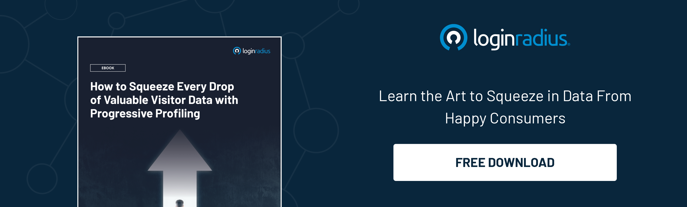

## Introduction

Cost per acquisition (CPA) is what businesses need today. Whether an e-commerce platform or a service-based company, everyone is hunting for ways to reduce their CPA. 

Companies are always ready to invest in marketing and advertisement that brings quality leads. However, not every marketing campaign is fruitful enough to generate leads that further derive more conversions. 

The essential marketing requirement is to know your customers and learn about their preferences. Every marketing tactic is useless without understanding these fundamental aspects. 

So does it mean marketers need to ask the same questions about user preferences and demands each time a user lands on their platform? Unfortunately, yes! And that too, through long registration forms that may end up causing customer fatigue/ [registration fatigue](https://www.loginradius.com/blog/identity/how-ui-ux-affects-registration/). 

Here’s where the critical role of identity management comes into play! 

With a reliable [customer identity and access management](https://www.loginradius.com/blog/identity/customer-identity-and-access-management/) (CIAM) system, marketers need not worry about collecting valuable customer insights; CIAM does it all without burning a pocket!

Let’s understand how an identity management system for CPA reduction can help businesses thrive and succeed in the long run. 

## What is Identity Management? How Does it Help in Reducing CPA? 

In industry, [digital identity management](https://www.loginradius.com/blog/identity/digital-identity-management/) primarily refers to how a customer’s personal information is safely collected, stored, and accessed.

Identity management offers endless possibilities to marketers since they can utilize valuable insights collected from user behavior and preferences. This data is stored within a CIAM and can be used for multiple purposes. 

Customer identity and access management (CIAM) is taking over the customer login experience. There’s more at stake than just registration and authentication. 

CIAM simplifies every business task that deals with your customers individually, including those that haven’t registered on your site yet. 

With a single data hub for all identities, CIAM seamlessly links authentication, customer management, sales, marketing, business intelligence, and services.

Companies that provide an excellent digital experience should also focus on offering customers personalizing services. To accomplish this, businesses need to build a 360-degree view of the customer profile based on interactions with the company. And CIAM does it all!

And with heaps of insightful information about users, businesses can deliver personalized experiences and product/service suggestions, which minimizes cost per acquisition. 

## A Unified View of Every Customer 

CIAM offers a complete [unified view of each customer](https://www.loginradius.com/profile-management/). And you can leverage the data in the marketing and promotion of your business. 

Connecting the data gathered from your services and websites gives you a complete overview of each customer. You'll have access to real-world data in startling detail with a complete picture of everything a customer has done since the first time they visited your site.

You can use this data to monitor customer journeys across multiple apps and services, create marketing personas that reflect your customers, design new products or special offers, and direct your customers towards choices that will benefit both of you.

When you understand your customers more deeply, you can reach them more quickly and serve them better. All of this adds up to more revenue and a lower acquisition and retention cost. Hence, identity management for CPA reduction becomes the need of the hour. 

## Collect What’s Needed

Many businesses quickly collect an array of customer data during the registration process. If you don’t take the time to consider if/why/how you’ll use all of this data— or determine the right time to collect this information—you’ll run into any issues. 

Collecting unnecessary data wastes resources and increases the risk of identity theft. Plus, gathering too much data also causes customers to abandon registration, slow the process, and feel intrusive.

With a reliable CIAM, businesses can leverage the true potential of progressive profiling. 

Progressive profiling for customer registration allows you to split a potentially complicated registration process into multiple steps. You can capture a customer’s information upfront and then slowly build a holistic view of that customer through subsequent actions.

With [LoginRadius Progressive Profiling](https://www.loginradius.com/progressive-profiling/), custom workflows allow customers to share information as they continue interacting with your brand. Choose which data you want to gather through various stages of a customer’s journey. You can set rules to suit your business requirements and win your customers’ trust.

## Final Thoughts 

With identity management for CPA reduction, businesses can unleash the true potential of customer insights and create winning marketing strategies that eventually minimize the overall costs of acquiring a lead. 

Apart from reducing the cost per acquisition, businesses can ensure robust customer identity security with a cloud-based customer identity and access management (CIAM) system. 

Hence, if a business wishes to succeed with minimum investment, it must leverage the true potential of a CIAM solution. 

