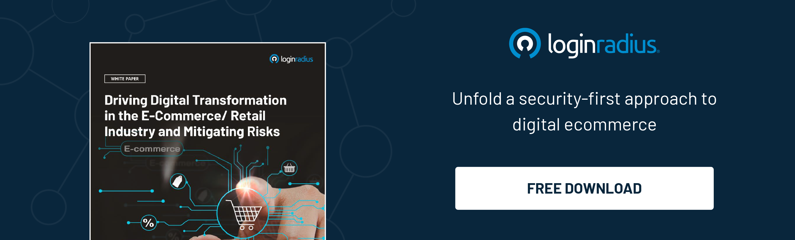

## Introduction

Data has become a cornerstone of decision-making across industries in the digital age. Whether it's e-commerce, healthcare, finance, or marketing, data accuracy is critical to making informed choices. 

However, the sheer volume of data generated and stored today often challenges data accuracy. This is where identity resolution techniques come into play, enhancing data accuracy and ensuring that organizations work with reliable, consistent, and up-to-date information.

Let’s uncover the aspects of identity resolution and how businesses can leverage their true potential to scale overall growth. 

### Understanding Identity Resolution: Unveiling the Bigger Picture

Identity resolution refers to connecting fragmented data points across different channels and devices to create a [unified and accurate view of an individual ](https://www.loginradius.com/customer-profiling/)customer or prospect. It involves analyzing and matching data from various sources, such as online interactions, offline transactions, social media, email, and more, to create a cohesive and holistic customer profile.

Identity resolution includes Identifying and linking different data points that correspond to the same real-world entity, such as an individual or a business.  

This involves accommodating and merging data from various sources to create a comprehensive and accurate profile. Identity resolution goes beyond simple data matching; it involves sophisticated algorithms and methodologies that factor in variations in data formats, spellings, and other discrepancies.

### Importance of Identity Resolution in Enhancing Data Accuracy

Accurate data is the foundation of numerous business operations, and identity resolution is pivotal in ensuring its integrity. Let's understand this with  a couple of scenarios where identity resolution techniques demonstrate their significance:

1. **Personalization and Customer Experience:** Imagine a customer interacting with a company through [multiple touchpoints](https://www.loginradius.com/blog/growth/omnichannel-customer-experience/)—website, social media, and physical store. Without accurate identity resolution, the company might treat each touchpoint as a separate interaction, leading to a fragmented and impersonal customer experience. Identity resolution ensures that all these interactions are linked to the same customer profile, allowing companies to deliver personalized experiences based on a holistic understanding of the customer.

2. **Risk Management in Finance:** In the financial sector, accurate identity resolution is crucial for mitigating risks associated with fraud and compliance. Banks and financial institutions deal with many data sources, including transaction records, government databases, and customer profiles. By accurately linking these disparate pieces of data, identity resolution helps identify potentially fraudulent activities and ensure that transactions comply with regulations.

### Examples of Identity Resolution in Action

1. **Healthcare Sector:** Consider a patient seeking medical care from an extensive hospital network. This patient may have records spread across various departments and clinics. Using identity resolution techniques, the hospital can unify these records to create a comprehensive medical history for the patient. This improves the quality of care and streamlines administrative processes, leading to better overall patient outcomes.

2. **Retail and Marketing:** In the retail industry, identity resolution can be a game-changer for understanding customer behavior. Let's say a customer shop online, subscribes to a newsletter, and makes in-store purchases. By accurately resolving the identity of this customer across different channels, the retailer can gain insights into their preferences and habits, allowing for targeted marketing campaigns that resonate with the customer's interests.

 

### Considerations in Identity Resolution

While identity resolution offers numerous benefits, it has its challenges. Ensuring data privacy, handling data quality issues, and maintaining compliance with regulations are vital considerations when implementing identity resolution techniques. 

Organizations must invest in [robust data governance frameworks](https://www.loginradius.com/data-governance/) to safeguard sensitive information and maintain the trust of their customers.

### Conclusion

In a data-driven world, accuracy is paramount. The ability to link and reconcile data from disparate sources can make the difference between informed and misguided decisions. Identity resolution techniques solve the challenge of maintaining data accuracy, enabling organizations to create comprehensive, reliable, and actionable insights. 

From delivering personalized customer experiences to enhancing risk management, identity resolution through a robust CIAM  empowers businesses to harness the full potential of their data.

By embracing these techniques and addressing the associated challenges, organizations can unlock a new level of efficiency and effectiveness in their operations, ultimately leading to tremendous success in today's competitive landscape. As technology evolves, identity resolution will remain a cornerstone of data accuracy and a driving force behind data-driven innovation.

